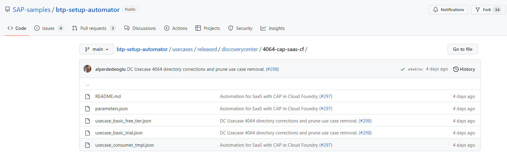

# Develop a multitenant Software as a Service application in SAP BTP using CAP

> Note: The content of this GitHub repository has been created as source for a SAP Discovery Center Mission (available soon). For a better tutorial experience, we advise using the mission in the SAP Discovery Center.

## Description

The **Sustainable SaaS (SusaaS)** sample application has been built in a partner collaboration to help interested developers, partners, and customers in developing multitenant Software as a Service applications using CAP and deploying them to the SAP Business Technology Platform (SAP BTP). For this use-case, the **Cloud Foundry Runtime** was chosen. Still, you can also develop similar SaaS applications in other runtimes like **Kyma** or  the SAP BTP **ABAP** environment.

The example focuses on using standard frameworks and SAP BTP services for developing, deploying, and monitoring the solution like the CAP framework, SAP API Management, CI/CD Service, Alert Notification, Autoscaler, and many more. 

The sample application has a focus on the topic of sustainability and is therefore called **Sustainable SaaS** (SuSaaS) app. It allows customers (**consumer tenants**) of the SaaS application to extend their SAP solutions like S/4HANA with additional features developed by the SaaS vendor (**provider**). 

Due to the technical and theoretical complexity of the topic, the sample application shall not be seen or used in any kind for productive scenarios. It is supposed to present ideas and approaches for putting your scenario into practice. Our goal is to cover as many topics as we can, but not in the greatest depth that might justify productive usability.  

Below you can find a solution architecture diagram of the sample application. As you can see, the app contains a lot of services and tools which you will use in this mission (click to enlarge).

## Content

As stated above, the documentation content of this GitHub repository has been created for consumption in [SAP Discovery Center](https://discovery-center.cloud.sap/missiondetail/4064/4275), so the table of content follows the structure of the Discovery Center scopes. While we highly recommend starting your personal mission instance in SAP Discovery Center, you can also follow the steps here in GitHub using the linked README documents below.

Besides the documentation residing in the [main](github.com/SAP-samples/btp-cf-cap-multitenant-susaas) branch of this GitHub repository, you can find two more branches:

- the [basic](https://github.com/SAP-samples/btp-cf-cap-multitenant-susaas/tree/basic) branch
- the [advanced](https://github.com/SAP-samples/btp-cf-cap-multitenant-susaas/tree/advanced) branch 

Both contain codebases for the deployment of the Basic and Advanced Scopes described in the mission target. The Expert Scope does not have its own codebase. Instead, the main branch provides the respective code snippets and explanations to set up the different scenarios. 

To get started, we recommend going through the **Discover** part first. This will introduce you to the basics of this scenario, the concepts of multitenancy, and Software as a Service applications. 

**Discover**
- [Discover the mission target](./docu/1-discover/1-discover-mission-target/README.md)
- [Learn the basics of SAP BTP](./docu/1-discover/2-learn-basics-sap-btp/README.md)
- [Partners in SAP BTP ecosystem](./docu/1-discover/3-partners-sap-btp-ecosystem/README.md)
- [Get an idea of SaaS applications](./docu/1-discover/4-get-idea-saas-applications/README.md)
- [Understand SAP BTP multitenancy](./docu/1-discover/5-understand-btp-multitenancy/README.md)
- [What's New](./docu/1-discover/6-whats-new/README.md)

Deploy the **Basic Scope** of the SusaaS sample application after preparing your provider subaccount by assigning the required entitlements. Learn about the different components used in the comprehensive SaaS sample app running in your environment now and subscribe a first consumer tenant. 

**Basic Scope**
- [Introduction Basic Scope](./docu/2-basic/0-introduction-basic-scope/README.md)
- [Repository structure](./docu/2-basic/1-understand-repo-structure/README.md)
- [Prepare your Provider Subaccount](./docu/2-basic/2-prepare-provider-subaccount/README.md)
- [Build and deploy the SaaS application](./docu/2-basic/3-build-deploy-saas-application/README.md)
- [Subscribe a consumer subaccount](./docu/2-basic/4-subscribe-consumer-subaccount/README.md)
- [Test the application](./docu/2-basic/6-test-the-application/README.md)
- [Explore the components](./docu/2-basic/7-explore-the-components/README.md)  
- [Push data to the SaaS API](./docu/2-basic/5-push-data-to-saas-api/README.md)  
- [Unsubscribe a consumer subaccount](./docu/2-basic/8-unsubscribe-consumer-subaccount/README.md)
- [Undeploy the SaaS application](./docu/2-basic/9-undeploy-saas-application/README.md)
- [Troubleshooting](./docu/2-basic/10-troubleshooting/README.md)

Enhance your SaaS sample app with **Advanced Scope** features like API Management to monitor and manage your SaaS API endpoints or SAP Identity Authentication to provide a central user management without relying on SAP ID service. Furthermore, you will learn and see a sample of how to integrate a backend system like SAP S/4HANA from a SaaS consumer perspective. 

**Advanced Scope**
- [Introduction Advanced Scope](./docu/3-advanced/0-introduction-advanced-scope/README.md)
- [Repository structure](./docu/3-advanced/1-understand-repo-structure/README.md)
- [Prepare the provider subaccount](./docu/3-advanced/2-prepare-provider-subaccount/README.md)
- [Central user management with SAP IAS](./docu/3-advanced/3-central-user-management-ias/README.md)
- [Build and deploy the SaaS application](./docu/3-advanced/4-build-deploy-saas-application/README.md)
- [Subscribe a consumer subaccount](./docu/3-advanced/5-subscribe-consumer-subaccount/README.md)
- [Test the application](./docu/3-advanced/6-test-the-application/README.md)
- [Push data from SAP S/4HANA system](./docu/3-advanced/7-push-data-s4hana-system/README.md)
- [Integrate with SAP API Management](./docu/3-advanced/8-integrate-sap-api-management/README.md)
- [Troubleshooting](./docu/3-advanced/9-troubleshooting/README.md)

The **Expert Scope** contains a variety of different topics which will make your application and life as a SaaS developer even more convenient. This reaches from the usage of CI/CD tools and SAP Cloud Transport Management for continuous deployment to the management and backup of your tenant database containers. You will learn about multi-region deployments of SaaS applications and how to tackle topics like Custom Domain usage. 

> **Important** - The Expert Scope is still Work-in-Progress. The code and documentation are subject to change. 

**Expert Scope (WIP)**
- [Introduction Expert Scope](./docu/4-expert/0-introduction-expert-scope/README.md)
- [Feature Toggles](./docu/4-expert/feature-toggles/README.md)
- [SaaS Consumer Extensibility](./docu/4-expert/consumer-extensibility/README.md)
- [HDI container administration](./docu/4-expert/hdi-container-administration/README.md)
- [Setup SAP CI/CD for your project](./docu/4-expert/setup-cicd-for-project/README.md)
- [Configure SAP Transport Management](./docu/4-expert/configure-transport-management/README.md)
- [How to do local/hybrid development](./docu/4-expert/local-hybrid-development/README.md)
- [Manage tenant database containers](./docu/4-expert/manage-tenant-containers/README.md)
- [Backup database containers](./docu/4-expert/backup-database-containers/README.md)
- [Update tenant database containers](./docu/4-expert/update-tenant-containers/README.md)
- [Setup custom domain usage](./docu/4-expert/custom-domain-usage/README.md)
- [Custom domain for SAP IAS](./docu/4-expert/custom-domain-for-ias/README.md)
- [Integrate a consumer's IdP](./docu/4-expert/integrate-consumers-idp/README.md)
- [Deploy to multiple regions](./docu/4-expert/deploy-multiple-regions/README.md)
- [Send email using Microsoft Graph API](./docu/4-expert/send-emails-graph-api/README.md)
- [Using the SAP Theme Designer](./docu/4-expert/using-sap-theme-designer/README.md)
- [Multiple SAP HANA Cloud instances](./docu/4-expert/multiple-hana-cloud/README.md)
- [Troubleshooting](./docu/4-expert/troubleshooting/README.md)

## SAP BTP Setup Automator

> ([Click here](https://github.com/SAP-samples/btp-setup-automator/tree/main/usecases/released/discoverycenter/4064-cap-saas-cf)) to find the SAP BTP Setup Automator instructions for this use-case.

This use-case can also be set up in your SAP BTP environment using the **SAP BTP Setup Automator**! Currently only the **Basic Scope** is supported for an automated setup using Free (Tier) or Trial services. You can find the instructions in the SAP BTP Setup Automator repository ([click here](https://github.com/SAP-samples/btp-setup-automator/tree/main/usecases/released/discoverycenter/4064-cap-saas-cf)).

## Requirements

The technical requirements for setting up this sample SaaS application can also be found in the different scope tutorials. Please find more details in the respective mission documentation [**Prepare your Provider Subaccount**](https://github.com/SAP-samples/btp-cf-cap-multitenant-susaas/tree/main/docu/2-basic/2-prepare-provider-subaccount/README.md). 

If not yet done, for this sample application we recommend to set up a **Pay-As-You-Go (PAYG)** or **CPEA** account and use the mentioned **Free (Tier) service plans**. A tutorial how to setup a PAYG account (allowing you to use all Free Tier service plans) can be found in the [Tutorial Navigator](https://developers.sap.com/tutorials/btp-free-tier-account.html). 

### Basic Scope

The **Basic Scope** of the sample application requires the following set of SAP BTP entitlements in the provider subaccount and can be done using **Free (Tier) service plans** of **PAYG** and **CPEA** accounts.

> **Hint** - The Basic Scope can also be done in **Trial** accounts, although we recommend to use one of the account types mentioned above. Please make sure to choose the **us10** region to use SAP HANA Cloud in this case. 

| Service                           | Free (Tier)  Plans  | Number of Instances |
|-----------------------------------|------------|:-------------------:|
| [SAP Alert Notification service for SAP BTP](https://discovery-center.cloud.sap/serviceCatalog/alert-notification?region=all) | Free / *(Trial: Lite)* |     1    |
| [Application Autoscaler](https://discovery-center.cloud.sap/serviceCatalog/application-autoscaler/?service_plan=standard&region=all&commercialModel=cloud) | Standard |     1    |
| [SAP Application Logging Service](https://discovery-center.cloud.sap/serviceCatalog/application-logging-service/?region=all) | Lite |     1    |
| [SAP Authorization and Trust Management Service](https://discovery-center.cloud.sap/serviceCatalog/authorization-and-trust-management-service?region=all&tab=feature)| Broker   Application |     1   1    |
| [SAP BTP, Cloud Foundry Runtime](https://discovery-center.cloud.sap/serviceCatalog/cloud-foundry-runtime?region=all) | Free / *(Trial: Standard)* |    1    |
| [SAP Cloud Management Service for SAP BTP](https://discovery-center.cloud.sap/serviceCatalog/cloud-management-service/?region=all) | Central |     1    |
| [SAP Credential Store](https://discovery-center.cloud.sap/serviceCatalog/credential-store?region=all) | Free / *(Trial: Trial)* |     1    |
| [Destination Service](https://discovery-center.cloud.sap/serviceCatalog/destination?service_plan=lite&region=all&commercialModel=cloud) | Lite |     1    |
| [SAP HTML5 Application Repository Service for SAP BTP](https://discovery-center.cloud.sap/serviceCatalog/html5-application-repository-service?region=all) | App-host  App-runtime |    1   1   |
| [SAP SaaS Provisioning Service](https://discovery-center.cloud.sap/serviceCatalog/saas-provisioning-service?service_plan=application&region=all&commercialModel=cloud) | Application |    1    |
| [SAP HANA Cloud](https://discovery-center.cloud.sap/serviceCatalog/sap-hana-cloud?tab=customerreference&region=all) | Free / *(Trial: HANA)* |    1    |
| [SAP HANA Schemas & HDI Containers](https://help.sap.com/docs/SAP_HANA_PLATFORM/3823b0f33420468ba5f1cf7f59bd6bd9/e28abca91a004683845805efc2bf967c.html?version=2.0.04&locale=en-US) | hdi-shared |    1    |
| [SAP Service Manager](https://discovery-center.cloud.sap/serviceCatalog/service-manager/?region=all) | Container |    1    |
| | |

### Advanced Scope

The **Advanced Scope** requires some additional services and software components which are listed below. Please note that the **SAP Identity Authentication Service** is only available in **Pay-As-You-Go (PAYG)** and **CPEA** accounts.

> **Hint** - The Advanced Scope cannot be deployed to Trial accounts!

| Service | Free (Tier) Plans | Number of Instances |
|---|---|:---:|
| [SAP Integration Suite](https://discovery-center.cloud.sap/serviceCatalog/integration-suite?region=all) | Free  |     1    |
| [SAP API Management, API portal](https://help.sap.com/docs/SAP_CLOUD_PLATFORM_API_MANAGEMENT/66d066d903c2473f81ec33acfe2ccdb4/e609a3efe6d64e1781cbf81ae5592071.html?locale=en-US)         | apim-as-route-service                |     1    |
| [SAP Identity Authentication](https://discovery-center.cloud.sap/serviceCatalog/identity-authentication?region=all&tab=feature) | Free test/prod tenant |  |
| SAP NetWeaver System | |
| | |

> **SAP Integration Suite** - The **free service plan** is usable for 90 days only. Your tenant will be decommissioned after 90 days and you need to set up a new tenant if you wish to do further validations. 

> **SAP Identity Authentication** - When signing up for a PAYG or CPEA account, you're entitled for a free test and productive SAP Identity Authentication Service tenant. Any further tenant can be licensed as **Aditional Tenant** and will be charged according to your account type. Please also check the official SAP Help documentation ([click here](https://help.sap.com/docs/IDENTITY_AUTHENTICATION/6d6d63354d1242d185ab4830fc04feb1/93160ebd2dcb40e98aadcbb9a970f2b9.html?locale=en-US#loio93160ebd2dcb40e98aadcbb9a970f2b9__licensing_section)) and the following blog post ([click here](https://blogs.sap.com/2021/10/26/is-sap-cloud-identity-services-for-free/)) for further information.

> **SAP NetWeaver System** - An SAP NetWeaver system is only required if you want to test the automated data push feature from an existing SAP solution. You can use all **SAP S/4HANA** releases and also any other SAP systems which has an SAP NetWeaver stack version higher than 7.3.

### Expert Scope

The Expert Scope will require the following additional service and software components which are listed below. Almost all parts of the **Expert Scope** can be done using **Free (Tier) service plans** of **PAYG** and **CPEA** accounts. The only exception is the usage of a custom domain (see details below). 

> **Hint** - Most of the **Expert Scope** can also be done in Trial accounts, although we recommend to use one of the account types mentioned above. 

| Service  | Free (Tier) Plans | Number of Instances |
|----------|------------------|:-------------------:|
| [SAP Continuous Integration and Delivery](https://discovery-center.cloud.sap/serviceCatalog/continuous-integration--delivery?region=all) | Free / *(Trial: Trial)*  | 1 |
| [SAP Cloud Transport Management](https://discovery-center.cloud.sap/serviceCatalog/cloud-transport-management?region=all) | Free / *(Trial: Lite)* | 1 |
| [SAP Custom Domain ](https://discovery-center.cloud.sap/serviceCatalog/custom-domain?service_plan=custom-domain&region=all) | Paid plan only | 1 |
| | |

> **Important** The **SAP Custom Domain** Service can only be added as **paid plan** in PAYG or CPEA accounts. Please check the respective pricing details before adding and using this service in your SAP BTP account. 

## Deployment

The deployment is described in the **Basic Scope** of the mission documentation ([click here](./docu/2-basic/3-build-deploy-saas-application/README.md)). 

## Known Issues
**Open**
  - Consumer extension API issue (Workaround available - 2022/12/19)
    - **Problem**: Applying a Consumer extension currently results in the Push API not being usable by the extended tenant anymore. 
    - **Issue**: The current implementation has issues to read and process the CSN file of the extended SaaS CAP service. This service serves as a base for the API CAP service.
    - **Workaround**: Extensibiltiy has been temporarily disabled for the CAP API Service using an additional server.js file. 
    - **Solution**: Issues has been addressed with the CAP product management and potential solutions will be worked on. 

**Solved**
 - Chart destroy issue (Solved - 12/12/2022)
   - **Problem**: Trying to open the Assessments is not possible after it is been successfully opened before
   - **Issue**: If the charts in the Assessments app have not been rendered because you haven't loaded the object page subsections, some chart-related components are not destroyed properly when leaving the Assessments app. 
   - **Workaround**: Refresh the page and open the Assessments app again. Open all Object Page Sections at least once before leaving the Assessments app.
   - **Solution**: Issue fixed by the development team and released in upcoming SAPUI5 version. Latest SAPUI5 version currently not usable due to percentage sign issue. 
 - Percentage sign issue (Solved - 12/12/2022)
   - **Problem**: Using the latest SAPUI5 versions, fields with percentage signs cannot be edited properly anymore
   - **Issue**: Fields show the percentage sign once within and once outside of the edit box. When changing the edit box value, no requests are triggered to the backend and changes to drafts cannot be saved. 
   - **Workaround**: Use SAPUI5 release 1.102.5 or lower. 
   - **Solution**: Issue fixed by the development team and released in upcoming SAPUI5 version. 

## How to obtain support
[Create an issue](https://github.com/SAP-samples/btp-cf-cap-multitenant-susaas/issues) in this repository if you find a bug or have questions about the content.
 
For additional support, [ask a question in SAP Community](https://answers.sap.com/questions/ask.html).

## Contributing
If you wish to contribute code or offer fixes or improvements, please send a pull request. Due to legal reasons, contributors will be asked to accept a DCO when they create the first pull request for this project. This happens in an automated fashion during the submission process. SAP uses [the standard DCO text of the Linux Foundation](https://developercertificate.org/).

## License
Copyright (c) 2022 SAP SE or an SAP affiliate company. All rights reserved. This project is licensed under the Apache Software License, version 2.0 except as noted otherwise in the [LICENSE](LICENSE) file.
