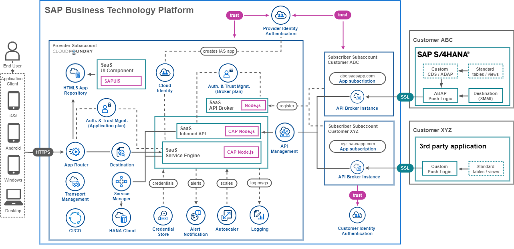

# Discover the Mission Target

In this mission, you will learn how to set up a multitenant Software as a Service (SaaS) application in your SAP Cloud Foundry environment of the SAP Business Technology Platform (SAP BTP). The sample application has a focus on the topic of Sustainability and is called **Sustainable SaaS** (SusaaS). It allows **consumers** of your SaaS application to extend their SAP solutions like S/4HANA with additional features provided by you as a SaaS **provider**. 

1. [Mission Scopes](#1-Mission-Scopes)
2. [GitHub Repository](#2-GitHub-Repository)
3. [Mission Audience](#3-Mission-Audience)
4. [Focus Topics](#4-Focus-Topics)
5. [Known Issues](#5-Known-Issues)
6. [Obtain Support](#6-Obtain-Support)
7. [Provide Feedback](#7-Provide-Feedback)
8. [What's New](#8-What's-New)

In this simple scenario, the application allows you to assign users to multiple projects, in which they can assess dedicated circularity metrics of products imported from an SAP backend system like S/4HANA. Besides the assessment of financial product sales data, the app also allows to import or to enter recycling data or product design information. 

See the following screenshots to get an idea of the application features. The details will be described in later parts of the mission (click to enlarge).

Due to the technical and theoretical complexity of the topic, the sample application shall not be seen or used in any kind for productive scenarios. Furthermore, it shall give you a lot of ideas and approaches for your own scenario implementation. We aim to cover as many topics as possible but not in the greatest depth that might justify productive usability.  

Below you can find a solution architecture diagram of the sample application. As you can see, the app contains a lot of services and tools which you will use during the course of this mission (click to enlarge).

## 1. Mission Scopes

This mission is structured in three different major scopes which are **Basic**, **Advanced**, and **Expert**. This section will give you a brief overview of the scopes and the requirements from an SAP BTP license perspective. For the Basic and Advanced Scope, there are separate GitHub branches including dedicated codebase whereas the Expert Scope is only described in written format. 

**Basic**

The **Basic** scope contains a very comprehensive version of the **SusaaS (Sustainable SaaS)** application, which can be deployed to your SAP BTP Trial, Free Tier, or Enterprise account. It contains **free services** only and is the foundation of the Advanced Scope. The objective of this scope is a SaaS application that can be deployed and tested by each and every developer in the community. It contains all major SaaS components (including an Inbound API) which are also part of the Advanced Scope but excludes paid services which will be part of the next scope. 

**Advanced**

> **Important** - The Advanced Scope is still Work-in-Progress. The code and documentation are subject to change. 

The **Advanced** scope adds further enterprise features to your SusaaS application like 
- a real SAP S/4HANA backend pushing data to the SaaS APIs
- SAP API Management for managing your SaaS API
- users being centrally managed in SAP Identity Authentication Service

Some Advanced Scope features are not available in the Trial version of SAP BTP (e.g., SAP Identity Authentication Service) or only for a limited timeframe (e.g., SAP Integration Suite). For this reason, you will either need a Free Tier or Enterprise subscription of SAP BTP to use these services. The same applies to an SAP NetWeaver or SAP S/4HANA system, which you either need to bring yourself or you need to set up a [CAL instance](https://cal.sap.com/) which will cost you a few dollars per month (don't forget to stop your system if not in use :) ).

**Expert**

> **Important** - The Expert Scope is still Work-in-Progress. The code and documentation are subject to change. 

The **Expert** scope does not provide a dedicated codline but contains a lot of further expert knowledge for developers implementing SaaS applications on SAP BTP. The different topics of the Expert Scope mostly result from experiences of the latest learnings and challenges of a Proof-of-Concept which was conducted with an SAP Partner. T

The topics include but are not limited to
 - Using a custom domain for your SaaS app 
 - Handling tenant database containers
 - Providing your SaaS application in multiple regions
 - Configuring SAP CI/CD service for your application
 - Release to production using SAP Transport Management
 - ...

## 2. GitHub Repository 

You can find the code of the sample application in the following sap-samples GitHub repository.

https://github.com/SAP-samples/btp-cf-cap-multitenant-susaas

The repository contains three different branches. 
- [**main**](https://github.com/SAP-samples/btp-cf-cap-multitenant-susaas) - Mission documentation 
- [**basic**](https://github.com/SAP-samples/btp-cf-cap-multitenant-susaas/tree/basic/) - Codeline for Basic mission scope 
- [**advanced**](https://github.com/SAP-samples/btp-cf-cap-multitenant-susaas/tree/advanced/) - Codeline for Advanced mission scope

You can either clone or fork the repository to your own GitHub account. 

## 3. Mission Audience

While the ecosystem of partner-built software for SAP On-Premise solutions has grown very well over the last decades, the available partner offerings and the interest in building solutions on SAP BTP starts to increase. A lot of SAP partners wonder how to port their existing developments to the cloud, to satisfy the demand of their existing customers moving to SAP BTP, or reach out to a much broader market than before. 

For that reason, this mission and the related topic of developing multitenant SaaS applications on SAP BTP is of great interest to partners and customers. It is supposed to give all interested stakeholders an introduction to the theoretical basics of Software as a Service on SAP BTP and provides a great codebase that can be used to kickstart your own implementation. Whereas some other great sample missions on building SaaS applications in SAP BTP Kyma environment already exist ([see here](https://discovery-center.cloud.sap/missiondetail/3683/3726/)), this mission focuses on the SAP Cloud Foundry environment, which is a fundamental pillar of the SAP BTP success. 

There is no previous knowledge required for this mission, so all new but also experienced developers can set up the sample application. Nevertheless, a basic understanding of SAP BTP service offerings will help you grasp the ideas and concepts. 

## 4. Focus Topics

The main topics of the mission include: 

* Understanding Software as a Service and multitenancy
* Using SaaS-related features of SAP BTP, Cloud Foundry Runtime
* Developing extensions for SAP solutions like S/4HANA based on 
  - the latest SAP CAP release features
  - a UI based on SAP Fiori Elements for OData v4 
  - SAP HANA Cloud as a powerful persistence layer
  - APIs for flexible consumer data integration
  - and many more...
* Expert topics to consider when building SaaS apps like
  - set up a custom domain for your app
  - deploying your app to multiple regions
  - handling tenant database containers
  - usage of CI/CD and Transport Management
  - and many more...

## 5. Known Issues

The tutorial is provided on an "as-is" basis. Currently, the following known issues for the project exist.

**SAP Fiori Elements**
 - Chart destroy issue
   - **Problem**: Trying to open the Assessments is not possible after it is been successfully opened before
   - **Issue**: If the charts in the Assessments app have not been rendered because you haven't loaded the object page subsections, some chart-related components are not destroyed properly when leaving the Assessments app. 
   - **Workaround**: Refresh the page and open the Assessments app again. Open all Object Page Sections at least once before leaving the Assessments app.
   - **Status**: Issue fixed by the development team and released in upcoming SAPUI5 version.

## 6. Obtain Support

Please check if you find your issue described in the **Known Issues** section ([click here](#5-known-issues)) or the **Troubleshooting** chapters ([basic](../../2-basic/10-troubleshooting/README.md), [advanced](../../3-advanced/9-troubleshooting/README.md), [expert](../../4-expert/troubleshooting/README.md)) of the different mission parts. 

If not, please create a GitHub issue to get support or to report a bug (https://github.com/SAP-samples/btp-cf-cap-multitenant-susaas/issues).

## 7. Provide Feedback

Nobody is perfect so please let us know how we can improve our samples so that you can take the most out of it! Feel free to share your feedback with us using the Discovery Center **Ask Expert** messaging feature or create an issue in GitHub as described above. This will help us to improve this mission and further content for you and other stakeholders. 

## 8. What's New

Check the latest release and **What's New** details in the respective card of the **Discover** mission scope ([click here](../6-whats-new/README.md)).