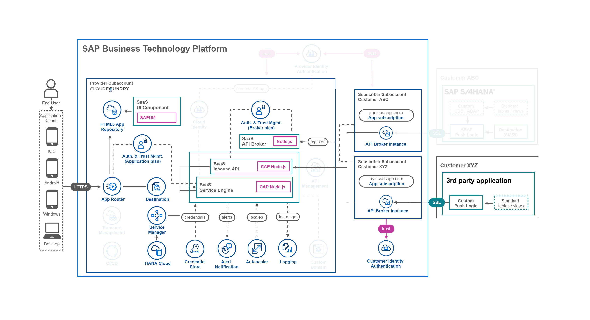
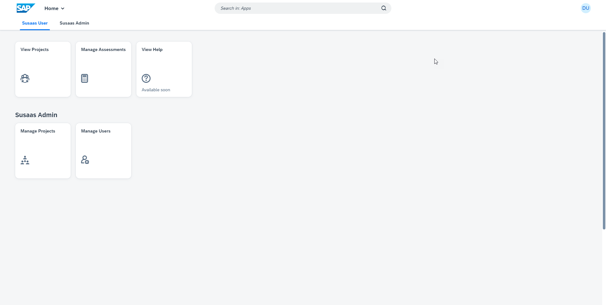

# Introduction to the Basic Scope

> **Important** - The major Scopes (**Basic** and **Advanced**) of this mission are independent of each other, which means you can also directly start with the Advanced Scope if you like. The Advanced Scope contains all features of the Basic Scope and more but provides less detailed instructions and guidance as we assume a higher level of expertise. The **Expert** Scope contains selected additional features that can be applied to the Basic **or** the Advanced Scope. You don't have to go through all Scopes to complete this mission. If e.g., the Basic Scope is sufficient for you, feel free to finalize the mission after successful completion.  

The **Basic Scope** of the mission will provide you with the core elements required for a Software as a Service (SaaS) application on SAP Business Technology Platform (SAP BTP). 

1. [Step-by-Step](#1-Step-by-Step)
2. [Scope Features](#2-Scope-Features)
3. [Scope Result](#3-Scope-Result)

You can set up the **Basic Scope** in any productive SAP BTP environment using **Free (Tier) service plans** of your own **Pay-as-you-Go** (PAYG) or **CPEA** account. See the following screenshot to get an idea of the Basic Scope architecture.

> **Hint** - The Basic Scope can also be done in **Trial** accounts, although we recommend to use one of the account types mentioned above. 

## 1. Step-by-Step

For completing the **Basic Scope** please follow the respective cards or check out the linked Readme documents. 

1. Start with **Understanding the repo structure**. ➜ ([click here](../1-understand-repo-structure/README.md))
2. **Prepare your provider subaccount** for deployment. ➜ ([click here](../2-prepare-provider-subaccount/README.md))
3. Next, **build and deploy** your SaaS application. ➜ ([click here](../3-build-deploy-saas-application/README.md))
4. After deployment **subscribe a consumer subaccount**. ➜ ([click here](../4-subscribe-consumer-subaccount/README.md))
5. Provide sample content by **pushing data to the SaaS API**. ➜ ([click here](../5-push-data-to-saas-api/README.md))
6. Play around with the app and **test features end-to-end**. ➜ ([click here](../6-test-the-application/README.md))
7. **Explore the application components** in greater detail. ➜ ([click here](../7-explore-the-components/README.md))
8. Learn how to **unsubscribe a consumer account**. ➜ ([click here](../8-unsubscribe-consumer-subaccount/README.md))
9. **Undeploy the SaaS application** if required. ➜ ([click here](../9-undeploy-saas-application/README.md))
10. Check the **Troubleshooting** section in case of issues. ➜ ([click here](../10-troubleshooting/README.md))

## 2. Scope Features

The **Basic Scope** provides the sample implementation of a CAP-based multitenant SaaS application containing features like a

- **SAP HANA Cloud** database model to store the application or API data of all tenants and a data model shared among all tenants.
- **CAP OData service** providing an OData v4 service for the application layer including annotations (Service Engine).
- **Fiori Elements** application based on various annotations and samples for extension options (UI Component).
- **CAP API service** providing all tenants an interface to provide data from solutions like SAP S/4HANA (SaaS API).
- **Service Broker** allowing tenants to create a service broker instance to access the application's API (API Broker).

Furthermore, the **Basic Scope** provides sample integrations and usage scenarios of SAP BTP services including 

- basic enterprise application features like
    - **Alert Notification Service** informing you about issues with your application like a crash or errors during tenant onboarding.
    - **Autoscaler Service** which is scaling your SaaS application components in case of increased workload by your SaaS tenants.
    - **Logging Service** allowing you to track and access and analyze logs of your SaaS application.
    - **Credential Store** which is used to securely store secrets like technical platform administrator credentials.
    - **HTML5 Application Repository** storing and serving your static application content making your app more resilient.
- important components for SaaS usage like
    - **SAP HANA Cloud** allowing you to use the powerful container concept for tenant separation on the same database.
    - **Service Manager** which is responsible for handling a secure communication with the tenant database containers. 
    - **Application Router** which is one of the key players in handling the multitenancy features of your SaaS application.
- Authorization & Trust Management service instances of
    - **application** plan which handles the XSUAA-based application authentication and authorization of all tenants.
    - **broker** plan which takes care of the XSUAA-based API access security requirements for all tenants.

As the setup includes a lot of different services and components, only the elements which are not self-explanatory will be covered in detail by this mission scope. 

We highly recommend checking SAP Help or related documentation of the components (e.g., npm packages) in case you want to learn more. Please also check the [**Explore the Components**](../7-explore-the-components/README.md) part of this mission scope to find more details about the most important application components!

## 3. Scope Result

The result of this scope will be a SaaS application running in a subaccount of your own SAP BTP global account which 

- offers your tenants a user interface to
    - **manage** the tenant-specific **users** of the SaaS application.
    - create **projects** and assign users as **members** to different projects.
    - setup **assessments** for analyzing product circularity metrics.
- provides an SAP HANA Cloud HDI (*) container based **data separation** for all tenants.
- can be subscribed from subaccounts (**consumers**) in the same global account.
- creates a dedicated **service broker instance** for **API access** during the subscription.
- allows your tenants to read and **update data** using a multitenant **API** endpoint.
- let tenants **prefill** their assessments with data uploaded through the API.

(*) HDI - HANA Deployment Infrastructure

See the following screenshots will give you an idea of the Basic Scope results (click to enlarge).

|  | 
|:----------: | :------------: |
| *Main Menu* | *Project List* |

|  | 
|:----------------: | :-------------------: |
| *Project Details* | *Project Assessments* |

|  | 
|:----------------: | :------------------: |
| *Project Members* | *Add Project Member* |

|  | 
|:----------: | :------------: |
| *User List* | *User Details* |

|  | 
|:----------------: | :------------------: |
| *Assessment List* | *Assessment Details* |

|  | 
|:--------------------: | :------------------: |
| *Circularity Metrics* | *Circularity Charts* |

|  | 
|:-------------: | :--------------------: |
| *Sales Splits* | *Prefill Sales Splits* |

|  | 
|:----------------: | :----------------------: |
| *Material Splits* | *Modify Material Splits* |

|  
|:----------------: |
| *Material Splits* |