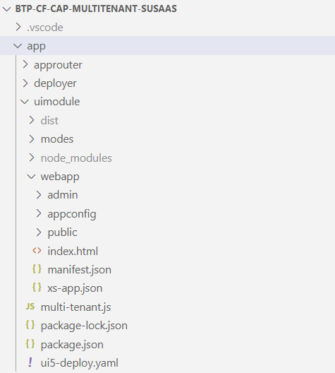

# Understand the Repository Structure

This part of the mission will briefly outline the structure of the **Basic Scope** branch so you're comfortable navigating through the provided repository. The following screenshots and explanations will give you an idea of the respective branch. 

1. [Overview](#1-overview)
2. [Application Router](#2-application-router)
3. [API Broker](#3-api-broker)
4. [Deployment Configurations](#4-deployment-configurations)
5. [Tenant Database Container](#5-tenant-database-container)
6. [Shared Database Container](#6-shared-database-container)
7. [HTTP Test Files](#7-http-test-files)
8. [Annotation Files](#8-annotation-files)
9. [Business Application Service](#9-business-application-service)
10. [API Service](#10-api-service)
11. [Test objects](#11-test-objects)

Also check out the **Explore the application** part of this mission which describes various components and their tasks in greater detail ([click here](../7-explore-the-components/README.MD)).

## 1. Overview

The repository consists of several directories containing the API (service) broker, the API service and the application layers like User Interface, the business application service layer and the data models deployed in a tenant-specific and shared database container.

| | |
|:--: | :--- |
|  |     **app -** Approuter and Fiori Elements   **broker -** Service broker configuration   **configs -** Deployment configurations (e.g. XSUAA)   **db -** Tenant data model   **db-com -** Shared data model   **http -** Http files for API testing   **srv -** Business application service   **srv-api -** API service   **test -** Unit tests and sample data   **mta.yaml -** Descriptor for .mtar deployment   **package.json -** CDS related configs (e.g. mtxs, build settings) |

## 2. Application Router

Besides the **Approuter** instance, the **app** directory contains all SAP Fiori Elements user interface definitions which are dynamically generated based on the business application service annotations.

| | |
|:--: | :--- |
|  |  **approuter -** Approuter default instance   **uimodule -** UI development content 
 **modes -** Local development configs   **webapp -** Fiori Elements app definitions  
**admin -** Admin apps  **appconfig -** Fiori Launchpad config  **public -** User apps 

 **multi-tenant.js -** Required for local development |

## 3. API Broker

The **broker** directory contains the API broker related development objects.

| | |
|:--: | :--- |
|  |  **catalog.json -** Service broker definition |

## 4. Deployment Configurations

In the **configs** directory, deployment related configuration files are stored and linked in the deployment descriptor (mta.yaml). 

| | |
|:--: | :--- |
|  | **alert-notif.json -** Alert Notification configuration   **xs-security.json -** XSUAA configuration |

## 5. Tenant Database Container

The **db** directory contains the definition of the tenant specific data model, which is deployed to a new isolated database container for each and every SaaS tenant upon subscription. 

| | |
|:--: | :--- |
|  |    **cfg -** Configuration files for shared database container access   **src -** Native SAP HANA database objects  
 **functions -** Functions   **procedures -** Stored Procedures   **roles -** Schema roles   **synonyms -** Synonyms 
 **data-models.cds -** Tenant data model definition   **data-types.cds -** Tenant data model types  |

## 6. Shared Database Container

The **db_com** directory contains the definition of the shared data model, which is accessible from all tenant database containers. It is used for data required by all consumer tenants (e.g. master data like Currencies, Languages or Countries).

| | |
|:--: | :--- |
|  | **src -** Native SAP HANA database objects  
 **data -** Sample csv files for Countries, Languages and Currencies   **\*_ACCESS.hdbrole -** Roles for external access by tenant database containers 
  **data-model.cds -** Shared data model definition |

## 7. HTTP Test Files

The **http** directory contains http files allowing you to test the SaaS API endpoints from a SaaS consumer perspective. Further details on how to use these HTTP files can be found in a separate part of this mission ([click here](../5-push-data-to-saas-api/README.MD)).

| | |
|:--: | :--- |
|  |  **api\*.http -** HTTP files for API testing |

## 8. Annotation Files

The **annotations** directory in the **srv** directory contains all 
business application service related annotations. These annotations define the capabilites and features of the OData services but also define the layouts of the SAP Fiori Elements interfaces. 

| | |
|:--: | :--- |
|  |  **admin -** Admin service annotations   **public -** User service annotations  
 **capabilities.cds -** Service capability annotations  **fieldControls.cds -** Service field control annotations  **layouts_\*.cds -** Fiori Elements layout annotations 
 **labels.cds -** Label annotations   **valueHelp.cds -** Value help annotations    |

## 9. Business Application Service

The rest of the **srv** directory contains the implementation of all business application service related features. This includes the OData services for the user interfaces (Admin and User service) as well as the automation logic executed on subscription of new consumer-tenants. A lot of onboarding steps have been automated using different Cloud Foundry APIs and SAP BTP services. 

| | |
|:--: | :--- |
|  | **i18n -** Language files   **utils -** Service utilities (mainly for automation purpose)  
 **alertNotification.js -** Alert Notification utilities   **automator.js -** Automation scripts   **cf-utils.js -** Cloud Foundry utilities  **cis-central.js -** Cloud Management Service utilities  **credStore.js -** Credential Store utilities  **destination.js -** Destination Service utilities  **service-manager.js -** Service Manager utilities  **token-utils.js -** Token helper utilities  **user-management.js -** User management utilities 
 **admin-service.cds -** Admin service definition  **admin-service.js -** Admin service handler   **annotations.cds -** Annotation file collector  **provisioning.js -** Provisioning handler   **public-service.cds -** User service definition   **public-service.js -** User service handler   **server.js -** Custom server.js  |

## 10. API Service

The **srv-api** directory contains the implementation of the API Service which can be used by SaaS consumers to provide or maintain data in their tenant database containers. Further details can be found in a separate part of this mission ([click here](../5-push-data-to-saas-api/README.MD)).

| | |
|:--: | :--- |
|  |  **api-capabilities.cds -** API service capabilities   **api-service.cds -** API service definition   **api-service.js -** API service handler   |

## 11. Test objects

The **test** directory contains sample data for local development and testing purposes as well as sample unit tests. 

| | |
|:--: | :--- |
|  | **data -** Sample data for tenant data model    **index.cds -** CDS file for builder   **test.js -** Sample unit tests   |