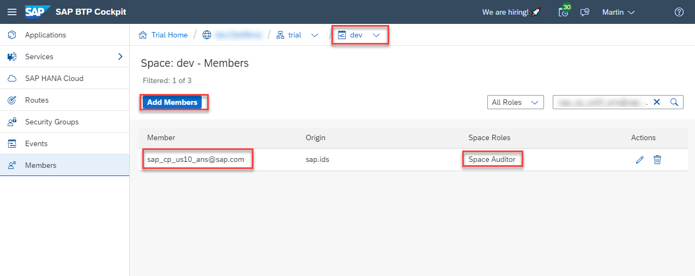

# Prepare the Provider Subaccount

In this chapter, you will learn how to prepare your SAP BTP Provider Subaccount for the deployment of the SaaS solution by assigning the required entitlements. 

1. [Prerequisites for Provider Subaccount](#1-Prerequisites-for-Provider-Subaccount)
2. [Entitlements for Provider Subaccount](#2-Entitlements-for-Provider-Subaccount)
3. [SAP HANA Cloud prerequisite](#3-SAP-HANA-Cloud-prerequisite)
4. [SAP Alert Notification Technical User](#4-SAP-Alert-Notification-Technical-User)
5. [Limitations of free service plans](#5-Limitations-of-free-service-plans)
6. [Troubleshooting](#6-Troubleshooting)
7. [Further information](#7-Further-Information)

## 1. Prerequisites for Provider Subaccount

As already mentioned, you can set up the **Basic Scope** in any SAP BTP environment using **Free (Tier) service plans** of your own **Pay-as-you-Go** (PAYG) or **CPEA** account. A tutorial how to setup a PAYG account (allowing you to use all Free Tier service plans) can be found in the [Tutorial Navigator](https://developers.sap.com/tutorials/btp-free-tier-account.html). 

> **Hint** - The Basic Scope can also be done in **Trial** accounts, although we recommend to use one of the account types mentioned above. Please make sure to choose the **us10** region to use SAP HANA Cloud in this case. 

After provisioning of your SAP BTP account (which might take a few hours after placing your free order in SAP Store), please continue with the following steps.

* Enable the SAP BTP Cloud Foundry environment using the **free** service plan (assign in Entitlements if not visible!)
> **Important** -  Please make sure to your Cloud Foundry Org(anization) name does not contain any spaces (follows the ^\s*\S+\s*$ Regex format)

* Create an SAP BTP Cloud Foundry Space and name it e.g., dev.
> **Important** -  Please make sure to your Cloud Foundry Space name does not contain any spaces (follows the ^\s*\S+\s*$ Regex format)

* Set up a SAP HANA Cloud instance using the **hana-free** service plan.

> **Important** - Make sure to create the Cloud Foundry environment using the **free** plan and not the **Standard** plan. Otherwise, you will be charged from the first GB of runtime used. 

Please check the limitations mentioned below when it comes to the usage of some SAP BTP service plans like e.g., hana-free. Furthermore, please note that the hana-free service plan is not available in all SAP BTP regions. You can check the availability in SAP Discovery Center ([click here](https://discovery-center.cloud.sap/serviceCatalog/sap-hana-cloud?region=all&tab=service_plan&service_plan=free&commercialModel=cloud)).

## 2. Entitlements for Provider Subaccount

The application requires the following set of SAP BTP entitlements in the Provider Subaccount:

| Service                           | Free (Tier)  Plans  | Number of Instances |
|-----------------------------------|------------|:-------------------:|
| [SAP Alert Notification service for SAP BTP](https://discovery-center.cloud.sap/serviceCatalog/alert-notification?region=all) | Free / *(Trial: Lite)* |     1    |
| [Application Autoscaler](https://discovery-center.cloud.sap/serviceCatalog/application-autoscaler/?service_plan=standard&region=all&commercialModel=cloud) | Standard |     1    |
| [SAP Application Logging Service](https://discovery-center.cloud.sap/serviceCatalog/application-logging-service/?region=all) | Lite |     1    |
| [SAP Authorization and Trust Management Service](https://discovery-center.cloud.sap/serviceCatalog/authorization-and-trust-management-service?region=all&tab=feature)| Broker   Application |     1   1    |
| [SAP BTP, Cloud Foundry Runtime](https://discovery-center.cloud.sap/serviceCatalog/cloud-foundry-runtime?region=all) | Free / *(Trial: Standard)* |    1    |
| [SAP Cloud Management Service for SAP BTP](https://discovery-center.cloud.sap/serviceCatalog/cloud-management-service/?region=all) | Central |     1    |
| [SAP Credential Store](https://discovery-center.cloud.sap/serviceCatalog/credential-store?region=all) | Free / *(Trial: Trial)* |     1    |
| [Destination Service](https://discovery-center.cloud.sap/serviceCatalog/destination?service_plan=lite&region=all&commercialModel=cloud) | Lite |     1    |
| [SAP HTML5 Application Repository Service for SAP BTP](https://discovery-center.cloud.sap/serviceCatalog/html5-application-repository-service?region=all) | App-host  App-runtime |    1   1   |
| [SAP SaaS Provisioning Service](https://discovery-center.cloud.sap/serviceCatalog/saas-provisioning-service?service_plan=application&region=all&commercialModel=cloud) | Application |    1    |
| [SAP HANA Cloud](https://discovery-center.cloud.sap/serviceCatalog/sap-hana-cloud?tab=customerreference&region=all) | Free / *(Trial: HANA)* |    1    |
| [SAP HANA Schemas & HDI Containers](https://help.sap.com/docs/SAP_HANA_PLATFORM/3823b0f33420468ba5f1cf7f59bd6bd9/e28abca91a004683845805efc2bf967c.html?version=2.0.04&locale=en-US) | hdi-shared |    1    |
| [SAP Service Manager](https://discovery-center.cloud.sap/serviceCatalog/service-manager/?region=all) | Container |    1    |
| | |

If you need help assigning entitlements to your provider subaccount, you might find information [here](https://help.sap.com/docs/SERVICE_TICKET_INTELLIGENCE/fb95f4cf368448be94f0eaed1583f491/cda19c940bf5404c8e81770b0f879e82.html?locale=en-US).

## 3. SAP HANA Cloud prerequisite

Make sure that you have a SAP HANA Cloud instance in the Cloud Foundry Space of your provider subaccount. Alternatively, you you can share an existing SAP HANA Cloud instance with your provider Cloud Foundry Organization or Space. For more details see - [Create an SAP HANA Database Instance Using SAP HANA Cloud Central](https://developers.sap.com/tutorials/hana-cloud-mission-trial-2.html).

## 4. SAP Alert Notification Technical User

Please add a dedicated Technical User as a Space Auditor to the Cloud Foundry Space of your Provider Subaccount. This user is required by SAP Alert Notification to inform you about lifecycle events of your SaaS application. You can find a list of users per region in the official SAP Help documentaton ([click here](https://help.sap.com/docs/ALERT_NOTIFICATION/5967a369d4b74f7a9c2b91f5df8e6ab6/4255e6064ea44f20a540c5ae0804500d.html?locale=en-US)).

For **us10** region, please add for example **sap_cp_us10_ans@sap.com** as a Space Auditor. 

## 5. Limitations of free services plans

When using SAP BTP free (tier) services plans like **hana-free** for SAP HANA Cloud, please be aware of the following limitations:

- Free **SAP HANA Cloud** instances will be stopped on a daily base to reduce resource consumption. Check and if necessary restart your SAP HANA Cloud instance before using your SaaS subscription. 
- Your application instances will be stopped on a daily base to reduce memory consumption. Make sure to check your applications and restart them if necessary before using the application. 

## 6. Troubleshooting

For troubleshooting please check the separate **Troubleshooting** section of this scope ([click here](../10-troubleshooting/README.md)).

## 7. Further information

Please use the following links to find further information on the topics above:

* [SAP Help - Trial Accounts and Free Tier](https://help.sap.com/docs/BTP/65de2977205c403bbc107264b8eccf4b/046f127f2a614438b616ccfc575fdb16.html?locale=en-US)
* [SAP Help - Enterprise Accounts](https://help.sap.com/docs/BTP/65de2977205c403bbc107264b8eccf4b/171511cc425c4e079d0684936486eee6.html)
* [SAP Help - Getting Started in the Cloud Foundry Environment](https://help.sap.com/docs/BTP/65de2977205c403bbc107264b8eccf4b/b328cc89ea14484d9655b8cfb8efb508.html?locale=en-US)
* [SAP Help - Account Administration in the Cockpit](https://help.sap.com/docs/BTP/65de2977205c403bbc107264b8eccf4b/8061ecc529d74465b2b9566a634943ec.html)
* [SAP Help - Create a Subaccount](https://help.sap.com/docs/BTP/65de2977205c403bbc107264b8eccf4b/05280a123d3044ae97457a25b3013918.html?locale=en-US)
* [SAP Help - Configure Entitlements and Quotas for Subaccounts](https://help.sap.com/docs/BTP/65de2977205c403bbc107264b8eccf4b/5ba357b4fa1e4de4b9fcc4ae771609da.html?locale=en-US)
* [SAP Help - Map an SAP HANA Database to a Cloud Foundry Space](https://help.sap.com/docs/HANA_CLOUD/9ae9104a46f74a6583ce5182e7fb20cb/1683421d02474567a54a81615e8e2c48.html?locale=en-US)
* [SAP Discovery Center](https://discovery-center.cloud.sap)