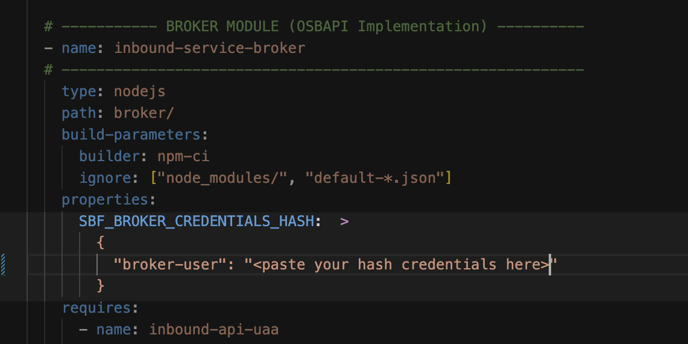
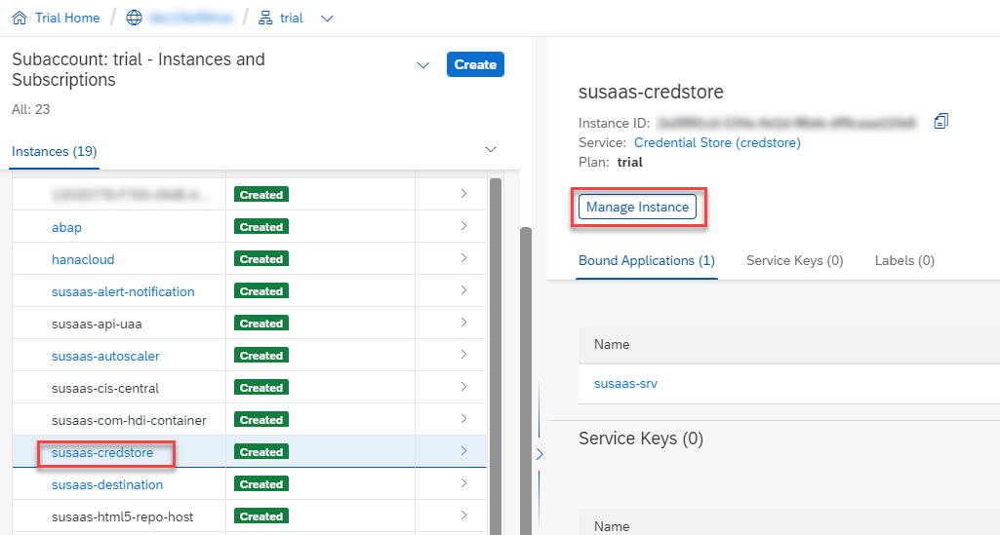
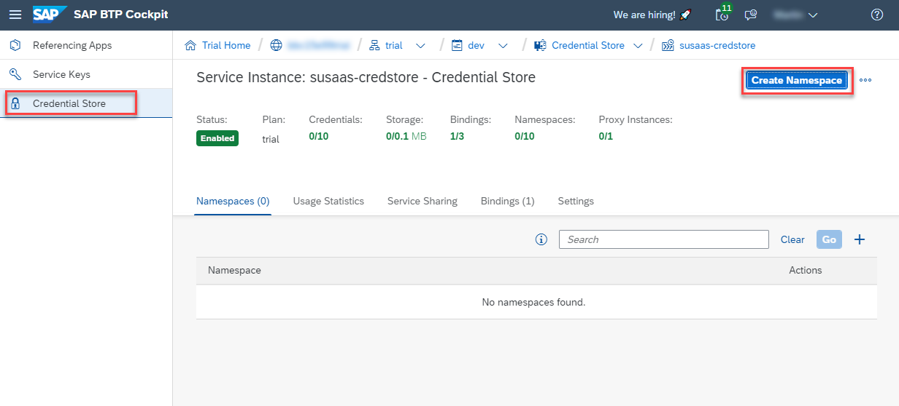

# Build and deploy the SaaS application

Before the deployment of the sample application, you need to build the project and do some basic steps which are required for security purposes. After deployment, please make sure that the required credential values are stored in the SAP Credential Store created during deployment.  

1. [Prepare the SaaS Application for deployment](#1-Prepare-the-SaaS-Application-for-deployment)
2. [Setup the Credential Store](#2-Setup-the-Credential-Store)
3. [Troubleshooting](#3-Troubleshooting)
4. [Further Information](#4-Further-Information)


## 1. Prepare the SaaS Application for deployment

Let's get started with the preparation of the codebase in which a few customizations need to be undertaken before you can start the build and deployment to your provider subaccount. 

1.1. (Fork and) Clone this repository, then checkout to the **basic** branch.

```sh
$ git checkout basic
```

1.2. Provide a receiver mail address in the **Alert Notification** service configuration which you can find in the **configs** directory.

[](./images/DEPL_EmailNotifSrv.png)

1.3. From the root directory please execute the following npm script to create catalog IDs and credentials for your service broker instance. 

```sh
$ npm run init:broker
```

1.4.  After completing Step 1.3. please note that your catalog IDs are added to your broker/catalog.json and you should see an output similar to the screenshot below. Store your plaintext password for later usage and please copy the hashed credentials which are highlighted below.

> **Important** - Please make sure to store the hashed and plaintext password in a secure place especially in a productive scenario that you and also other SAP BTP platform administrators can access at any time!  

[](./images/broker-credentials.png)

1.5. Go to your mta.yaml file and paste copied hashed credentials to the placeholder shown below.

[](./images/paste-creds.png)

> **Hint** - After this configuration please note that your service broker username is **broker-user** and the corresponding password is the plaintext password from **Step 1.3.**

1.6. Decide if you want to deploy the sample data CSV files with your project. We recommend using the SaaS API to push the respective data after the deployment of the solution.

The sample files provide content for end-to-end testing purposes like **Users**, **Projects**, **Assessments**, **Product** and **Sustainability Data**. This data is supposed to be used for **local development** and **testing scenarios** only. If for any reason you still want to deploy the sample CSV files stored in the [test directory](https://github.com/SAP-samples/btp-cf-cap-multitenant-susaas/tree/basic/test/data), please modify the *before-all* command section of your *build-parameters* in the **mta.yaml** file as follows. 

> **Important** - Keep in mind - if you deploy the application incl. sample files, existing table content will be overwritten!

```yaml
build-parameters:
  before-all:
    - builder: custom
      commands:
        ### Deployment w/o csv sample files ###
        #- npx -p @sap/cds-dk cds build --profile production

        ### Deployment w/ csv sample files ###
        - npx -p @sap/cds-dk cds build --profile production,csv
```

We highly recommend deploying the sample application **without** sample files as this might lead to confusion for your consumers. Instead, please use the SaaS API features if you want to push initial data for **Products** or **Sales Orders** to your consumer tenants. You can find the related documentation in the **Basic Scope** ([click here](../5-push-data-to-saas-api/README.md)).

1.7 Build your project from the root directory.

```sh
$ mbt build
```

1.8. Please run the command below to deploy the SaaS application to your provider subaccount. 

```sh
$ cf deploy mta_archives/<your_mtar_file>
```

1.9. After the deployment of the Alert Notification service instance, you should have an e-mail in your inbox, requiring a confirmation that you're willing to receive messages from Alert Notification. Please confirm this request accordingly.

> **Hint** - If you don't receive an e-mail, please make sure you successfully completed step 1.2. of the current chapter. If not, please repeat the previous steps or change the recipient in the existing Alert Notification service instance. Also check your Spam folder. 

[](./images/AN_ConfirmMail.png)

1.10. Once the deployment has finished, you're almost ready to go. To support some automation steps like the creation of routes or deployment of the API Service Broker in the consumer subaccounts, make sure not to miss the next step before settings up your first consumer subaccount. 


## 2. Setup the Credential Store

Before you learn how to subscribe new tenants in the next part of the mission, you need to provide two credentials in the Credential Store. These credentials are essential for some parts of the automated subscription process. 

2.1. In your provider subaccount, please go to the Instances and Subscriptions menu and click on your **susaas-credstore** instance or use the **Manage Instance** button. 

[](./images/CS_Service.png)

2.2. In the instance management, please switch to the **Credential Store** menu and click on **Create Namespace**. 

[](./images/CS_Namespace.png)

2.3. A namespace needs to be created together with the first credential value. Therefore, please select the Credential Type **Password** and click on **Next**. 

[](./images/CS_InitialValue.png)

2.4. In the following screen, define the namespace called **susaas** and provide the following credential value details.  

**Name**: btp-admin-user

**Value & Username**: 

Provide the e-mail address (Username) and password (Value) of an SAP BTP user which is used for automation purposes. Make sure this user has the **Subaccount Administrator** role-collection in your **Provider subaccount** and the **Space Developer** role in the respective Cloud Foundry space. In a Trial context, your current user should be sufficient. 

> **Hint** - If you don't want to use a personal/named user for this purpose, we recommend using a custom IdP and defining a technical user there. The usage of **P or S-User** for technical tasks is possible but especially for productive scenarios not recommended by SAP. 

[](./images/CS_AdminUser.png)

2.5. Please create a second **Password** credential value as described below.

**Name**: susaas-broker-credentials

**Value & Username**: 

As Value please provide the **Plaintext Password** of your API broker user. This password is required when registering the API broker in any of your consumer subaccounts during automation.

> **Hint** - You created this password in step 1.4 of "[Prepare the SaaS Application for deployment](#1-Prepare-the-SaaS-Application-for-deployment)". 
  [](./images/SB_PlainText.png)

As a Username please use the value **broker-user**. 

[](./images/CS_BrokerUser.png)


## 3. Troubleshooting

For troubleshooting please check the separate **Troubleshooting** section of this scope ([click here](../10-troubleshooting/README.md)).


## 4. Further information

Please use the following links to find further information on the topics above:

* [SAP Help - SAP Alert Notification service for SAP BTP](https://help.sap.com/docs/ALERT_NOTIFICATION?locale=en-US)
* [SAP Help - SAP Alert Notification service for SAP BTP Client](https://github.com/SAP/alert-notification-node-client)
* [npmjs - @sap/sbf Service Broker Framework](https://www.npmjs.com/package/@sap/sbf)
* [SAP Help - Multitarget Applications in the Cloud Foundry Environment](https://help.sap.com/docs/BTP/65de2977205c403bbc107264b8eccf4b/d04fc0e2ad894545aebfd7126384307c.html?locale=en-US)
* [SAP Help - Multitarget Application Commands for the Cloud Foundry Environment](https://help.sap.com/docs/BTP/65de2977205c403bbc107264b8eccf4b/65ddb1b51a0642148c6b468a759a8a2e.html?locale=en-US)
* [Cloud MTA Build Tool (MBT)](https://sap.github.io/cloud-mta-build-tool/)
* [SAP capire - Providing Initial Data](https://cap.cloud.sap/docs/guides/databases?q=hdbtabledata#providing-initial-data)
* [SAP capire - Configuration Profiles](https://cap.cloud.sap/docs/node.js/cds-env#profiles)
* [SAP Help - SAP Credential Store](https://help.sap.com/docs/CREDENTIAL_STORE?locale=en-US)