# Subscribe a Consumer Subaccount

In this part of the mission, you will learn how to subscribe your first tenant subaccount. The process is fairly simple if you followed the previous steps and also configured the credential store with the correct details. 

1. [SaaS application subscription](#1-SaaS-application-subscription)
2. [API Service Broker instance](#2-API-Service-Broker-instance)
3. [Initialize the SaaS application](#3-Initialize-the-SaaS-application)
4. [Improvement options](#4-Improvement-options)
5. [Troubleshooting](#5-Troubleshooting)
6. [Further Information](#6-Further-Information)

## 1. SaaS application subscription

1.1. Create a new subaccount for your SaaS consumer. Make sure the subaccount is in the same region as the provider subaccount (e.g., us10 in Trial environments). 

[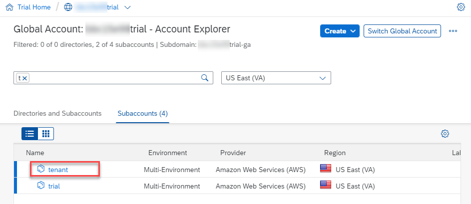](./images/SUB_SubsTenant.png)

1.2. In the new consumer subaccount, **do not** enable the SAP Cloud Foundry environment. It is not required for the Basic Scope of the mission. 

1.3. You can now create a new subscription in the consumer subaccount. Therefore, please go to **Instances and Subscriptions** and click on **Create**. 

[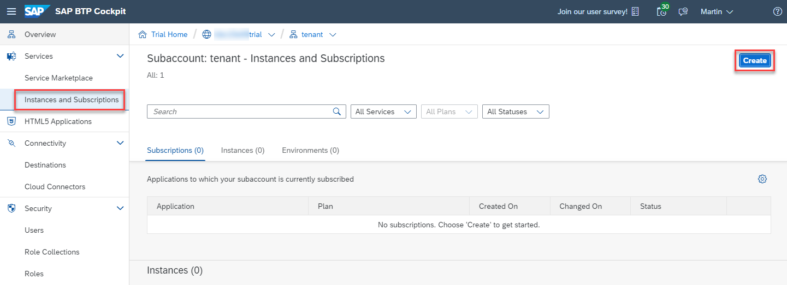](./images/SUB_CreateSub01.png)

1.4. Select the **Sustainable SaaS** service which might have a different name based on your provider's Cloud Foundry Space name. In the screenshot the Cloud Foundry space in the provider subaccount was named **dev**. 

[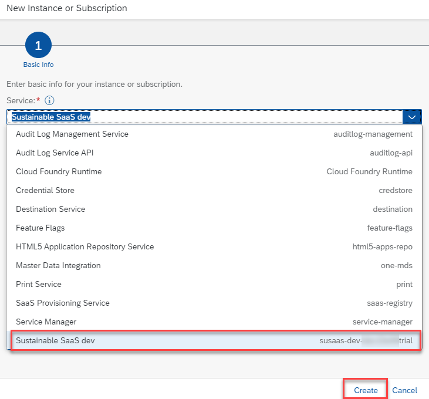](./images/SUB_CreateSub02.png)

1.5. Select the **default** plan and click on **Create**. 

1.6. Wait until your subscription is in Status **Subscribed**. 

[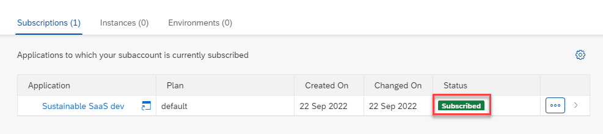](./images/SUB_CreateSub03.png)

## 2. API Service Broker instance

2.1. Create an instance of the API Service Broker which was registered in the consumer subaccount during the provisioning process. 

2.2. Therefore, go to the **Instances and Subscriptions** menu and click on **Create** again. Select the new **susaas-api** service from the list. 

[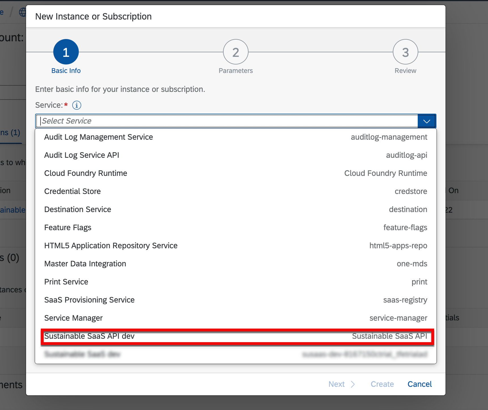](./images/SUB_CreateAPI01.png)

2.3. Decide for a service plan of your choice either **default** or **premium**. There is no difference in available features for testing purposes. As Runtime Environment select **Other** and give your instance a name like **susaas-api**. Then click on **Create**.

[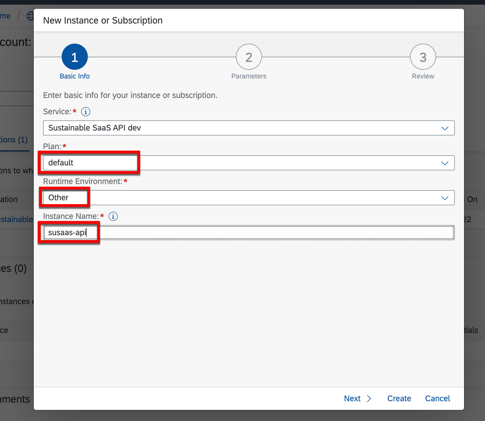](./images/SUB_CreateAPI02.png)

2.4. Once the instance is created, you will see it in your list of services. 

[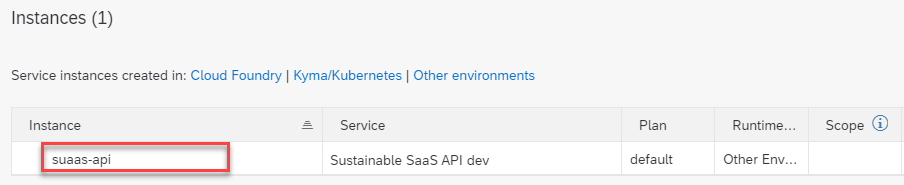](./images/SUB_CreateAPI02.png)

2.5. You can now create a **Service Binding** used by your API clients like e.g. SAP S/4HANA or in any other third party tool interacting with the SaaS API. In this sample the binding is named **default**. 

> **Hint** - Clicking on the service binding will show you the client credentials required for API access. 

[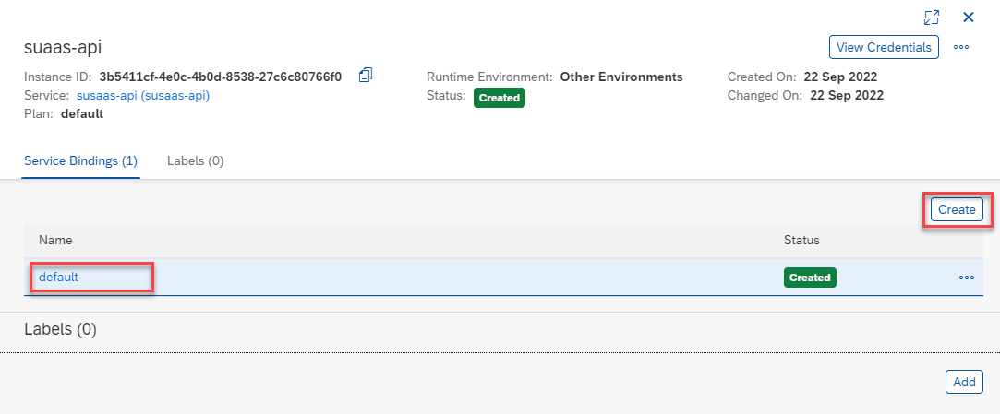](./images/SUB_CreateAPI04.png)

2.6. Here you see the a sample of the client credentials containing the actual API endpoint as well as the authentication endpoints, Client-ID and Client Secret which are essential for external access to the SaaS API. 

> **Important** - The Client-ID and Client Secret will be unique for each and every consumer tenant and tokens created using these credentials are used to identify a tenant interacting with this API.

2.7. Keep the last steps in mind, as you will need the client credentials in one of the next mission sections.

## 3. Initialize the SaaS application

Once the subscription of the SaaS application is successful and you created an API Service Broker instance, you (as a provider administrator) need to setup a first administrative user for your consumer's application instance.

> **Important** - As the SaaS application offers an in-app user management component, all regular consumer tenant users have to be created and managed from within the application. If you create users manually in SAP XSUAA and assign a role collection, these users will not show up in the in-app user management.  

3.1. To give the first tenant administrator access to the in-app user management, please **temporarily** assign the **Administrator** role collection to your provider administrator user (and Subaccount administrator) handling the onboarding process. This is the only time a **temporary** assignment of a role collection in the SAP BTP Cockpit takes place to complete the onboarding process by the provider administrator.

> **Hint** - The **Administrator** role collection allows users to create new projects, assign members to projects and to create assessments in the sample application. Furthmore, an administrator can add new users to the SaaS application. The **Member** role collection allows project members to create new assessments in a dedicated project. The **Extension** role collection is currently not used but in theory allows developers of a consumer tenant to extend the SaaS application using standard CAP extension features for SaaS Apps.

[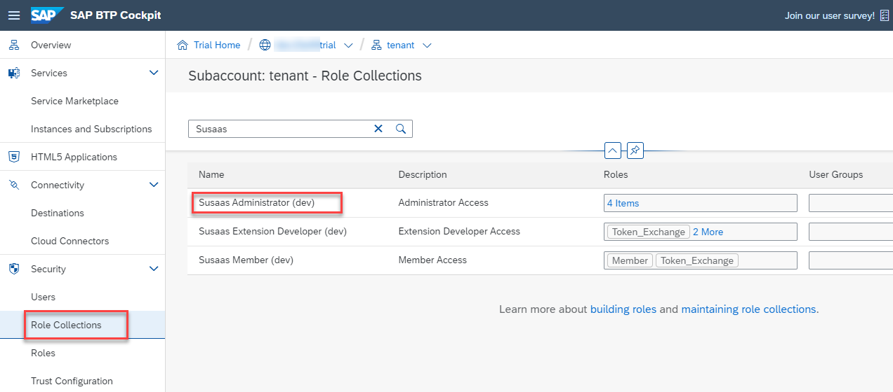](./images/SUB_InitApp01.png)

[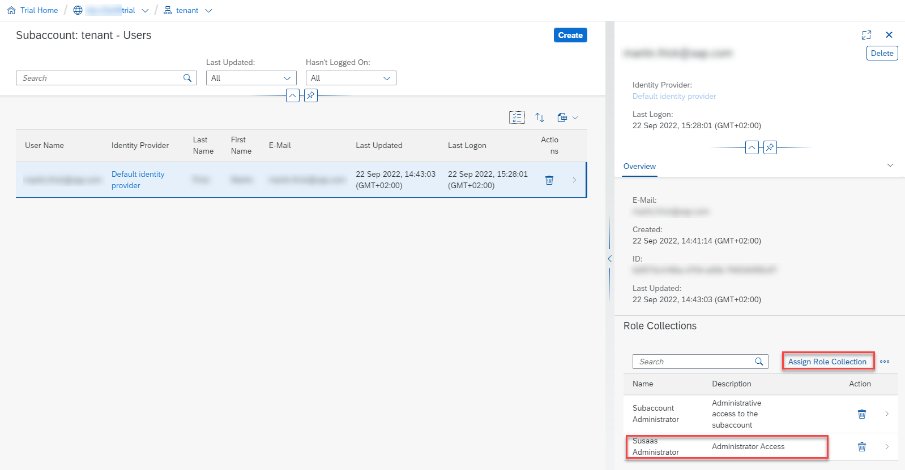](./images/SUB_InitApp02.png)

3.2. Once the role collection is assigned to you as a provider administrator (doing the initial onboarding), go back to the **Instances and Subscriptions** and open the subscription in an Incognito window so that the latest scopes are available after login. 

[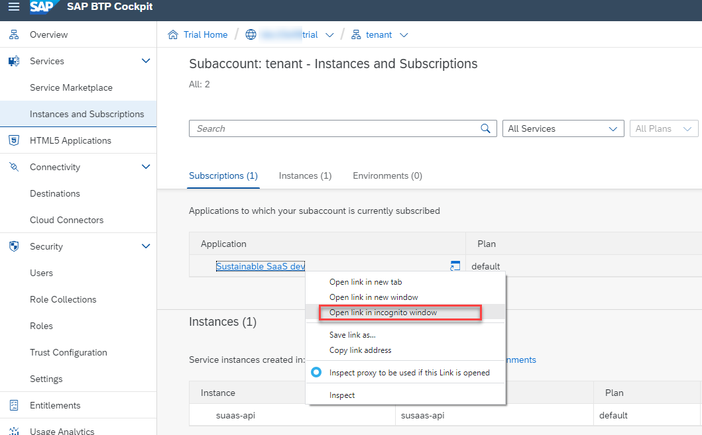](./images/SUB_InitApp03.png)

3.3. After successful login using your provider administrator user (and Subaccount administrator), open the **Manage Users** tile. 

[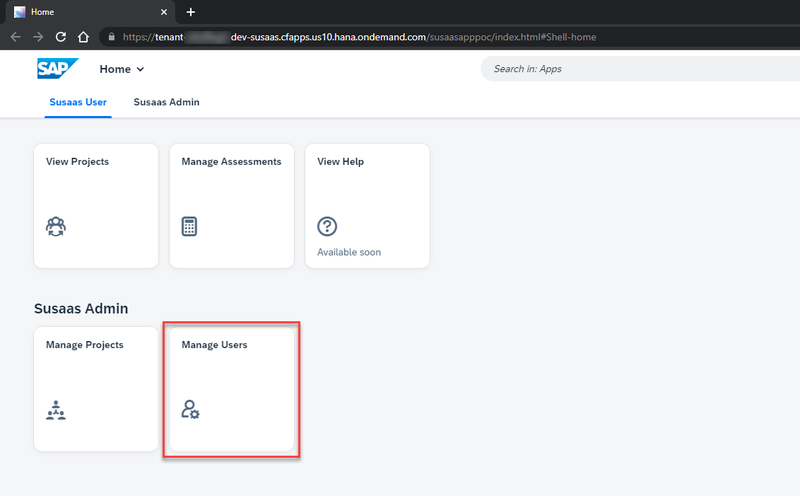](./images/SUB_InitApp05.png)

3.4. Click on **Create** to add a new tenant administrator user to the SaaS application. This will be the first administrative user of the application from a consumer perspective.

3.5. Provide the first and last name of the first tenant administrator and a valid email address. This email address has to be assigned to an existing SAP ID Service user (e.g., a valid S or P user)! 

> **Hint** - To create a new SAP ID Service account which can be used for this purpose, please follow [this tutorial](https://developers.sap.com/tutorials/hcp-create-trial-account.html).

3.6. Assign the required **Administrator** role using the selection field. Click on **Create** to setup the user in the SaaS tenant database container and to trigger an automated user creation + role assignment in the consumer subaccount. 

3.7. Clicking on the back arrow in the top left of your screen, you can back to the user list and should see the first tenant administrator user you just created as an provider administrator. 

3.8. Going back to the SAP BTP Cockpit, you will see the tenant administrator user you just created in the **Users** menu, with the respective Administrator role collection assigned. Remember not to create, change or delete any tenant user or administrator outside the in-app user management!

[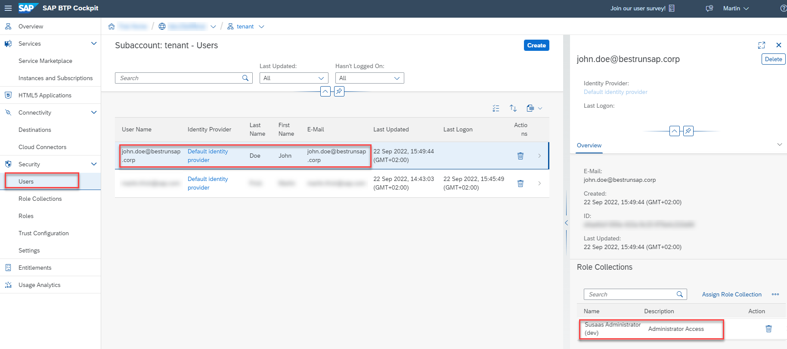](./images/SUB_InitApp10.png)

3.9. This tenant administrator user can now login to the tenant instance of the SaaS application and create further users or administrators using the in-app user management. Just provide them the URL of the subscription instance. 

[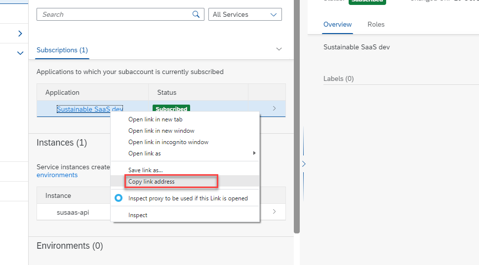](./images/SUB_TenantURL.png)

3.10. You can now remove the **Administrator** role collection from your own SAP BTP Subaccount administrator using the SAP BTP Cockpit features. Remember - The **temporary** role collection assignment was only required for the initial setup of the first **tenant administrator** user using the in-app user management.

## 4. Improvement options

Concerning automation of onboarding processes, some further aspects of the previous steps could be automated like:

- Automation of consumer subaccount onboarding
- Further subscription process automations
- Automation of first tenant administrator setup
- ...

These aspects have not been covered in the sample application but feel free to add further features to this sample using a pull request. 

## 5. Troubleshooting

For troubleshooting please check the separate **Troubleshooting** section of this scope ([click here](../10-troubleshooting/README.MD)).

## 6. Further Information

Please use the following links to find further information on the topics above:

* [SAP Help - Providing Multitenant Applications to Consumers](https://help.sap.com/docs/BTP/65de2977205c403bbc107264b8eccf4b/7a013f1d89f34a0084ea3d9a8bb2adbd.html?locale=en-US)
* [SAP Help - Create a Subaccount](https://help.sap.com/docs/BTP/65de2977205c403bbc107264b8eccf4b/05280a123d3044ae97457a25b3013918.html?locale=en-US)
* [SAP Help - Subscribe to Multitenant Applications Using the Cockpit](https://help.sap.com/docs/BTP/65de2977205c403bbc107264b8eccf4b/7a3e39622be14413b2a4df7c02ca1170.html?locale=en-US)
* [SAP Help - Managing Services Using the SAP BTP Cockpit](https://help.sap.com/docs/SERVICEMANAGEMENT/09cc82baadc542a688176dce601398de/cdce096d411242bcbfb9644d0860fd0f.html?locale=en-US)
* [SAP Help - Creating Service Instances in Cloud Foundry](https://help.sap.com/docs/SERVICEMANAGEMENT/09cc82baadc542a688176dce601398de/6d6846def3c443aa9f83d127353147ce.html?locale=en-US)
* [SAP Help - Creating Service Keys in Cloud Foundry](https://help.sap.com/docs/SERVICEMANAGEMENT/09cc82baadc542a688176dce601398de/6fcac08409db4b0f9ad55a6acd4d31c5.html?locale=en-US)
* [SAP Help - Security Administration: Managing Authentication and Authorization](https://help.sap.com/docs/BTP/65de2977205c403bbc107264b8eccf4b/1ff47b2d980e43a6b2ce294352333708.html?locale=en-US)
* [SAP Help - Assigning Role Collections to Users or User Groups](https://help.sap.com/docs/BTP/65de2977205c403bbc107264b8eccf4b/31532c77bd61421e9d40d100fd75ef52.html?locale=en-US)