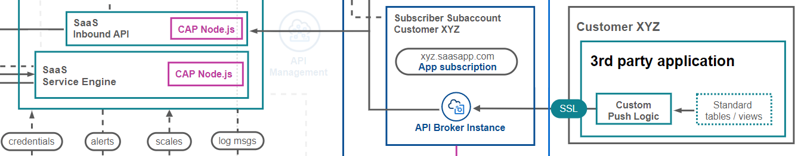
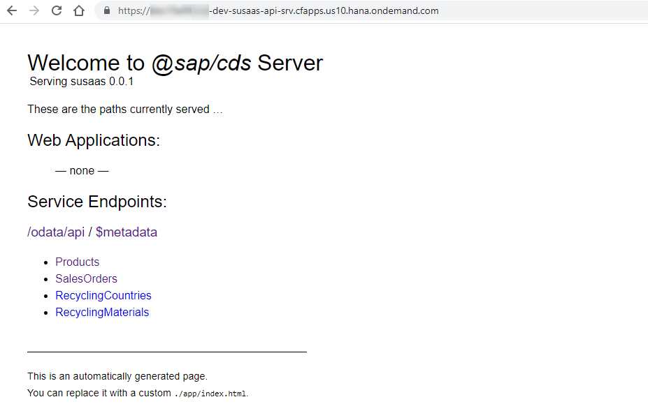
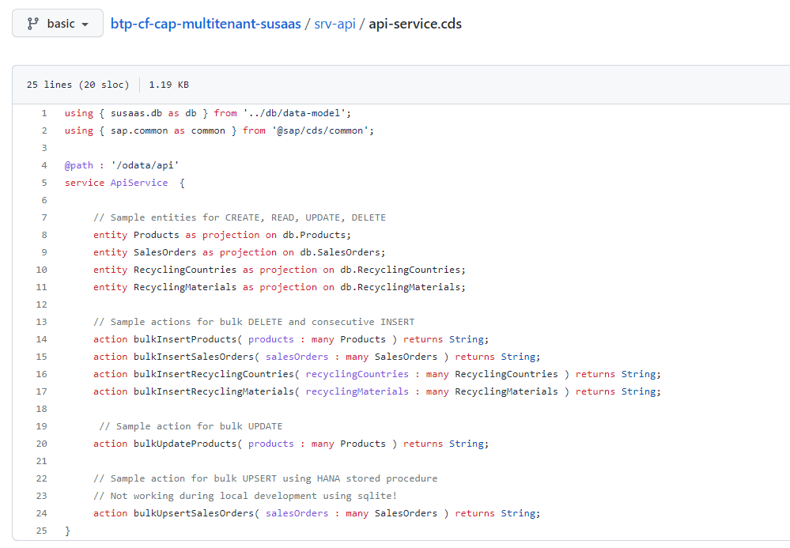
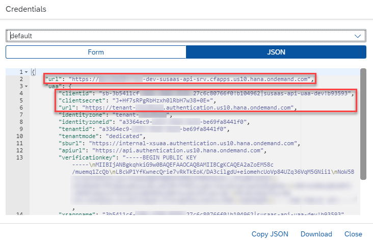
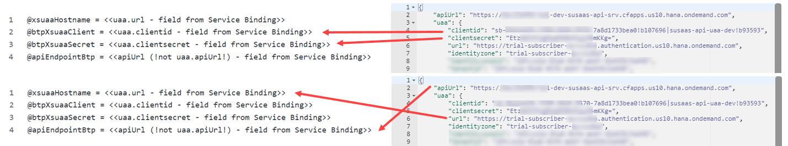

# Push data to the SaaS API

The SaaS application is equipped with a built-in API, that your SaaS consumers can use, to push data to their tenant database containers or to modify existing data. In this part of the mission, you will learn how to connect to this API endpoint as a consumer and push some sample data. 

1. [SaaS API access](#1-SaaS-API-access)
2. [Troubleshooting](#2-Troubleshooting)
3. [Further Information](#3-Further-Information)

In the Basic Scope, we will keep it short and simple and explain how to interact with the API using generic HTTP requests based on the HTTP sample files provided in the GitHub repository. You can run similar HTTP requests as provided below using tools like Postman or Insomnia. 

[](./images/API_ArchDetails.png?raw=true)


## 1. SaaS API access

Below you can see the tables of the tenant data model which can be maintained by consumers using the SaaS API. Besides product master data, SaaS consumers can also use the API for transactional data allowing them to prefill their Sustainability assessments.

[](./images/DM_Tables.png?raw=true)

The main entities like Products, Sales Orders and further Recycling content can be maintained using the API. As you can see, also some sample actions are provided for bulk inserts, updates, and upserts whereas the last one has been implemented as an SAP HANA Stored Procedure (click to enlarge). 

[](./images/API_Endpoints01.png?raw=true)
[](./images/API_Endpoints02.png?raw=true)

To connect to the SaaS API as a consumer, make sure you followed all steps described in the **Subscribe Consumer Subaccount** card or Readme document([click here](../4-subscribe-consumer-subaccount/README.md)). You will need the service binding credentials which you created in the API Broker service instance. If you haven't created this service binding yet, please go back and do it now. 

[](./images/API_ServiceKey.png?raw=true)

1.1. Within your development project change to the **http** directory. Here you will find sample API calls that you can use to push data to a tenant database container. In this sample we will push some **Product** data (*apiProducts.http*) to the SaaS API which will be stored in the respective database container. Make sure you have the required plugin installed (e.g., for VS Code) to run HTTP files.  

1.2. Each of the HTTP files contains a header section in which you can insert the tenant-specific service binding details used to connect to the SaaS API. Please update the parameters according to your values. Make sure **not to push** these changes back to GitHub! Either remove the credentials before saving or rename your HTTP files to ***-private.http** (e.g., apiProducts-private.http), which are excluded in the .gitignore file. 

[](./images/API_HttpCreds.png?raw=true)

> **Hint** - The *xsuaaHostname* is equal to the *uaa.url* parameter. The *apiEndpointBtp* equals the *apiUrl* parameter.

1.3. After updating the relevant parameters based on your tenant-specific service binding credentials, you can request the required OAuth token for accessing the SaaS API. Therefore, execute the following request which will return a Bearer token that can be used for the upcoming API calls.

> **Important** - If you're facing an **Unauthorized** error, please try to URL-encode (various web-tools or npm packages available to do so) your Client ID and Secret and try to fetch a token again!

```http
# @name getXsuaaToken

POST {{xsuaaHostname}}/oauth/token
Accept: application/json
Content-Type: application/x-www-form-urlencoded

client_id={{btpXsuaaClient}}
&client_secret={{btpXsuaaSecret}}
&grant_type=client_credentials
```

1.4. Once done, Run the following request to upload products to the SaaS API on behalf of your consumer tenant. The respective product data will be stored in the tenant database container and can be used to create new assessments in the SaaS application. The required access token is taken from the results of the previous OAuth request. 

> **Hint** - In the **Advanced Scope** of this mission, you will see that the sample EPM model provides the same data values, and your consumer's on-premise solutions like SAP S/4HANA will use the same API endpoint to push this sample product data. 

> **Important** - Be aware that using this API endpoint will erase all data before uploading your new product values to the respective tenant database container tables. 

```http
@access_token = {{getXsuaaToken.response.body.$.access_token}}

# @name uploadProductsBtp

POST {{apiEndpointBtp}}/odata/api/bulkInsertProducts
Authorization: Bearer {{access_token}}
Content-type: application/json

{
"products" : [
        {"ID":"HT-1000","typeCode":"PR","category":"Notebooks","supplierId":"0100000046","taxTarifCode":1,"measureUnit":"EA","weightMeasure":4.2,"weightUnit":"KG","price":956,"text":"Notebook Basic 15","language_code":"E","currency_code":"EUR"},
        {"ID":"HT-1001","typeCode":"PR","category":"Notebooks","supplierId":"0100000047","taxTarifCode":1,"measureUnit":"EA","weightMeasure":4.5,"weightUnit":"KG","price":1249,"text":"Notebook Basic 17","language_code":"E","currency_code":"EUR"},
        {"ID":"HT-1002","typeCode":"PR","category":"Notebooks","supplierId":"0100000048","taxTarifCode":1,"measureUnit":"EA","weightMeasure":4.2,"weightUnit":"KG","price":1570,"text":"Notebook Basic 18","language_code":"E","currency_code":"USD"},
        {"ID":"HT-1003","typeCode":"PR","category":"Notebooks","supplierId":"0100000049","taxTarifCode":1,"measureUnit":"EA","weightMeasure":4.2,"weightUnit":"KG","price":1650,"text":"Notebook Basic 19","language_code":"E","currency_code":"EUR"},
        {"ID":"HT-1055","typeCode":"PR","category":"Multifunction Printers","supplierId":"0100000069","taxTarifCode":1,"measureUnit":"EA","weightMeasure":6.3,"weightUnit":"KG","price":99,"text":"Multi Print","language_code":"E","currency_code":"EUR"},
        {"ID":"HT-1056","typeCode":"PR","category":"Multifunction Printers","supplierId":"0100000070","taxTarifCode":1,"measureUnit":"EA","weightMeasure":4.3,"weightUnit":"KG","price":119,"text":"Multi Color","language_code":"E","currency_code":"JPY"},
        {"ID":"HT-1060","typeCode":"PR","category":"Mice","supplierId":"0100000071","taxTarifCode":1,"measureUnit":"EA","weightMeasure":0.09,"weightUnit":"KG","price":9,"text":"Cordless Mouse","language_code":"E","currency_code":"EUR"},
        {"ID":"HT-1063","typeCode":"PR","category":"Keyboards","supplierId":"0100000074","taxTarifCode":1,"measureUnit":"EA","weightMeasure":2.1,"weightUnit":"KG","price":14,"text":"Ergonomic Keyboard","language_code":"E","currency_code":"BRL"},
        {"ID":"HT-1120","typeCode":"PR","category":"Keyboards","supplierId":"0100000065","taxTarifCode":1,"measureUnit":"EA","weightMeasure":1,"weightUnit":"KG","price":29,"text":"Cordless Bluetooth Keyboard","language_code":"0","currency_code":"EUR"}
    ]
}
```

1.5. Enrich the product data of your consumer tenants with further details by using the following request. It will update existing product records in the tenant database container with sales split details and additional sustainability notions. 

> **Hint** - You might ask yourself why these additional details are not part of the initial product data request?! Unfortunately, this advanced product information is not part of the EPM model and has been added for illustration purposes of a potential sustainability use-case. Therefore, it has to be provided by a manual upload or maintained in the SaaS application itself. 

> **Important** - Do not use this API with a larger payload, as it processes the records one after another as the CAP CQL UPDATE feature does not allow to provide multiple entity values. 

```http
# @name uploadProductsExtendedBtp

POST {{apiEndpointBtp}}/odata/api/bulkUpdateProducts
Authorization: Bearer {{access_token}}
Content-type: application/json

{
    "products" : [
        {"ID": "HT-1000","eolProductDesign": 43,"traditionalSalesShare": 82,"repairSalesShare": 8,"resellSalesShare": 10},
        {"ID": "HT-1001","eolProductDesign": 38,"traditionalSalesShare": 97,"repairSalesShare": 3,"resellSalesShare": 0},
        {"ID": "HT-1002","eolProductDesign": 35,"traditionalSalesShare": 87,"repairSalesShare": 5,"resellSalesShare": 8},
        {"ID": "HT-1003","eolProductDesign": 42,"traditionalSalesShare": 74,"repairSalesShare": 20,"resellSalesShare": 6},
        {"ID": "HT-1055","eolProductDesign": 56,"traditionalSalesShare": 98,"repairSalesShare": 1,"resellSalesShare": 1},
        {"ID": "HT-1056","eolProductDesign": 49,"traditionalSalesShare": 95,"repairSalesShare": 3,"resellSalesShare": 2},
        {"ID": "HT-1060","eolProductDesign": 25,"traditionalSalesShare": 99,"repairSalesShare": 0,"resellSalesShare": 1},
        {"ID": "HT-1063","eolProductDesign": 34,"traditionalSalesShare": 97,"repairSalesShare": 1,"resellSalesShare": 2},
        {"ID": "HT-1120","eolProductDesign": 28,"traditionalSalesShare": 95,"repairSalesShare": 2.5,"resellSalesShare": 2.5}
    ]
}
```

1.6. In case you want to upload the same data as provided in the sample CSV files ([click here](https://github.com/SAP-samples/btp-cf-cap-multitenant-susaas/tree/basic/test/data)), you can use the HTTP sample files below to do so. Simply provide the tenant-specific client credentials in the header of the HTTP files and you're ready to push the sample content to dedicated consumer tenants. Don't forget to rename your files to *-private.http to prevent them from being committed to Git. 

>**Hint** -  Please keep in mind, that you can also deploy your SaaS project **incl.** the CSV sample files instead of pushing the data using the API. This is fine for testing purposes **but** will overwrite existing data upon redeployment or upgrades of tenant database containers. 

- [Products](https://github.com/SAP-samples/btp-cf-cap-multitenant-susaas/blob/basic/http/apiProducts.http)
- [Sales Orders](https://github.com/SAP-samples/btp-cf-cap-multitenant-susaas/blob/basic/http/apiSalesOrders.http)
- [Recycling by Country](https://github.com/SAP-samples/btp-cf-cap-multitenant-susaas/blob/basic/http/apiRecyclingCountries.http)
- [Recycling by Material](https://github.com/SAP-samples/btp-cf-cap-multitenant-susaas/blob/basic/http/apiRecyclingMaterials.http)

1.7. After pushing all data provided in the HTTP files, you will be able to progress with the next part of this mission and test the application end-to-end. You can create Assessments for the uploaded sample products and even **prefill** Sales Order, Material, and Recycling sample values for certain products e.g., HT-1000 or HT-1001. Below you can see a sample Assessment that was created based on the provided data for product HT-1000.

[](./images/API_SampleHT1000.png?raw=true)

1.8. Feel free to go to the next part of the mission and test the consumer instance end-to-end.


## 2. Troubleshooting

For troubleshooting please check the separate **Troubleshooting** section of this scope ([click here](../10-troubleshooting/README.md)).


## 3. Further Information

Please use the following links to find further information on the topics above:

* [SAP Help - Creating Service Keys in Cloud Foundry](https://help.sap.com/docs/SERVICEMANAGEMENT/09cc82baadc542a688176dce601398de/6fcac08409db4b0f9ad55a6acd4d31c5.html?&locale=en-US)
* [Cloud Foundry Documentation - Client Credentials Grant](https://docs.cloudfoundry.org/api/uaa/version/76.1.0/index.html#client-credentials-grant)
* [VS Code - REST Client](https://marketplace.visualstudio.com/items?itemName=humao.rest-client)
* [SAP Help - HANA UPSERT Statement](https://help.sap.com/docs/HANA_CLOUD_DATABASE/c1d3f60099654ecfb3fe36ac93c121bb/ea8b6773be584203bcd99da76844c5ed.html?locale=en-US)
* [SAP Help - HANA Procedures](https://help.sap.com/docs/HANA_CLOUD_DATABASE/d1cb63c8dd8e4c35a0f18aef632687f0/d43d91578c3b42b3bacfd89aacf0d62f.html?locale=en-US)