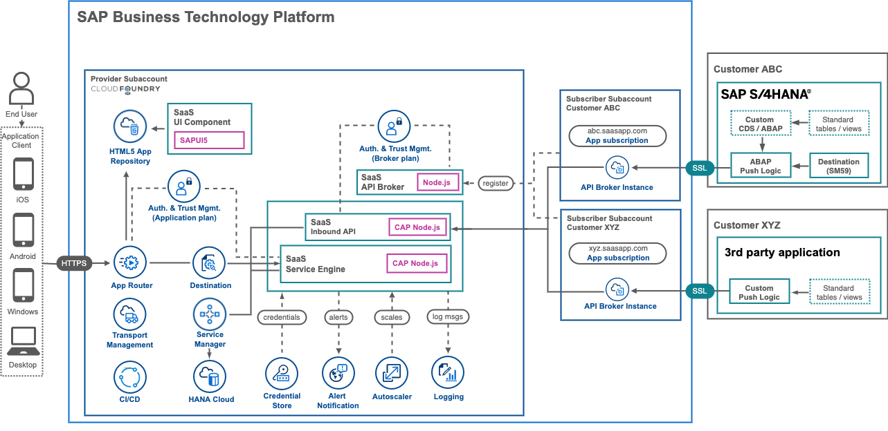
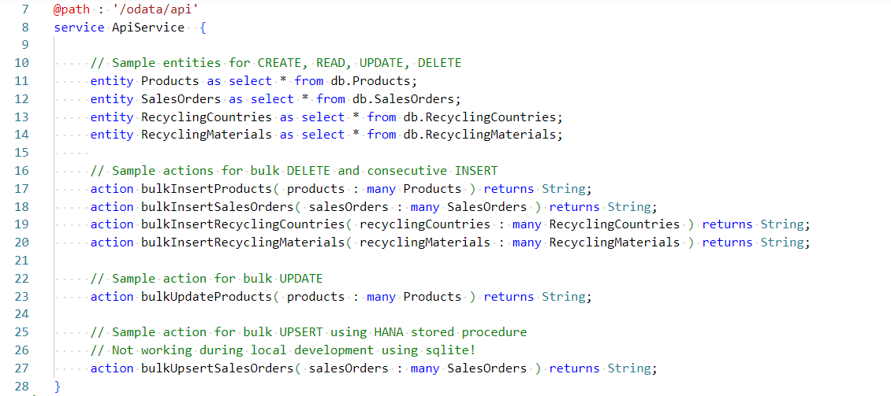
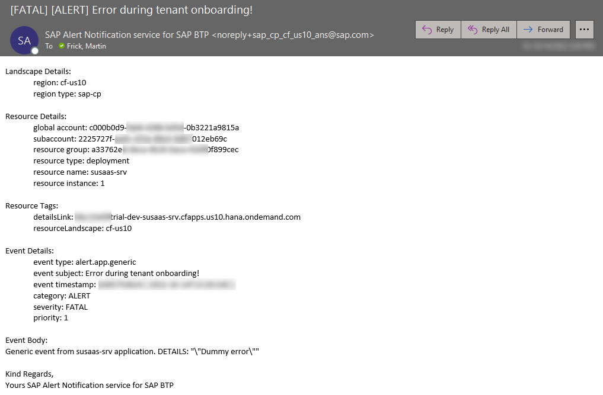

# Explore the application components

After you have deployed the sample application the following components will be available in your provider account:

1. [Application Router](#1-application-router) for handling multitenancy authentication 
2. [UI Component](#2-ui-component) providing the user interface of the app
3. [Business Application Service](#3-business-application-service) for onboarding and providing OData services
4. [API Service](#4-api-service) for external data integration
5. [API Broker](#5-api-broker) for creating an API Service Broker
6. [Tenant database containers](#6-tenant-database-containers) for tenant-specific data
7. [Shared database container](#7-shared-database-container) for data shared among all tenants
8. [Resiliency components](#8-Resiliency-components) to make the app more resilient
9. [Further information](#9-Further-Information)

This part of the mission will provide deeper insights into the different components and let you build up some expert knowledge about topics like **Service Brokers** or **Multitenancy**. The screenshot below shows the architecture of the **Basic Scope** which will run in the **trial** environment seamlessly.

[](./images/basic-arch1.png)


## 1. Application Router 

> **Important** - Find more details in the [Multitenancy Readme](./components/Multitenancy.md) Reamde document!

The application router is the single point of entry for an application running in the Cloud Foundry environment on SAP BTP. An application router can be used to serve static content, authenticate users, rewrite URLs, and forward or proxy requests to other microservices while propagating user and tenant information.

Each multitenant application has to deploy its own application router, and the application router handles requests of all tenants to the application. The application router is able to determine the tenant identifier out of the URL and then forwards the authentication request to the tenant User Account and Authentication \(UAA\) service and the related identity zone.


## 2. UI Component

The user interface of this sample application has been developed using **SAP Fiori Elements**. SAP Fiori Elements-based applications benefit from a template and metadata-driven approach. SAP Fiori Elements provides designs for UI patterns and predefined floorplans for common application use cases. App developers can use SAP Fiori Elements to create SAP Fiori applications based on OData services and annotations that don't need JavaScript UI coding. 

The resulting app uses predefined views and controllers that are provided centrally. This means no application-specific view instances are required. SAPUI5 interprets metadata and annotations of the underlying OData service and uses the corresponding views for the SAP Fiori app at startup. Still, SAP Fiori Elements-based applications can be easily extended with minimal coding effort.

To learn more about SAP Fiori Elements please check out the excellent [**SAP Fiori elements for OData V4 Feature Showcase**](https://github.com/SAP-samples/fiori-elements-feature-showcase/) and the links provided in the **Further Information** section.

## 3. Business Application Service

> **Important** - Find more details in the [Helper Classes](./components/HelperClasses.md) Reamde document!

The service layer of the sample application has been developed using the **SAP CAP** framework. It provides OData services for the UI component and has built-in support for multitenancy with an SAP HANA Cloud database. Furthermore, it provides the (un-)subscription callbacks required for tenant onboarding. While the OData service definition and the custom handlers are straightforward, most of the interesting code snippets can be found in the helper classes used for the automation of subscription requirements. The Business Application Service also contains the annotations required by SAP Fiori Elements for automatically rendering a proper UI. 


## 4. API Service 

> **Important** - Find more information on how to use the SaaS API in the following part of this mission ([click here](../5-push-data-to-saas-api/README.md))!


For consumers that want to push data to their database container instances of the SaaS solution, an API endpoint has been developed using CAP. Tenants can use this API to push data to their own SAP HANA HDI containers for calculation and analysis purposes. The API is accessible using client credentials provided to consumer tenants using a service instance of the SaaS API (Service) Broker. Check out the next card to find out how to push data to this API as a SaaS consumer.

Below you can see the available entities of the SaaS API. Besides application-related data like Product information or Sales Order records, also master data like Currencies, Languages, or Countries can be maintained using the API. 

[](./images/API_Endpoints.png)

Besides the default CRUD methods for entity maintenance, also some sample actions are provided allowing a bulk-insert (delete & insert) for the major application entities. 

Finally, you can find samples for OData actions allowing you to bulk-update products using CAP CQL UPDATE feature and to bulk-upsert Sales Orders using an SAP HANA Stored procedure.


## 5. API Broker 

> **Important** - Find more details in the [Service Broker](./components/ServiceBrokers.md) Reamde document!

Service brokers manage instances of services used by applications running in the Cloud Foundry runtime.

In Cloud Foundry, the service broker is responsible for maintaining and managing instances of service brokers and all available services. Services can be bound to applications that require the services provided by a service instance. Developers can use the service broker to bind service instances to the application that wants to make use of the services.

In this application scenario, we have created an API for SaaS consumers as a backing service. Therefore, the service broker is responsible of creating [SaaS API](#saas-api) service instances in the tenant subaccounts. 


## 6. Tenant database containers

The application provides a sample data model, which supports a flexible usage of SAP Fiori Elements for OData v4 including features like Draft support. This data model is deployed upon subscription of a consumer tenant into a new SAP HANA HDI database container. You don't have to take care of this process as it is automatically handled by the Service Manager Instance (*container* plan). Check the [**Further Information**](README.md#9-further-information) section to learn more about the HDI Containers managed by the Service Manager. Using the HANA Deployment Infrastructure (HDI) and associated containers, allows secure isolation of all tenant-related data. 

As CAP is a great backing service for the usage of SAP Fiori Elements providing the required OData services and annotations, also the data model structure has to be compliant with an easy-to-consume user interface usage.

Furthermore, the requirement for a tenant-based SaaS API is fulfilled by dedicated tables which each consumer can maintain using the SaaS API. By decoupling these tables from draft-enabled application tables, consumers can decide to prefill content into their assessments but are also flexible in setting up their own scenarios using the manual data input. 

Below you can see an overview pf the tables deployed into new tenant database containers upon subscription.

[](./images/DM_Tables.png)

> **Hint** - The **Roles** table is only used for local development scenarios. If running the app in SAP BTP, the roles are automatically fetched from SAP XSUAA and no separate storage is required. 


## 7. Shared Database Container

> **Important** - Find more details in the [Shared Container](./components/SharedContainer.md) Reamde document!

To have the ability to share data among your consumer tenants, a shared database container is set up for the sample scenario. This allows the provider to maintain e.g. master data (Languages, Countries, Currencies) in a central place and update it simultaneously for all consumer tenants. This concept is building on the cross-container access capabilities of database containers in the same Cloud Foundry Space. 


## 8. Resiliency components

To make your SaaS application more resilient additional services are used by the solution. 

**Autoscaler**

The Autoscaler is declared in the deployment descriptor and scaling rules can be defined in the respective **requires** section of the applications using the Autoscaler service instance. Below you can see an up- or downscale based on memory and CPU consumption of the business application service. 

```yaml
  # ----------------- AUTOSCALER  ------------------------------------
  - name: susaas-autoscaler
  # ------------------------------------------------------------------
    type: org.cloudfoundry.managed-service
    parameters:
      service: autoscaler
      service-plan: standard
```

```yaml
  # --------------------- SERVER MODULE ------------------------
  - name: susaas-srv
  # ------------------------------------------------------------
    type: nodejs
    path: gen/srv
    ...
    
    requires:
      - name: susaas-autoscaler
        parameters:
          config:
            instance_min_count: 1
            instance_max_count: 2
            scaling_rules:
            - {"metric_type": "memoryutil","threshold": 80,"operator": ">=","adjustment": "+1"}
            - {"metric_type": "memoryutil","threshold": 60,"operator": "<","adjustment": "-1"}
            - {"metric_type": "cpu","threshold": 80,"operator": ">=","adjustment": "+1"}
            - {"metric_type": "cpu","threshold": 30,"operator": "<","adjustment": "-1"}
```

**Alert Notification**

The Alert Notification service instance is declared in the deployment descriptor ([mta.yaml](https://github.com/SAP-samples/btp-cf-cap-multitenant-susaas/blob/basic/mta.yaml)) and further detailed configurations can be found in an additional config file ([configs/alert-notif.json](https://github.com/SAP-samples/btp-cf-cap-multitenant-susaas/blob/basic/configs/alert-notif.json)).

```yaml
  # ----------------- ALERT NOTIFICATION  ---------------------------- 
  - name: susaas-alert-notification
  # ------------------------------------------------------------------
    type: org.cloudfoundry.managed-service
    parameters:
      service: alert-notification
      service-plan: standard
      service-name: susaas-alert-notification
      path: ./configs/alert-notif.json
```

As already explained, please make sure to update the recipient's e-mail address in the config file before deploying the solution. After deployment, check your inbox to confirm that Alert Notification may sent e-mails to you.

```json
{
    "actions": [
        {
            "type": "EMAIL",
            "name": "send-email",
            "state": "ENABLED",
            "properties": {
                "destination": "recipient@example.org",
                "useHtml": "false"
            }
        }
    ]
}
```

Besides default lifecycle events being monitored by Alert Notification like **Stop** or **Crash** of your application, also a generic alert is defined in the config file. This event type can e.g., be used from within your application coding. 

```json 
{
    "name": "Audit-App-Process-Crash",
    "propertyKey": "eventType",
    "propertyValue": "audit.app.process.crash"
},
{
    "name": "Alert-App-Generic",
    "propertyKey": "eventType",
    "propertyValue": "alert.app.generic"
}
```

A sample of how to manually trigger an Alert Notification event can be found in the error handler of the subscription **UPDATE** implementation ([srv/provisioning.js](https://github.com/SAP-samples/btp-cf-cap-multitenant-susaas/blob/basic/srv/provisioning.js)). The respective helper class can be found in the srv/utils folder ([srv/utils/alertNotification.js](https://github.com/SAP-samples/btp-cf-cap-multitenant-susaas/blob/basic/srv/utils/alertNotification.js)).

```js
try {
    let automator = new Automator();
    await automator.deployTenantArtifacts(tenant, tenantSubdomain, user);
} catch (error) {
    console.log("Automation skipped!");
    await alertNotification.sendEvent({
        type : 'GENERIC',
        data : {
            body : JSON.stringify(error),
            subject : 'Error during automation of tenant onboarding!',
            eventType : 'alert.app.generic',
            severity : 'FATAL',
            category : 'ALERT'
        }
    });
}
```

The result of such a custom event looks similar to the following screenshot.

[](./images/AN_ErrorMail.png)


## 9. Further information

Please use the following links to find further information on the topics above:

* [SAP Help - Application Router](https://help.sap.com/docs/BTP/65de2977205c403bbc107264b8eccf4b/01c5f9ba7d6847aaaf069d153b981b51.html?locale=en-US)
* [SAP Help - Multitenancy](https://help.sap.com/docs/BTP/65de2977205c403bbc107264b8eccf4b/5310fc31caad4707be9126377e144627.html)
* [npmjs - @sap/approuter](https://www.npmjs.com/package/@sap/approuter)
* [Fiori Design Guidelines - SAP Fiori Elements](https://experience.sap.com/fiori-design-web/smart-templates/)
* [SAPUI5 - Developing Apps with SAP Fiori Elements](https://sapui5.hana.ondemand.com/sdk/#/topic/03265b0408e2432c9571d6b3feb6b1fd)
* [GitHub - SAP Fiori Elements for OData V4 Feature Showcase](https://github.com/SAP-samples/fiori-elements-feature-showcase/)
* [CAP documentation - Serving Fiori UIs](https://cap.cloud.sap/docs/advanced/fiori)
* [CAP documentation - Welcome to CAP](https://cap.cloud.sap/docs/)
* [SAP Blog - The hidden life of ServiceManager handled containers](https://blogs.sap.com/2021/02/15/the-hidden-life-of-servicemanager-handled-containers/)
* [Youtube - In 1 Take HiddenLife](https://www.youtube.com/playlist?list=PLh-wY37tGNym7zeZB2lxpL8JueLbepWDA)
* [Youtube - Multitenant Business Applications with CAP](https://blogs.sap.com/2021/06/03/getting-started-with-multitenant-business-applications-on-sap-btp-continued-hands-on-video-tutorials/)
* [SAP Help - Application Autoscaler](https://help.sap.com/docs/Application_Autoscaler?locale=en-US)
* [SAP Help - SAP Alert Notification service for SAP BTP](https://help.sap.com/docs/ALERT_NOTIFICATION?locale=en-US)