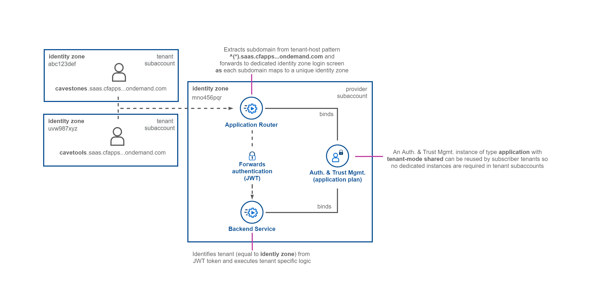
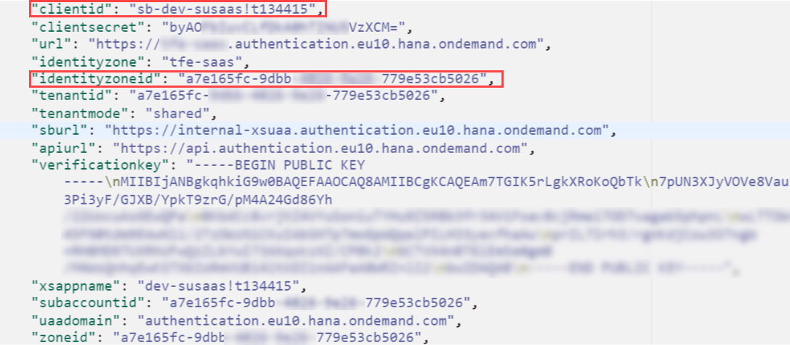
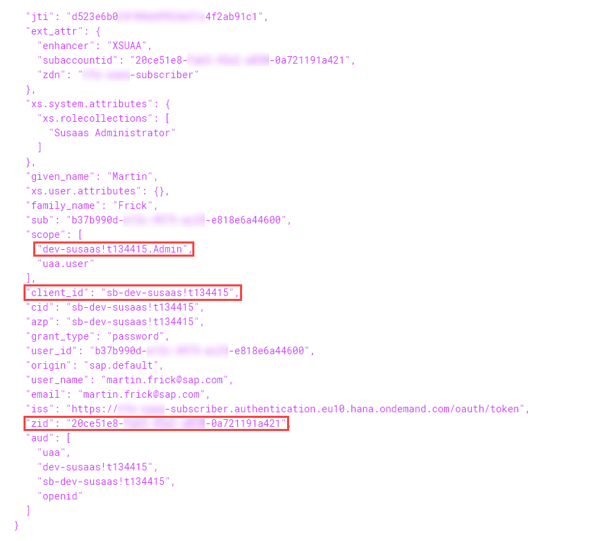

# Deep Dive into Multitenancy

In this part of the mission, you will learn about different aspects of multitenancy and how multitenancy is handled by the SaaS application.

1. [Application Router](#1-Application-Router) 
1.1. [Application Router and identiy zones](#11-Application-Router-and-identiy-zones) 
1.2. [Application Router and multitenancy authentication](#12-Application-Router-and-multitenancy-authentication)

2. [Authorization & Trust management service](#2-Authorization-&-Trust-management-service) 
2.1. [shared tenant-mode](#21-Authorization-&-Trust-management-service---shared-tenant-mode) 
2.2. [application plan](#22-Authorization-&-Trust-management-service---application-plan)

## 1. Application Router

The application router is the single point-of-entry for an application running in the Cloud Foundry environment on SAP BTP. The application router is used to serve static content, authenticate users, rewrite URLs, and forward or proxy requests to other micro services while propagating user information. 

### 1.1. Application Router and identiy zones

Each multitenant application has to deploy its own application router, and the application router handles requests of all tenants to the application. The application router is able to determine the tenant identifier from the URL subdomain and then forwards the authentication request to the User Account and Authentication (UAA) service and the related identity zone. Each identity zone can be uniquely identified by a subdomain identifier. An identity zone is a logical boundary around the entities UAA manages. 

Those entities in a zone include and define e.g.:
- Users
- Group mappings
- Identity providers (IDPs) and access

This allows each tenant subaccount to handle users and authentication processes independently by e.g. using a custom IDP. As each request to the application router is forwarded to the correct identity zone, this allows a very flexible authentication approach. To read more about identity zones please refer to the official Cloud Foundry documentation ([click here](https://docs.cloudfoundry.org/uaa/uaa-concepts.html#iz)).

### 1.2. Application Router and multitenancy authentication

The followings steps are happening during authentication of consumer requests in a multitenant application. To learn more about the prerequistes like tenant-mode **shared** and the **application** service plan, please read the following sections providing more details. 

The application router must determine the tenant-specific subdomain for the UAA that in turn determines the identity zone, used for authentication. This determination is done by the `TENANT_HOST_PATTERN` environment variable. The `TENANT_HOST_PATTERN` is a string containing a regular expression with a capturing group. The request host is matched against this regular expression. The value of the first capturing group is used as the tenant subdomain.

If you have multiple routes to the same application, for example `tenant1.<application domain>` and `tenant2.<application domain>` the respective `TENANT_HOST_PATTERN` could be `^(.*).<application domain>` capturing the group `tenant1` and `tenant2`.

This URL-based method of identifying a tenant by handling consumer-specific authentication requirements is also depicted in the following visualization. Together with the steps described below, you should get a good idea of how multitenancy in SAP BTP is implemented. 

1) The application router derives the identity zone identifier from the URL using the `TENANT_HOST_PATTERN` approach described above. Each consumer subaccount maps to a unique identity zone and a unique subdomain associated to this identity zone. 

2) The application router calls the tenant-aware XSUAA service, which is responsible for the authentication of the business user.

3) XSUAA reads the tenant and gets the consumer-specific identity provider (IdP) from the tenant-specific identity zone. 

4) XSUAA delegates the authentication to the configured IdP, and creates a JSON Web Token (JWT) that contains the tenant, the current user, and the authorization scopes of the user. 

5) The JWT is then sent back to the application router, and from there to the application.

6) To read and store tenant-specific data, the multitenant application needs to know the tenant ID. 

7) To retrieve the tenant ID, the multitenant application reads the tenant, user, and scopes from the given JWT. 

8) The tenant information is contained in the identityZone user attribute.

    >Sample Java Code to get the user's identityZone 
    >UserInfo userInfo = SecurityContext.getUserInfo();  
    >String identityZone = userInfo.getIdentityZone();

Learn more about the multitenancy concept using 

- SAP Help documentation ([click here](https://help.sap.com/docs/BTP/65de2977205c403bbc107264b8eccf4b/5af9067322214e8dbf354daae44cef08.html?locale=en-US)).
- Fundamentals of Multitenancy in SAP BTP ([click here](https://blogs.sap.com/2022/08/27/fundamentals-of-multitenancy-in-sap-btp/)).

## 2. Authorization & Trust management service

### 2.1. Authorization & Trust management service - **shared** tenant-mode

The tenant-mode **shared** allows you to share an UAA service instance of type **application** in a multitenant scenario. This is a central requirement of a multitenant application, as otherwise a separate UAA service instance would be required in each and every consumer subaccount. As all tenants share the same XSUAA instance and only the authentication is delegated to the respective tenant identity zone, this is a great process simplification.  

In a normal scenario in which the tenant-mode **dedicated** is set, XSUAA (overall) would only issue a token for a user, if he authenticates against the identity-zone in which the Auth. & Trust mgmt. service instance was created. If a user would authenticate using another identity-zone authentication endpoint (e.g. **consumer**.authentication.eu10.hana.ondemand.com), using the same Client-ID and Client Secret of the service binding, it fails. The Client-ID and Client Secret can only be used by a **dedicated** identity-zone which is the identity-zone in which the Auth. & Trust mgmt. service instance was created. 

In a tenant-mode **shared** scenario, XSUAA (Overall) will also issue tokens to users authenticating via other identity-zones (e.g. consumer.authentication.eu10.hana.ondemand.com), using the exact same Client-ID and Client-Secret which is bound to the application router via service binding to retreive the token. Nevertheless XSUAA will only issue a token for identity-zones of consumer subaccounts and keeps track of these consumer identity-zones. The Auth. & Trust mgmt. service instance though will be **shared** among multiple identity-zones and allows authentication using the exact same Client-ID and Client-Secret (taken from the service binding of the application router) for users authenticated via various identity zones. 

After authenticating with the **shared** client credentials to the identity-zone of the consumer, XSUAA will issue the respective scopes of the user within the consumer subaccount. These scopes are generated in the consumer subaccount upon subscription and have the same values in each an every subaccount based on the `<xsappname>!t<tenant index>` format mentioned in the **application** plan like e.g. "dev-susaas!t134415.Admin",

Below you can see two screenshots of the provider service credentials and a token issued for one of the consumer tenants. You can see that the consumer token has been issued using the Client-ID of the provider subaccount Auth. & Trust mgmt. service instance. Still the identity zone (zid) differs from the identiy zone of the provider subaccount. 

**Client Credentials** (Provider subaccount)

**Authorization Token** (Tenant subaccount)

### 2.2. Authorization & Trust management service - **application** plan

The service plan **application** requires that the xsappname which is specified in the xs-security.json file is unique in the Cloud Foundry landscape within each tenant (SAP BTP subaccount) in which the application is deployed. This means that an application may be deployed in several SAP BTP subaccounts at the same time but not twice in the same tenant (unless you modify the xsappname in xs-security.json). You would get an error message during the second deployment. 

The xsappname that is written into the credentials section of the environment is enhanced with a suffix and has the format `<xsappname>!t<tenant index>`. The tenant index is a running number that the UAA maintains internally. It differs from subaccount to subaccount. 

In a multitenant scenario, the actual application instances only exist in the provider subaccount, whereas XSUAA related objects like scopes, role templates and role collections are duplicated during the subscription process. Scopes have an equal format `<xsappname>!t<tenant index>.<scope>` in all consumer subaccounts e.g. **dev-susaas!t134415.Admin**.
