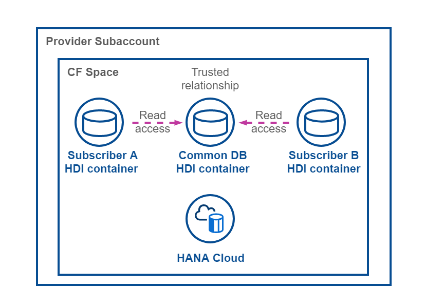
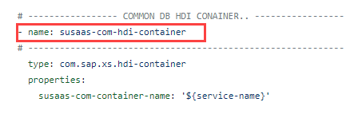
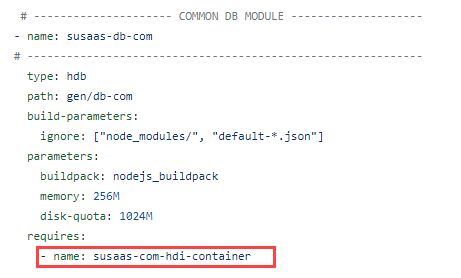
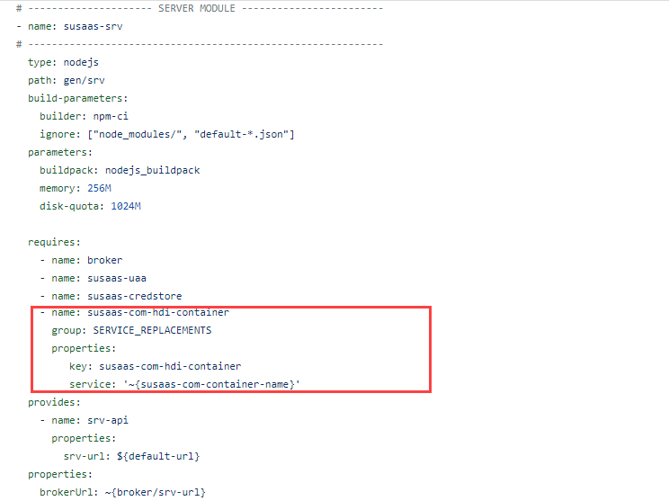

# Shared Database Container

To have the ability to share data among your consumer tenants, a shared database container is setup for this sample scenario. This allows you as a provider to maintain e.g., master data  like **Languages**, **Countries** or **Currencies** in a central place and update it for all consumer tenants. 

1. [Deployment descriptor](#1-Deployment-descriptor)
2. [Tenant Database Container](#2-Tenant-Database-Container)
3. [Keep in mind](#3-keep-in-mind)

This concept is building on the cross-container-access capabilities of database containers in the same Cloud Foundry Space. In this sample scenario, the shared database container is used to share a sample table called and master data along the tenant database containers.

[](./images/CD_Flow.png)


## 1. Deployment descriptor

The HDI container required for the shared data is defined in the mta.yaml file and created during deployment of the SaaS application to the provider subaccount. For the tenant database container instances, SAP Service Manager (container plan) takes care of the container lifecycle. For that reason, there is no need to specify any resources for these tenant-specific containers in the mta.yaml file. 

[](./images/CD_MtaRes.png)

To deploy content (like tables and views) to your shared database container, an additional module definiton is required resulting in a Node.js application repsonsible for the deployment of your shared database artifacts.

[](./images/CD_MtaMod.png)

To allow access from your tenant-specific database containers to the shared database container, it needs to be added as a dependency to the SaaS service module. This is a prerequisite as the required dependeny between a new tenant database containers and the shared database container needs to be resolved upon subscription of each new consumer tenant. As the subscription is handled by the SaaS Service module, it is essential to provide the binding in form of a so called **Service Replacement**. 

[](./images/CD_MtaReq.png)


## 2. Tenant Database Container

The concept of cross-container-access is based on a trusted relation between containers in the same Cloud Foundry Space. Still, to make the shared database container accessible from your tenant-specific database containers, some prerequistes need to be fulfilled. 

>**Important** - The concept of cross-container-access is very powerful but not trivial. Please refer to the official documentation in SAP Help to learn more ([click here](https://help.sap.com/docs/HANA_CLOUD_DATABASE/b9902c314aef4afb8f7a29bf8c5b37b3/4adba34bd86544a880db8f9f1e32efb7.html?&locale=en-US)).

**db-com/data-model.cds**
```json
context susaas.common {
    entity Shared : cuid {
        value : String;
    };
}
```

First of all, you need to assign the technical users of your tenant containers dedicated access roles defined in the shared database container. Therefore, a role **COM_EXTERNAL_ACCESS** is defined in the shared database container, providing **READ** access to a shared sample table called **SUSAAS_COMMON_SHARED** (see definition above). Same applies for the shared tables containing master data like **Countries** or **Currencies**. For the so called **Object Owner(s)** of the accessing tenant database containers, a similar role **COM_EXTERNAL_ACCESS#** is required, which includes the same permissions **including grant option**. 

**db-com/src/COM_EXTERNAL_ACCESS.hdbrole**

```json
{
    "role": {
        "name": "COM_EXTERNAL_ACCESS",
        "object_privileges": [
            { 
                "name":"SUSAAS_COMMON_SHARED", 
                "type":"TABLE", 
                "privileges":[ "SELECT" ], 
                "privileges_with_grant_option":[] 
            },
            { 
                "name":"SAP_COMMON_COUNTRIES", 
                "type":"TABLE", 
                "privileges":[ "SELECT" ], 
                "privileges_with_grant_option":[] 
            }
            ...
        ]
    }
}
```

These roles can now be used in the tenant database containers, where they need to be assigned to the **Object Owner(s)** and **Application User(s)** using a so called **.hdbgrants** file. This file is processed before deployment of a new tenant database container starts. It and ensures, that the technical users used during creation of new tenant datatabae container (but also during runtime access) have the required permissions to access the shared database container. 

**db/cfg/COM.hdbgrants**
```json
{
    "susaas-com-hdi-container": {
        "object_owner": {
            "container_roles": [
                "COM_EXTERNAL_ACCESS#"
            ]
        },
        "application_user": {
            "container_roles": [
                "COM_EXTERNAL_ACCESS"
            ]
        }
    }
}
```

After ensuring the technical users of new tenant database containers are assigned the reuqired roles to access the shared database container, you need to define so called **synonyms** for the shared target objects (e.g., tables or views). Therefore, two files are required. A so called **.hdbsynonymconfig** and a **.hdbsynonym** file. 


**db/cfg/COM.hdbsynonymconfig**
```json
{
    "SUSAAS_COMMON_SHARED": {
        "target": {
            "object": "SUSAAS_COMMON_SHARED",
            "schema.configure": "susaas-com-hdi-container/schema"
        }
    },
    "SAP_COMMON_COUNTRIES": {
        "target": {
            "object": "SAP_COMMON_COUNTRIES",
            "schema.configure": "susaas-com-hdi-container/schema"
        }
    },
    ...
}
```

**db/src/COM.hdbsynonym**
```json
{
    "SUSAAS_COMMON_SHARED": {},
    "SAP_COMMON_COUNTRIES": {},
    ...
}
```

Whereas the hdbsynonym file defines your synonym database object, the hdbsynonymconfig file is processed before the provisioning of a new tenant database container and provides configuration information to the Node.js deployer. In this case, the deployer is advised to dynamically read the schema name of the shared database container from the container service details. As no fixed schema name is defined for the shared database container (e.g., in the mta.yaml), the schema name is automatically generated upon deployment of the SaaS application. That's why for required references in the tenant database containers, we need to read the schema name dynamically from the container service binding details. See it as some kind of dynamic replacement instead of providing the unique schema name which could be something like ABC123XYZ987DEF456UVW.... 

The synonyms can now be used in CDS model definitons or other native SAP HANA database objects like Views or Calculation Views. Just make sure to use `@cds.persistence.exists` annotation in case of a CDS usage, to prevent the cds compiler from creating a new database artifact for the existing synonym.  

**db/data-model.cds**
```json
context susaas.common {
      @cds.persistence.exists
      entity Shared : cuid {
            value  : String;
      }
}

@cds.persistence.exists
extend sap.common.Countries {} 
```


## 3. Keep in mind

Please keep in mind that for database container backups, cross-container-access requirements cause some additional complexity. If you export a tenant database container and plan to import it again, you first need to ensure that the technical users of the new target database container (which you're planning to import the backup in) need to have the correct shared database container roles assigned (see hdbgrants details above) before applying the backup. 

> **Hint** - The hdbgrants files will not be applied in this case and you need to assign roles manually using the HDI Container APIs of the shared database container ([click here](https://help.sap.com/docs/SAP_HANA_PLATFORM/3823b0f33420468ba5f1cf7f59bd6bd9/40ba784dcaf44989b23f7eda316b4a0b.html?locale=en-US)). 