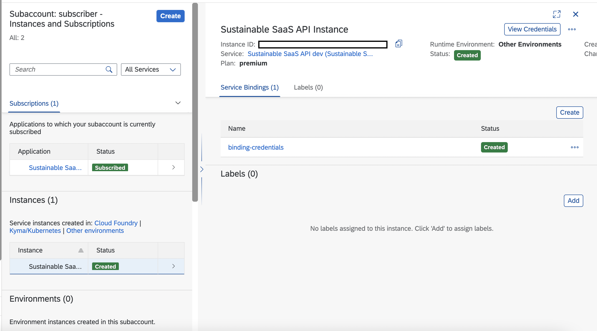
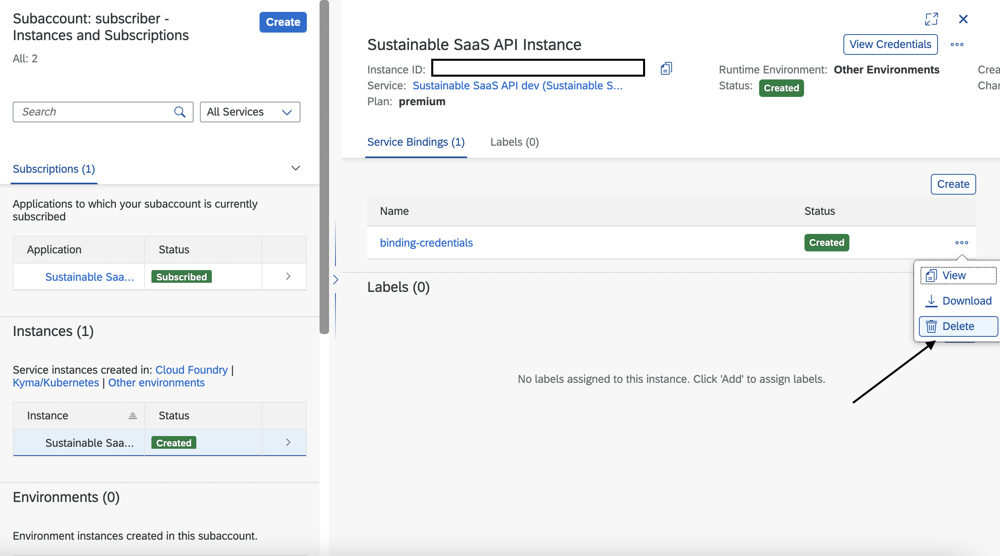
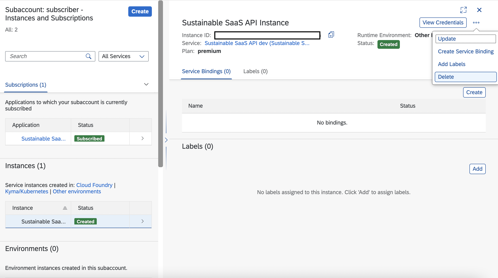
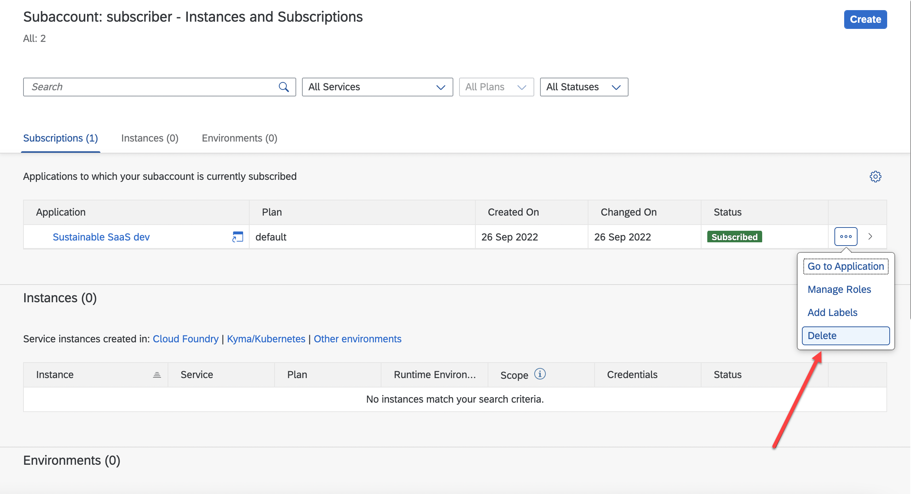
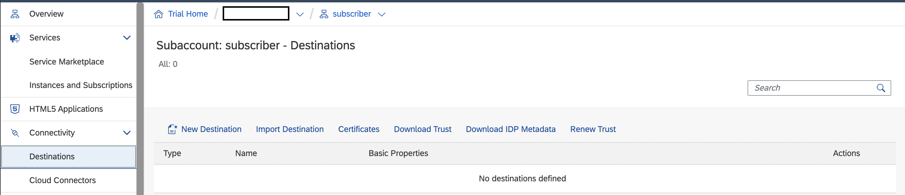
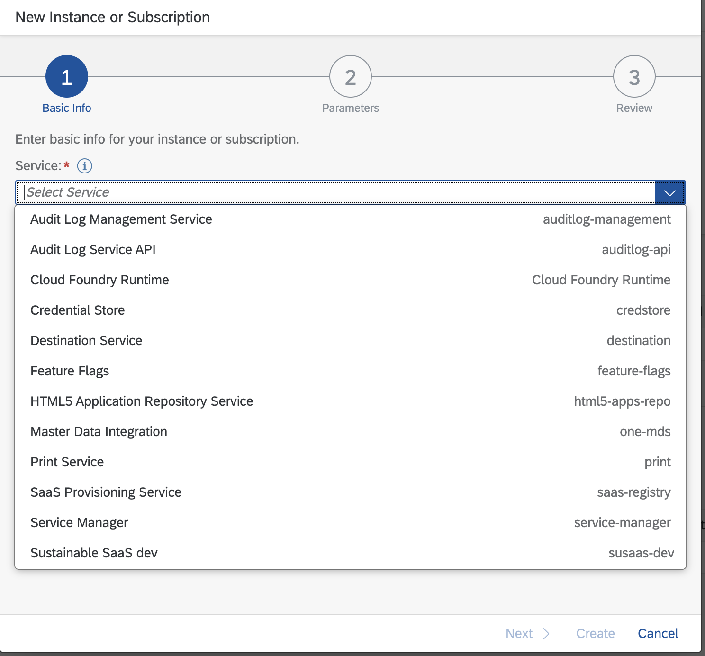

# Unsubscribe from a Consumer Subaccount

If a consumer subaccount is subscribed to the multitenant Sustainable SaaS application and created a service instance for the related SaaS API, the subaccount should look like the below (click to enlarge). 

The following steps show how to unsubscribe from the SaaS application and how to remove the API Broker instance from such a consumer subaccount. This is a prerequisite in case you want to deploy the **Advanced Scope** to the same landscape.  

1. [Unsubscribe a Consumer Subaccount](#1-Unsubscribe-a-Consumer-Subaccount)
2. [Check successful Unsubscription](#2-Check-successful-Unsubscription)
3. [Troubleshooting](#3-Troubleshooting)
4. [Further Information](#4-Further-Information)

## 1. Delete the service instance and unsubscribe

1.1. Remove the service binding of the Sustainable SaaS API service instance.

1.2. Delete the Sustainable SaaS API service instance.

1.3. Unsubscribe from the Sustainable SaaS business application.

## 2. Check successful Unsubscription

2.1. Check if the susaas_api destination is deleted from the tenant subaccount.

> **Hint** - The **susaas_api** destination is automatically removed by the application so you should not see it in the consumer subaccount after unsubscription.

> **Hint** - If your destination is not removed by the application automatically please remove it manually.

2.2. Check if Sustainable SaaS API Broker is unregistered.

> **Hint** - The **Sustainable SaaS API Broker** is automatically unregistered when unsubscribing from the Sustainable SaaS app in a consumer subaccount. Consequently, the Sustainable SaaS API should not be visible in a consumer subaccount anymore, when a new service instance creation attempt is made from that subaccount. As you can see below, the **Sustainable SaaS API** is not visible anymore.

> **Hint** - If your broker is not unregistered automatically, you should unregister it with SAP BTP CLI using this [command](https://help.sap.com/docs/BTP/btp-cli/btp-unregister-services-broker.html). Make sure your service broker is unregistered because otherwise you can **not** delete the consumer subaccount.

## 3. Troubleshooting

For troubleshooting please check the separate **Troubleshooting** section of this scope ([click here](../10-troubleshooting/README.md)).

## 4. Further Information

Please use the following links to find further information on the topics above:

* [SAP Help - Deleting Service Instances](https://help.sap.com/docs/SERVICEMANAGEMENT/09cc82baadc542a688176dce601398de/753463e1542f445895b420cd7957811c.html?&locale=en-US)
* [SAP Help - Unregister Services Broker](https://help.sap.com/docs/BTP/btp-cli/btp-unregister-services-broker.html)