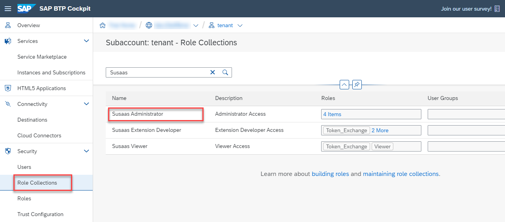
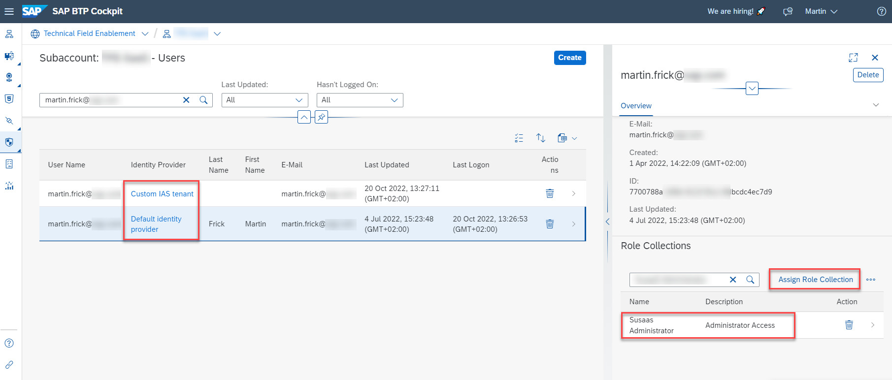
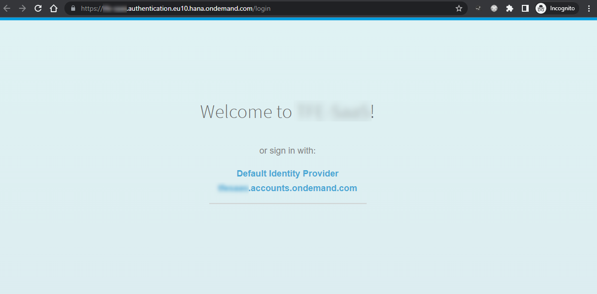
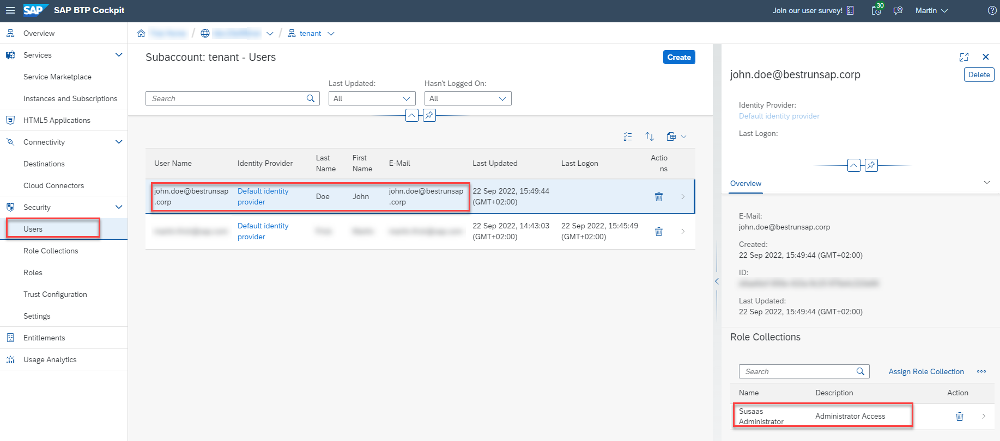
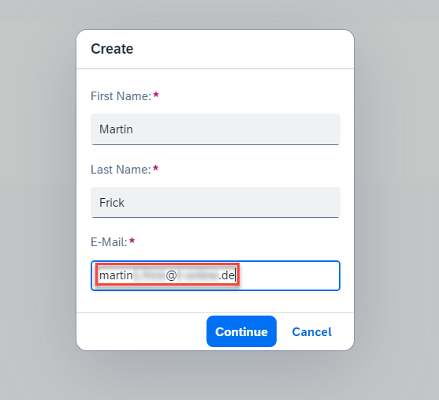
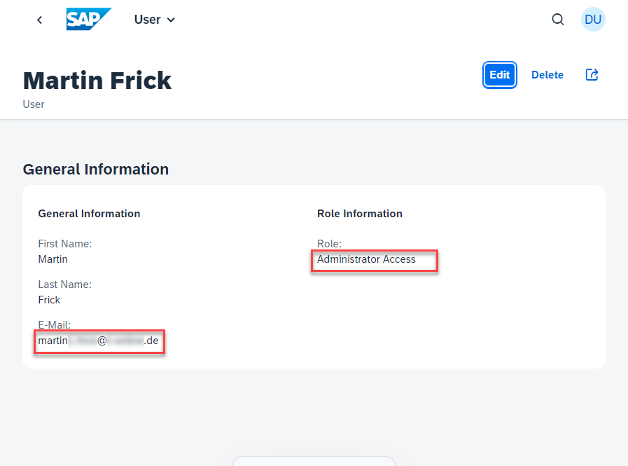
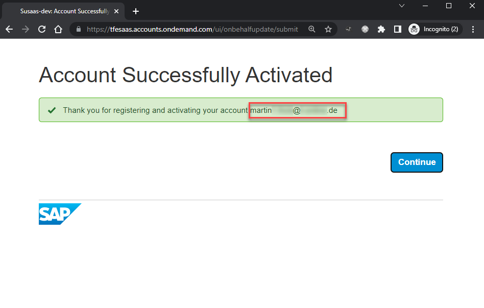
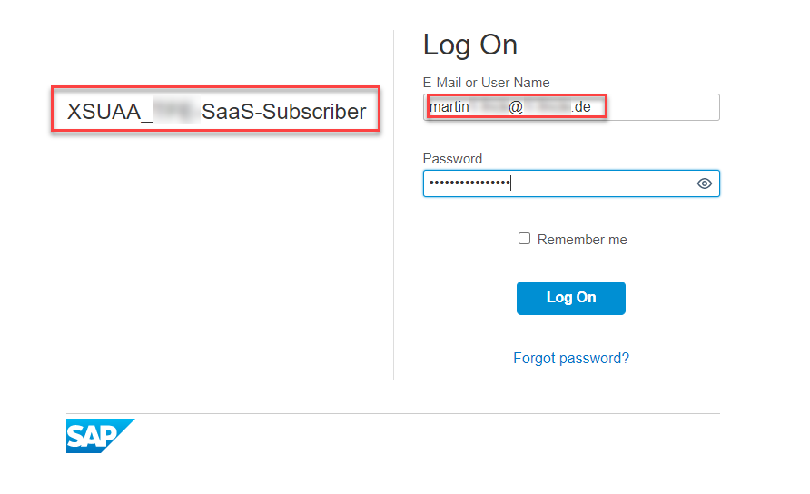
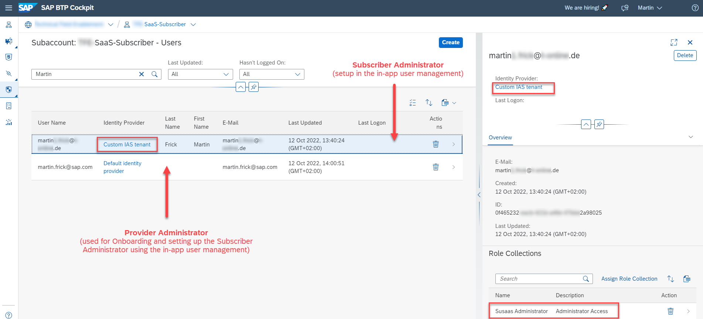
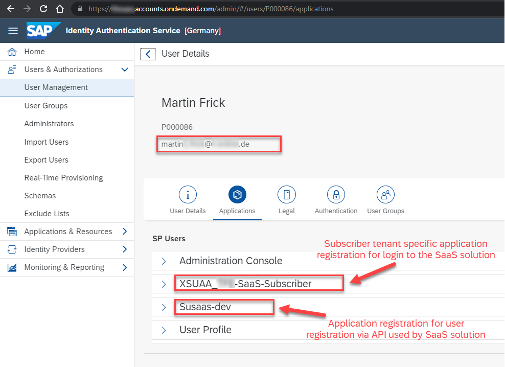

# Subscribe Consumer Subaccount

In this part of the mission, you will learn how to subscribe your first consumer tenant. The process is fairly simple if you followed the previous steps and also configured the Credential Store with the correct values ([click here](../4-build-deploy-saas-application/README.md#2-setup-the-credential-store)). Also make sure you configured the trust between the consumer subaccount and the central SAP Identity Authentication tenant ([click here](../3-central-user-management-ias/README.md#3-sap-ias-tenant-and-trust-configuration))!

1. [SaaS application subscription](#1-SaaS-application-subscription)
2. [API Service Broker instance](#2-API-Service-Broker-instance)
3. [Initialize the SaaS application](#3-Initialize-the-SaaS-application)
4. [Improvement options](#4-Improvement-options)
5. [Troubleshooting](#5-Troubleshooting)

In case you already completed the Basic Scope, the following steps will be familiar to you. Still, you can see it as a good exercise. 

## 1. SaaS application subscription

Please continue with the steps described in the corresponding part of the **Basic Scope** ([click here](../../2-basic/4-subscribe-consumer-subaccount/README.md#1-saas-application-subscription)). 

## 2. API Service Broker instance

Please continue with the steps described in the corresponding part of the **Basic Scope** ([click here](../../2-basic/4-subscribe-consumer-subaccount/README.md#2-api-service-broker-instance)). 

## 3. Initialize the SaaS application

Once the subscription of the SaaS application is successful and you created an API Service Broker instance, you (as a provider administrator) need to set up a first administrative user for your consumer's SaaS application instance.

> **Important** - As the SaaS application offers an in-app user management component, all regular tenant users have to be created and managed from within the SaaS application. If you create users manually in XSUAA or SAP IAS and assign a role collection, these users will not show up in the in-app user management.  

3.1. To give the first tenant administrator user access to the SaaS application instance, please **temporarily** assign the application's **Administrator** role collection to your own provider administrator user handling the onboarding process. This is the only time a **temporary** assignment of a role collection in the SAP BTP Cockpit takes place to complete the onboarding process by the provider administrator.

> **Important** - As you've setup the trust between the consumer subaccount and the central SAP Identity Authentication tenant, make sure to assign the role collection to the correct user. If you're unsure and the XSUAA user management shows your user for the Default Identity Provider **and** the Custom IAS tenant, you can assign the role collection to both users. 

> **Hint** - The **Administrator** role collection allows users to create new projects, assign members to projects, and create assessments in the sample application. Furthermore, an administrator can add new users to the SaaS application. The **Member** role collection allows project members to create new assessments in a dedicated project. The **Extension** role collection is currently not used but in theory, allows developers of a consumer tenant to extend the SaaS application using standard CAP extension features for SaaS Apps.

3.2. Once the role collection is assigned to you as a provider administrator (doing the initial onboarding), go back to the **Instances and Subscriptions** and open the subscription in an incognito window so that the latest scopes are available after login. 

3.3. As you've setup the trust between the consumer subaccount and the central SAP Identity Authentication tenant, you will be facing a selection screen allowing you to **choose an Identity Provider**. Make sure to choose the correct Identity Provider based on the role-assignment you've done two steps ago. 

3.4. After successful login using your provider administrator user (and Subaccount administrator), open the **Manage Users** tile. 

3.5. Click on **Create** to add a new tenant administrator user to the SaaS application. This will be the first administrative user of the application from a consumer perspective.

3.6. Provide the first and last name of the first tenant administrator and a valid e-mail address. Unlike the *Basic Scope*, this e-mail address can be any valid e-mail address and does not need to be assigned to an existing SAP ID user! This is due to the fact that SAP Identity Authentication is responsible for the central user management now. 

3.7. Assign the required **Administrator** role using the selection field. Click on **Create** to set up the user in the SaaS tenant database container and to trigger an automated user creation + role assignment in the consumer subaccount. 

> **Hint** - Sometimes a hyphen ("-") is displayed instead of the assigned role. This is a known issue. Please double-check the role-assignment in this case by switching to **Edit-Mode** which should display the correct role-assignment. 

3.8. Clicking on the back arrow in the top left of your screen, you can back to the user list and should see the first tenant administrator user you just created as a provider administrator. 

3.9. Going back to the SAP BTP Cockpit, you will see the tenant administrator user you just created in the **Users** menu, with the respective Administrator role collection assigned. Remember not to create, change or delete any tenant user or administrator outside the in-app user management!

3.10. You can now remove the **Administrator** role collection from your own SAP BTP Subaccount administrator using the SAP BTP Cockpit features. Remember - The **temporary** role collection assignment was only required for the initial setup of the first **tenant administrator** user using the in-app user management.

3.11. As the **Advanced Scope** contains a sample integration with SAP Identity Authentication Service, there are a few more steps required before the new consumer tenant administrator can access the consumer tenant instance using the tenant-specific URL you can get from the **Instances and Subscriptions** menu. 

3.12. First, in your **consumer subaccount** please disable the login using the default SAP ID Service in your **Trust Configuration** settings. Keeping this setting enabled, will confuse the consumer tenant users as for each login they need to choose which Identity Provider they want to use for authentication (SAP IAS vs. SAP ID Service). 

> **Important** - Please keep in mind, changing this setting that the **Provider administrator** cannot log in to the tenant subscription instance anymore.

3.13. Once the **Tenant administrator** is created by the **Provider administrator** using the in-app user management, he or she will receive an e-mail from the central SAP Identity Authentication Service instance. If not, please make sure you've correctly configured the Trust Configuration in the consumer subaccount ([click here](../3-central-user-management-ias/README.md)) and check the error logs of the susaas-srv application!

3.14. In the e-mail, the Tenant administrator will be asked to sign-up for the *Susaas-dev* application. The style and content of this e-mail can be modified for each application registration in SAP Identity Authentication Service ([click here](https://help.sap.com/docs/IDENTITY_AUTHENTICATION/6d6d63354d1242d185ab4830fc04feb1/b2afbcdccdf7410f8953e1e833e77de0.html?locale=en-US)). 

3.15. Clicking on the provided link, the **Tenant administrator** reaches the registration form in which he or she can change her first and last name if required and set a password for the SAP Identity Authentication account. 

3.16. Once the Tenant administrator completed the registration, a success message is displayed and the page can be closed. 

3.17. Now the new **Tenant administrator** can log in to the consumer tenant instance using the new credentials.

> **Hint** - You will not see the name of the SaaS application registration (*Susaas-Dev*) in the authentication screen but the name of the application registration created by the XSUAA - SAP IAS trust setup. This relates to the [Architecture Setup](../3-central-user-management-ias/README.md#6-architecture-and-flow) described in chapter *Central user management using SAP Identity Authentication Service*. This screen can also be customized in SAP Identity Authentication Service ([click here](https://help.sap.com/docs/IDENTITY_AUTHENTICATION/6d6d63354d1242d185ab4830fc04feb1/32f8d337f0894d269f5f89956803efac.html?locale=en-US)).

3.18. As a **Provider administrator** you will see the new **Tenant administrator** in your XSUAA user management using the SAP BTP Cockpit. In the following screenshot, you can see that the Provider administrator (using the Default Platform Identity Provider -> SAP ID Service) has set up the Tenant administrator (now assigned to the Custom Identity Provider -> SAP Identity Authentication). 

3.19. As a Provider Administrator, log in to SAP Identity Authentication - Administration Console and you can see the new **Tenant administrator** in the User Management section of SAP IAS. Switching to the **Applications** tab you will notice that the user has been **registered** by the *Susaas-dev* application but authenticates using the consumer-specific *XSUAA_<Subaccount-Name>* application.

## 4. Improvement options

Concerning the automation of onboarding processes, some further aspects of the previous steps could be automated:

- Automation of consumer subaccount onboarding
- Further subscription process automation
- Automation of first tenant administrator setup
- ...

These aspects have not been covered in the sample application but feel free to add further features to this sample using a pull request. 

## 5. Troubleshooting

For troubleshooting please check the separate **Troubleshooting** section of the **Basic Scope** ([click here](../../2-basic/10-troubleshooting/README.md)) and **Advanced Scope** ([click here](../9-troubleshooting/README.md)).

## 6. Further information

Please use the details provided in the **Basic Scope** ([click here](../../2-basic/4-subscribe-consumer-subaccount/README.md#6-Further-information)) to find further information on the topics above. 