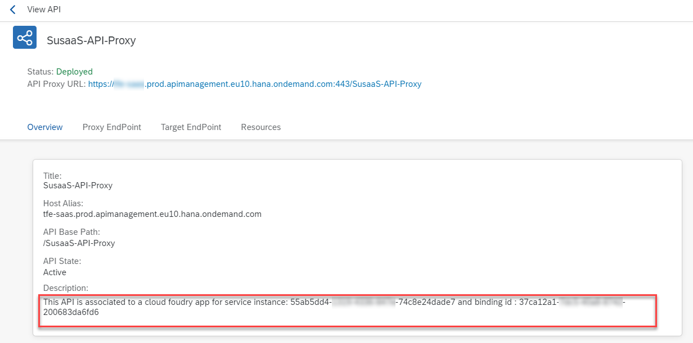

# Integrate SAP API Management

As your SaaS application contains an API which allows the SaaS consumers to interact programmatically with their tenant database containers, you need to ensure that your API endpoints are properly managed and monitored. For this purpose you should implement features like rate limiting to prevent e.g., DoS attacks. Furthermore you can ensure a fair usage of the resources among your consumers by e.g., setting up a quota depending on the chosen plan. A premium consumer might be eligible to send more requests per second as a standard consumer. A proper monitoring of your API will help you to analyze performance issues and to identify problems of your consumers. 

In this part of the mission, you will learn how to ensure that each and every request to your SaaS API is first going through SAP API Management, which will be the dedicated stanard solution provided by SAP for all API related requirements. 

1. [Architecture](#1-Architecture)
2. [Prerequisites](#2-Prerequisites)
3. [APIM as route service](#3-APIM-as-route-service)
4. [Bind the route service](#4-Bind-the-route-service)
5. [API Policies](#5-API-Policies)
6. [Decode the JWT token](#6-Decode-the-JWT-token)
7. [Spike Arrest feature](#7-Spike-Arrest-feature)
8. [API quotas](#8-API-quotas)
9. [Update policies and deploy](#9-Update-policies-and-deploy)
10. [Test the setup](#10-Test-the-setup)
11. [Deployment Descriptor](#11-Deployment-Descriptor)
12. [Troubleshooting](#12-Troubleshooting)
13. [Further Information](#13-Further-Information)


## 1. Architecture

SAP API Management is a new component in the central part of the **Advanced Scope** architecture. While in the Basic Scope, the API calls were directly accessing the CAP-based API service, now all requests will be passing through this additional component, giving you great flexbility in how to handle your in- and outbound API traffic. 

See the relevant part of the solution architecture below (click to enlarge):

[](./images/API_Architecture.png)


## 2. Prerequisites

For this setup, please make sure you have an SAP API Management instance up and running. As SAP API Management is a capability of **SAP Integration Suite**, please subscribe to SAP Integration Suite and active the respective **API Management** feature. Check the following documentations on how to enable SAP Integration Suite in a Trial [click here](https://developers.sap.com/tutorials/cp-starter-isuite-onboard-subscribe.html) and in any other environemnt [click here](https://help.sap.com/docs/SAP_CLOUD_PLATFORM_API_MANAGEMENT/66d066d903c2473f81ec33acfe2ccdb4/f6eb4332cd5144ef91f4a84cc614ba1c.html?locale=en-US). 

[](./images/API_IntegrationSuite.png)


## 3. APIM as route service

To connect your SaaS API with SAP API Managment, you can use a SAP BTP service called "APIM-as-route-service", which is also explained in greater detail by the following blog posts [click here](https://blogs.sap.com/2020/10/10/sap-apim-route-service-plan-to-manage-cloud-foundry-apps/) and [here](https://blogs.sap.com/2020/08/10/part-3-service-plan-of-sap-api-management-in-cloud-foundry-environment/). Furhter information about route services can be found in the official Cloud Foundry documentation [click here](https://docs.cloudfoundry.org/services/route-services.html).

Combining this service instance with your API route allows you to enforce API policies like Spike Arrest or Quotas no matter whether the accessing client is calling the API Proxy URL or the standard route of your API. So please setup an instance of the **apim-as-a-route-service** offering as you can see in the following screenshot. 

> **Hint** - If you cannot find the respective service plan, make sure you assigned it in your subaccount entitlements!

[](./images/API_ServiceInstance.png)

As SAP Integration Suite is one of the most powerful but also quite expensive SaaS products, you might consider the usage for your productive SaaS environment only.


## 4. Bind the route service

Now you need to bind the route service to your standard SaaS API route. This can be done using the cf CLI command bind-route-service (or brs). 

**Windows (Command Line)**
cf brs `<CF domain>` `<route-service>` --hostname `<API hostname>` -c '{\"api_name\":\"`<API Proxy name of your choice>`\"}'

**Windows (Power Shell)**
cf brs `<CF domain>` `<route-service>` --hostname `<API hostname>` -c "{\"api_name\":\"`<API Proxy name of your choice>`\"}"

>**Sample**<br>
>cf brs cfapps.eu10.hana.ondemand.com susaas-api-service --hostname abc84d15trial-dev-susaas-api-srv -c '{\"api_name\":\"SusaaS-API-Proxy\"}'

> **Important** - The command might differ depending on your cf CLI version. You can use *cf brs --help* to find the correct command related to your cf CLI version. 

Afer successfully running this command in your cf CLI, you will see a new API Proxy called **SusaaS-API-Proxy** in your SAP API Management **Develop** menu. 

[](./images/API_Proxy.png)

Checking the API Proxy details you will see in the description that this API Proxy is bound to a Cloud Foundry application which is your SaaS API. From now on, all requests reaching your SaaS API route will be running through SAP API Management and respective API policies are applied.

[](./images/API_ProxyDetails.png)


## 5. API Policies 

You can now apply relevant API Policies to your API Proxy using preconfigured templates and features. In this sample you will learn how to setup a Spike Arrest component for rate limiting and different quotas based on the plan (standard/premium) subscribed by the consumer. 

5.1. To setup the respective policies, click on **Policies** in the top right of your API Proxy. 

[](./images/API_Policies.png)

5.2. Switch to edit mode by clicking on **Edit** in the Policy Editor. 

[](./images/API_EditMode.png)


## 6. Decode the JWT token

6.1. Open the PreFlow of your API Proxy, where you will place the rate limiter of your API. You will see that the flow already contains some elements which were created when setting up the service-route instance. Please leave them as is. 

6.2. In this use-case, we will distinguish our SaaS API clients by their unique Client-ID, which can be found in the JWT token of each request. Therefore, please first add a feature called **DecodeJWT** which will allow you to make use of the JWT token content in subsequent steps. 

[](./images/API_DecodeJWT01.png)

6.3. You can name the flow element **decodeJwt**. If you choose a different name, please note it down as you will need it in one of the next steps. 

[](./images/API_DecodeJWT02.png)

6.4. Please remove the **`<Source>var.jwt</Source>`** line from the configuration. 

[](./images/API_DecodeJWT03.png)


## 7. Spike Arrest feature

7.1. After decoding the JWT token, please add the **Spike Arrest** feature from your policies toolbox. You can name the flow element **spikeArrest**. 

[](./images/API_SpikeArrest01.png)

7.2. Configure your Spike Arrest instance by providing the identifier which is the Client-ID in our case (see below). The required information is coming from the previous flow element used to decode the JWT token. You might need to change the **decodeJwt** value in case you named your flow element differently. 

```xml
<Identifier ref="jwt.decodeJwt.claim.client_id"/>
```

7.3. Furthermore, feel free to update the number of requests which you want to allow per minute (pm) or second (ps). Check the documentation [click here](https://docs.apigee.com/api-platform/reference/policies/spike-arrest-policy) of Spike Arrest as the configuration options are very comprehensive. 

```xml
<Rate>1ps</Rate> instead of <Rate>30pm</Rate>
```

[](./images/API_SpikeArrest02.png)


## 8. API quotas

Besides an API rate limiter feature preventing you from e.g. DoS attacks, you can also enhance your SaaS API by introducing a **plan**-based quota for your consumers. This allows you to differentiate premium from standard consumers and enables interested consumers an increased usage of your API. 

8.1. Let's start by introducing different subflows for your different API plans. To create a new subflow for the API Proxy PreFlow just click on the respective **+** icon.

[](./images/API_Quota01.png)

8.2. Create two new subflows called **standardPlanFlow** and **premiumPlanFlow**. These flows will be executed after the generic PreFlow depending on conditions you define. 

[](./images/API_Quota02.png)

8.3. We will differentiate the incoming requests by using the decoded JWT token again. Based on the configuration of the SaaS API, we decided to inject the selected service plan into the token issued by XSUAA. This allows you to read the consumer tenant's plan from the JWT token and include it into the **Flow Condition** like the following. 

> **Hint** - Please make sure to select the **standardPlanFlow** before adding the condition. 

```jwt.decodeJwt.claim.scope ~ "*plan_standard"```

[](./images/API_Quota03.png)

8.4. For the premiumPlanFlow the condition will look as follows. Please add it accordingly. 

```jwt.decodeJwt.claim.scope ~ "*plan_premium*"```

> **Hint** - The service plan identification using the JWT scope claim might be improved by a better approach in the future.

8.5. Now we can send requests through different flows depending on the consumer tenant's plan, we will now add different quota allowance based on the plans. To add a quota limit to your API, add the **Quota** feature from your policies toolbox. Name your flow element **quotaPremium** in the standard flow and **quotaStandard** in the premium flow. 

[](./images/API_Quota04.png)

8.6. For this very simple sample application you can configure your quota the following. This configuration will allow your consumers 1200 requests to your API per (1) day. The very comprehensive configuration options of the **Quota** feature can be found in the respective documentation [click here](https://docs.apigee.com/api-platform/reference/policies/quota-policy). Please ensure, the quota configuration also contains the Client-ID as an identifier. 

> For the **premium plan**, you can e.g., double the allowed number of requests per day to 2400 or use another configuration of your choice.  

```xml
<Quota async="false" continueOnError="false" enabled="true" type="calendar" xmlns="http://www.sap.com/apimgmt">
 	<Identifier ref="jwt.decodeJwt.claim.client_id"/>
 	<Allow count="1200"/>
 	<Interval>1</Interval>
	<Distributed>true</Distributed>
 	<StartTime>2015-2-11 12:00:00</StartTime>
	<Synchronous>true</Synchronous>
 	<TimeUnit>day</TimeUnit>
</Quota>
```

[](./images/API_Quota05.png)


## 9. Update policies and deploy 

9.1. After setting up the sample policies, please click on **Update** in the upper right of your Policies editor. 

[](./images/API_Deploy01.png)

9.2. Save your API Proxy changes by clicking on **Save**. 

[](./images/API_Deploy02.png)

9.3. Make sure to **Deploy** the latest version of your API Proxy by selecting the respective option. 

[](./images/API_Deploy03.png)


## 10. Test the setup

That's it, you've successfully integrated your SaaS API with SAP API Management and already configured some API Policies. To test the setup, feel free to create a new service key in a consumer subaccount (or use an existing one) and try calling your API endpoint e.g., using the sample http files.

You will notice that calling the API more than once per second (e.g. using Postman or the http files), will result in an error message sent by SAP API Management as the Spike Arrest policy will jump in. 


## 11. Deployment Descriptor

The API Management as route service (sap-apim-route-service) instance can also be defined in your mta.yaml deployment descriptor. Just add the following code snippet to your resources. Still you will need to execute the **cf bind-route-service** command as described in this tutorial. 

```yaml
  # ----------------- API Route Service -------------------------------------------
  - name: susaas-api-route-service
  # -------------------------------------------------------------------------------
    type: org.cloudfoundry.managed-service
    parameters:
      service: apimanagement-apiportal
      service-plan: apim-as-route-service
```

## 12. Troubleshooting

For troubleshooting please check the separate **Troubleshooting** section of the **Basic Scope** ([click here](../../2-basic/10-troubleshooting/README.MD)) and **Advanced Scope** ([click here](../9-troubleshooting/README.MD)).


## 13. Further Information

Please use the following links to find further information on the topics above:

* [SAP Help - SAP Integration Suite](https://help.sap.com/docs/SAP_INTEGRATION_SUITE?locale=en-US)
* [SAP Help - SAP API Management](https://help.sap.com/docs/SAP_CLOUD_PLATFORM_API_MANAGEMENT?locale=en-US)
* [SAP Help - SAP API Management in the Cloud Foundry Environment](https://help.sap.com/docs/SAP_CLOUD_PLATFORM_API_MANAGEMENT/66d066d903c2473f81ec33acfe2ccdb4/7d8514b4ab46455e8416723003b414d7.html?locale=en-US)
* [Cloud Foundry CLI Reference Guide - v8](https://cli.cloudfoundry.org/en-US/v8/)
* [Cloud Foundry CLI Reference Guide - v7](https://cli.cloudfoundry.org/en-US/v7/)
* [SAP Blog - SAP APIM - Route Service to Manage Cloud Foundry Apps](https://blogs.sap.com/2020/10/10/sap-apim-route-service-plan-to-manage-cloud-foundry-apps/)
* [SAP Blog - Service Plan of SAP API Management in Cloud Foundry Environment](https://blogs.sap.com/2020/08/10/part-3-service-plan-of-sap-api-management-in-cloud-foundry-environment/)
* [Cloud Foundry Documentation - Route Services](https://docs.cloudfoundry.org/services/route-services.html)
* [apigee Documentation - Policy reference overview](https://docs.apigee.com/api-platform/reference/policies/)
* [apigee Documentation - SpikeArrest policy](https://docs.apigee.com/api-platform/reference/policies/spike-arrest-policy)
* [apigee Documentation - Quota policy](https://docs.apigee.com/api-platform/reference/policies/quota-policy)
* [SAP Help - Condition Strings](https://help.sap.com/docs/SAP_CLOUD_PLATFORM_API_MANAGEMENT/66d066d903c2473f81ec33acfe2ccdb4/66561009a5b343658be2408981d005bb.html?locale=en-US)
* [SAP Help - Policy Types](https://help.sap.com/docs/SAP_CLOUD_PLATFORM_API_MANAGEMENT/66d066d903c2473f81ec33acfe2ccdb4/c918e2803dfd4fc487e86d0875e8462c.html?locale=en-US)