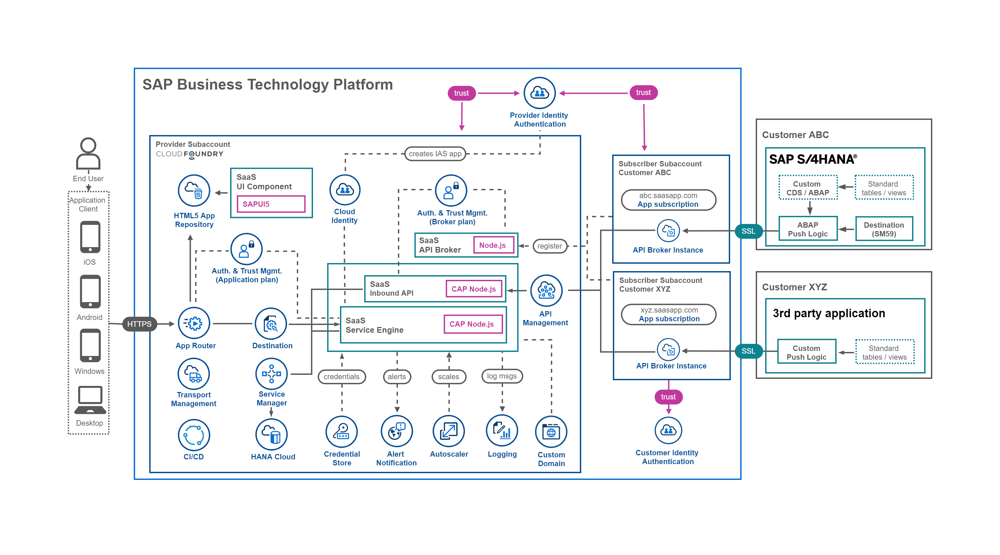

# Introduction to the Expert Scope

> **Important** - The major Scopes (**Basic** and **Advanced**) of this mission are independent of each other, which means you can also directly start with the Advanced Scope if you like. The Advanced Scope contains all features of the Basic Scope and more but provides less detailed instructions and guidance as we assume a higher level of expertise. The **Expert** Scope contains selected additional features that can be applied to the Basic **or** the Advanced Scope. You don't have to go through all Scopes to complete this mission. If e.g., the Basic Scope is sufficient for you, feel free to finalize the mission after successful completion.  

> **Important - WIP**  
> Some chapters of the **Expert Scope** are still being actively worked on! Feel free to browse the available sections to get an idea of what to expect once published. Some of the chapters already contain useful content while others will be uploaded during the next weeks!

In the [Basic Scope](../../2-basic/0-introduction-basic-scope/README.md) we have provided you the core elements required for a Software as a Service (SaaS) application on SAP Business Technology Platform (SAP BTP). 

In the [Advanced Scope](../../3-advanced/0-introduction-advanced-scope/README.md) we covered some more interesting topics when it comes to enterprise-readiness of your Software as a Service application that goes beyond the usage in a test scenario. 

The idea of **Expert Scope** builds on the Basic and Advanced Scope and features a variety of additional topics that will be relevant for you as a SaaS provider. 

See the following screenshot to get an idea of the Expert Scope architecture.

The **Expert Scope** will cover topics from doing backups of tenant database containers to using a custom domain for your SaaS application. Below you can find the current list of topics covered.  

You can set up most **Expert Scope** topics in any productive SAP BTP environment using **Free (Tier) service plans** of your **Pay-as-you-Go** (PAYG) or **CPEA** account. A tutorial how to setup a PAYG account (allowing you to use all Free Tier service plans) can be found in the [Tutorial Navigator](https://developers.sap.com/tutorials/btp-free-tier-account.html).

The only **exception** is the usage of a custom domain in SAP BTP! The [**SAP Custom Domain Service**](https://discovery-center.cloud.sap/serviceCatalog/custom-domain?service_plan=custom-domain) can only be added as **paid plan** in **PAYG** or **CPEA** accounts. Please check the respective pricing details ([click here](https://discovery-center.cloud.sap/serviceCatalog/custom-domain?service_plan=custom-domain&region=all&commercialModel=cloud&tab=service_plan)) before adding and using this service in your SAP BTP account. 

> **Hint** - Most Expert Scope topics can also be done in **Trial** accounts (see exclusions below), although we recommend to use one of the account types mentioned above (PAYG or CPEA).

* [Feature Toggles](../feature-toggles/README.md)
* [SaaS Consumer Extensibility](../consumer-extensibility/README.md)
* [Manage tenant database containers](../manage-tenant-containers/README.md)
* [HDI container administration](../hdi-container-administration/README.md) 
* [Backup database containers](../backup-database-containers/README.md)
    * Prerequisite - HDI container administration
* [Setup CI/CD for your project](../setup-cicd-for-project/README.md)
* [Configure SAP Cloud Transport Management](../configure-transport-management/README.md)
    * Prerequisite - Setup CI/CD for your project
* [Integrate a consumer's IdP](../integrate-consumers-idp/README.md)
* [Local and hybrid development](../local-hybrid-development/README.md)
* [Send emails using Microsoft Graph](../send-emails-graph-api/README.md)
* [Update tenant database containers](../update-tenant-containers/README.md)
* [Using SAP Theme Designer](../using-sap-theme-designer/README.md)
* [Deploy to multiple regions](../deploy-multiple-regions/README.md) (Trial - ✘)
* [Custom domain for SAP IAS](../custom-domain-for-ias/README.md) (Trial - ✘)
* [Custom domain usage](../custom-domain-usage/README.md) (Trial - ✘)
