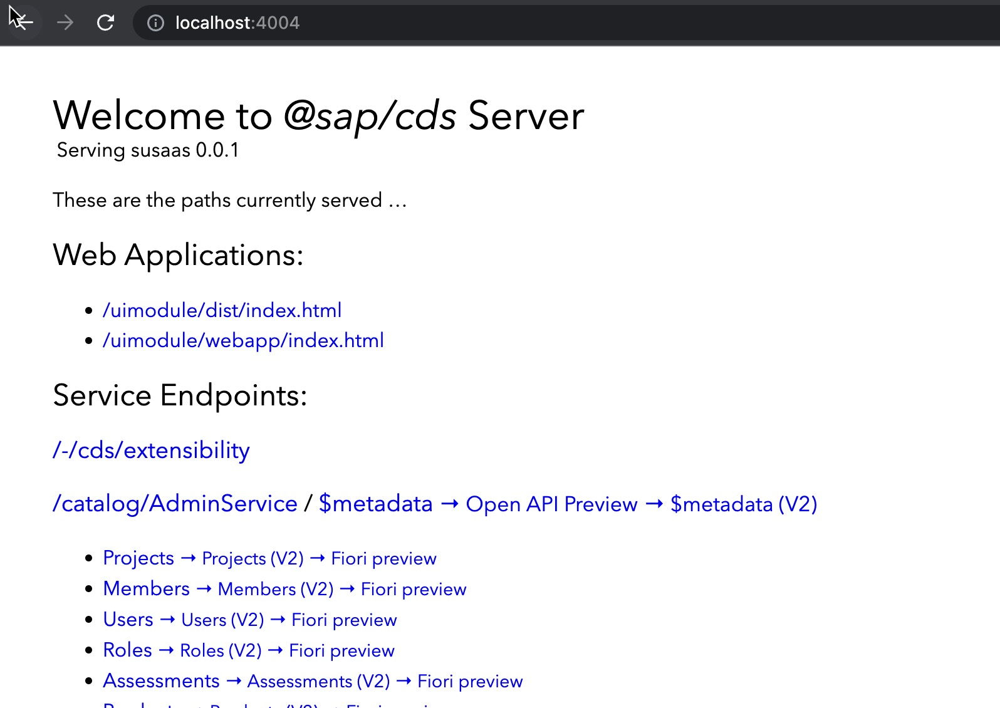
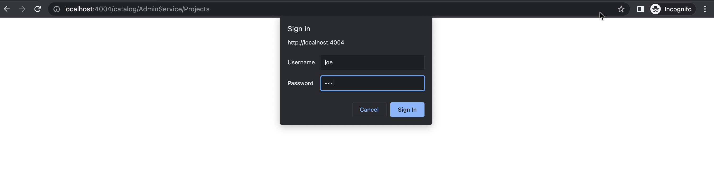
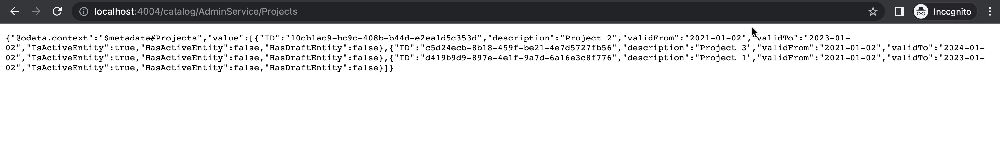
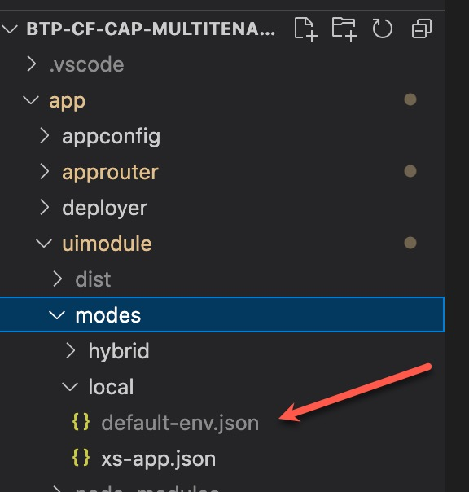
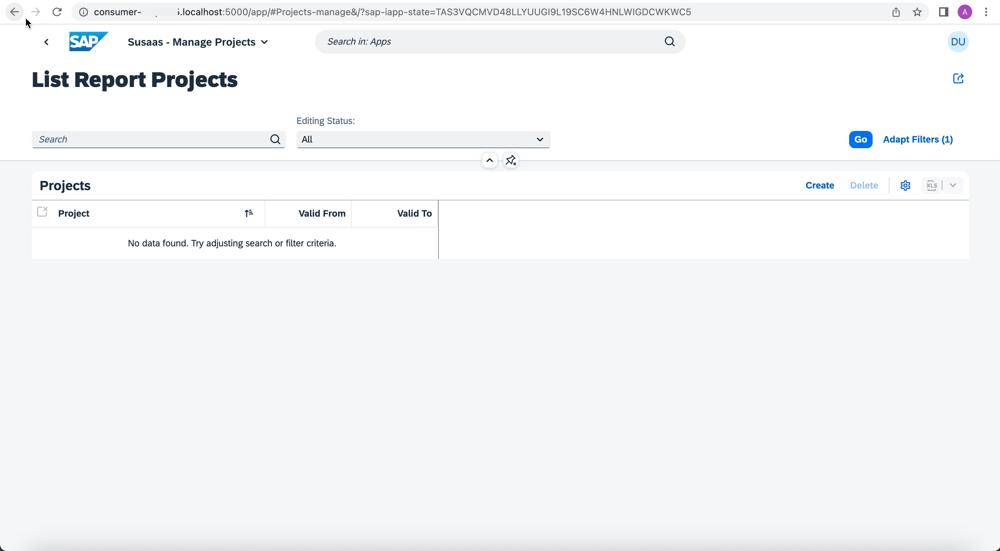
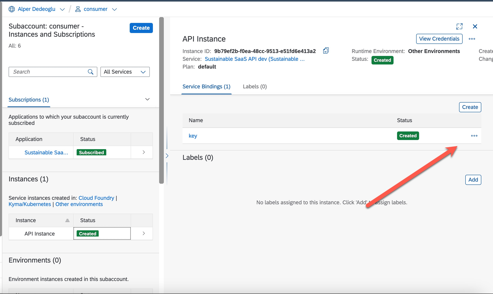

# Local and hybrid development


# Local Development 

A local development environment (LDE) is the way of running applications and services on your laptop/desktop.
Software developers use local development to test their development, examine newly added features and debug their applications.

> **Hint**: You may follow this documentation for both **Basic Scope** and **Advanced Scope**. You just need to checkout 
the [**basic**](https://github.com/SAP-samples/btp-cf-cap-multitenant-susaas/tree/basic) branch for **Basic Scope** and [**advanced**](https://github.com/SAP-samples/btp-cf-cap-multitenant-susaas/tree/advanced) for advanced scope, before starting to following the steps below.

## 1. Running the multitenant application locally (susaas-srv)

With SAP Cloud Application Programming Model's (CAP) latest MTX package release (@sap/cds-mtxs) developers are able to run 
their applications in local mode as mentioned [here](https://cap.cloud.sap/docs/guides/multitenancy/mtxs#test-drive-locally).

### 1.1. Insert recycling materials with API Locally 
Run the command below on your projects root directory to start the backend application locally.

```sh
cds run --profile local-with-mtx
```

If everything is fine, you should see an output as shown below.

```sh
[cds] - connect to db > sqlite { url: ':memory:' }
[cds] - serving cds.xt.SaasProvisioningService { path: '/-/cds/saas-provisioning' }
[cds] - serving cds.xt.ModelProviderService { path: '/-/cds/model-provider' }
[cds] - serving cds.xt.DeploymentService { path: '/-/cds/deployment' }
[cds] - serving AdminService { path: '/catalog/AdminService', impl: 'srv/admin-service.js' }
[cds] - serving PublicService { path: '/catalog/PublicService', impl: 'srv/public-service.js' }
[cds] - serving cds.xt.ExtensibilityService { path: '/-/cds/extensibility' }
[cds|t0] - loaded model from 1 file(s):

  node_modules/@sap/cds-mtxs/db/t0.cds

[mtx|t0] - (re-)deploying SQLite database for tenant: t0
/> successfully deployed to sqlite in-memory db


[cds] - server listening on { url: 'http://localhost:4004' }
[cds] - launched at 21/11/2022, 15:42:19, version: 6.3.1, in: 8.626s
[cds] - [ terminate with ^C ]
```

### 1.2. Onboard a new initial tenant to your application
Since we have our application up and running, the next step is adding a tenant to our application
so that a SQLITE instance for that spesific tenant is generated.

Create a new terminal instance and run the command below to onboard tenant **t1**.

```sh
cds subscribe t1 --to http://localhost:4004 -u joe:123
```

You should see an output as shown below.

```sh
Subscribing { tenant: 't1' } to { url: 'http://localhost:4004' }
Subscription succeeded.
```

Please notice that user **Joe** is defined at [package.json](https://github.com/SAP-samples/btp-cf-cap-multitenant-susaas/blob/basic/package.json) as a member of tenant **t1** with the roles **Admin** and **cds.Subscriber** as shown below.
Therefore we were able to subscribe the credentials of user **joe** since that user has priviledges to subscribe a tenant.

```json
...
        "[local-with-mtx]": {
          "strategy": "mock",
          "db": "sql-mt",
          "users": {
            "joe": {
              "ID": "joe",
              "GivenName": "Joe",
              "password": "123",
              "roles": [
                "Admin",
                "cds.Subscriber"
              ],
              "tenant": "t1"
            },
  ...
```

For further information, please see the [official documentation](https://cap.cloud.sap/docs/guides/multitenancy/mtxs#deploymentservice).


### 1.3. Check the application

Now that the application backend is running, we can directly go to [http://localhost:4004](http://localhost:4004).

[](./images/localhost.jpg)

Then you might click on **Projects** entity, after that a popup will ask credentials.
You might enter **joe** as username and **123** as password since that is our tenant **t1** sample user.

[](./images/localhostcreds.jpg)

Then you should see the projects in your browser as a response, as shown below.

[](./images/projects-response.jpg)

## 2. Running the frontend application locally (susaas)

Local frontend development is also crucial for the developers, since as a developer you would like to try things locally first
then deploy the real environment.
By following this section, you will be able to run your frontend application locally and do the local development.

### 2.1. Create a *default-env.json* file under directory /app/uimodule/local

We need to create a *default-env.json* file under /app/ui/module/local directory to be able to run the application locally.
This default-env.json file is needed for approuter to point our locally running backend.

[](./images/ui-default-env-local.jpg)

After creating file paste the content below into your default-env.json file.

```js
{
    "destinations" : [
          {
              "name": "susaas-srv-api",
              "url": "http://localhost:4004"
          }
    ], 
    "VCAP_SERVICES":{

    }
}
```

### 2.2. Start the frontend application locally

To start your frontend application locally run the commands below.

```sh
cd app/uimodule
npm run start:local
```

After running the commands, go to [http://localhost:5000](http://localhost:5000).
You should see the application as below.

[](./images/local-running-app-ui.jpg)

Click on anything and you will be asked for username and password in a dialog.
Use **joe** as username and **123** as password as we created on previous [step.](#12-onboard-a-new-initial-tenant-to-your-application).

Then you can explore the application, modify the UI via changing the annotations on backend and test your development.


## 3. Running the API Endpoint Locally 

In addition to frontend and backend, we also have a multitenant API endpoint which you might want to test locally.
But please notice that on local mode your changes will not be reflected to frontend or backend application since
the sqlite does not share. And also in local mode, you will not be running the multitenancy since the multitenancy endpoints 
are only available in backend application.

But you will still be able to check your API, if the relevant data is inserted correctly, if the handlers are running correctly and so on.

### 3.1. Start the API locally

On your root directory run the command below.

```sh
npm run api-start-local
```

Then you should see that API is running locally as shown below.

```sh
[cds] - connect to db > sqlite { url: ':memory:' }
 > init from db/data/susaas.db-Dummy.csv
 > init from test/data/susaas.db-Assessments.csv
 > init from test/data/susaas.db-CircularityMetrics.csv
 > init from test/data/susaas.db-MaterialSplits.csv
 > init from test/data/susaas.db-Members.csv
 > init from test/data/susaas.db-Products.csv
 > init from test/data/susaas.db-Projects.csv
 > init from test/data/susaas.db-RecyclingCountries.csv
 > init from test/data/susaas.db-RecyclingMaterials.csv
 > init from test/data/susaas.db-Roles.csv
 > init from test/data/susaas.db-SalesOrders.csv
 > init from test/data/susaas.db-SalesSplits.csv
 > init from test/data/susaas.db-Users.csv
/> successfully deployed to sqlite in-memory db

[cds] - serving ApiService { path: '/odata/api', impl: 'srv-api/api-service.js' }
There is no service, therefore does not serve multitenancy!

[cds] - server listening on { url: 'http://localhost:4005' }
[cds] - launched at 22/11/2022, 19:56:53, version: 6.3.1, in: 1.052s
[cds] - [ terminate with ^C ]
```


### 3.2. Read data from API Locally 

You can use the request below from a terminal to read current products

```sh
curl http://localhost:4005/odata/api/Products -u "joe:123"
``` 


### 3.3. Insert Products to API Locally 

You can use the request below from a terminal to insert products

```sh
curl --location --request POST 'http://localhost:4005/odata/api/bulkUpdateProducts' \
--user 'joe:123' \
--header 'Content-Type: application/json' \
--data-raw '
{
      "products" : [
            {"ID": "HT-1000-1","eolProductDesign": 43,"traditionalSalesShare": 82,"repairSalesShare": 8,"resellSalesShare": 10},
            {"ID": "HT-1001-2","eolProductDesign": 38,"traditionalSalesShare": 97,"repairSalesShare": 3,"resellSalesShare": 0}
      ]
}'
``` 


### 3.4. Insert recycling materials with API Locally 

You can use the request below from a terminal to insert recycling materials.

```sh
curl --location --request POST 'http://localhost:4005/odata/api/bulkInsertRecyclingMaterials' \
--user 'joe:123' \
--header 'Content-Type: application/json' \
--data-raw '{
      "recyclingMaterials" : [
            {"product_ID":"HT-1000","material":"MT10000001","materialName":"Aluminium","weightShare":14,"recycleShare":23},
            {"product_ID":"HT-1000","material":"MT20000008","materialName":"Plastic","weightShare":34,"recycleShare":30}

      ]
}'
```

Feel free to modify this requests and try other endpoints which are served under API.


# Hybrid Development

You can easily test your CAP application using a local database and mock ups. But at some point, you’re going to want to test with real cloud services. Of course, you can always deploy your application to the cloud.

With hybrid testing capabilities, you can stay in your local development environment and avoid the long turnaround times of cloud deployment, and you can selectively decide which services you want to use from the cloud.

To explain it a bit simpler, you will be still running on your laptop but you will be using SAP BTP Services like SAP HANA Cloud
XSUAA etc.

## Prerequisites

- To be able to start a hybrid development you should have your multitenant application already deployed to SAP BTP CF Runtime and you should have at least one subscribed tenant to your multitenant application. 

- In this sample you will be using [cf DefaultEnv](https://github.com/saphanaacademy/DefaultEnv) plugin so please install it before you start developing in hybrid mode.
You can install the **cf DefaultEnv plugin with following command.

- Make sure you already checked out to [basic](https://github.com/SAP-samples/btp-cf-cap-multitenant-susaas/tree/basic) or [advanced](https://github.com/SAP-samples/btp-cf-cap-multitenant-susaas/tree/advanced) branch


```sh
cf install-plugin DefaultEnv
```

> **Hint**: You may follow this documentation for both **Basic Scope** and **Advanced Scope**. You just need to checkout 
the [**basic**](https://github.com/SAP-samples/btp-cf-cap-multitenant-susaas/tree/basic) branch for **Basic Scope** and [**advanced**](https://github.com/SAP-samples/btp-cf-cap-multitenant-susaas/tree/advanced) for advanced scope, before starting to following the steps below.

## 1. Running the multitenant application in hybrid mode (susaas-srv)

In this section you will learn how to run your susaas-srv module with hybrid mode.
Which means the application runtime will be on your laptop but all the other backing services will be used from your
SAP BTP Account

### 1.1. Login to the CF organization of provider subaccount 

Run the command below and please make sure that you have logged in into your provider subaccount organization,
because all the backing services are created there.

```sh
cf login
```

### 1.2. Get environment variables for susaas-srv 
Your susaas-srv application name is built as susaas-srv-<yourcfspacename>.
Run the command below on your root directory.

```sh
cf de susaas-srv-<yourcfspacename>
```
### 1.3. Start the multitenant application in hybrid mode with production profile
Now that you have downloaded the environment variables, run the command below to 
start your application in hybrid mode.

```sh
cds watch --production
```

After running this command your application should be running but the logs should look different, because it 
is now running at production profile and the application logs are formatted for SAP BTP Application Logging service.

>**Hınt**: Please notice that, now your service is using every binded backing service from SAP BTP CF Runtime such as XSUAA, SAP HANA Cloud etc. 


## 2. Running frontend application in hybrid mode

In this section you will be running your frontend application with the connection to the backing services on cloud,
such as XSUAA, destination etc.

### 2.1. Read environment variables from Approuter (susaas)

First go to the directory which we need to download our environment variables to.

```sh
cd app/uimodule/modes/hybrid/ 
cf de susaas-<yourspacename>
```

Please notice that in app/uimodule/modes/hybrid directory default-env.json is created.


### 2.2. Replace TENANT_HOST_PATTERN variable for local development purposes

Go to your default-env.json file, replace the TENANT_HOST_PATTERN value as shown below.

```json
    {
    "VCAP_SERVICES":{
     ...
    },
    "VCAP_APPLICATION":{
      ...
    },
    "DEPLOY_ATTRIBUTES": "{\n  \"app-content-digest\" : \"123123123123\"\n}",
    "TENANT_HOST_PATTERN": "^(.*).localhost" // Put this value into your file
    }
```
### 2.3. Add destination to your desired backend application on **default-env.json** file

To be able to connect to our desired backend we need to also set the **destination** property in our
**default-env.json** file.

With this **destination** property you can connect your UI application to:
- The backend application running on SAP BTP
- The backend application running on localhost

```json
    {
    "VCAP_SERVICES":{
     ...
    },
    "VCAP_APPLICATION":{
      ...
    },
    "DEPLOY_ATTRIBUTES": "{\n  \"app-content-digest\" : \"123123123123\"\n}",
    "TENANT_HOST_PATTERN": "^(.*).localhost", // Put this value into your file,
    "destinations" : [
        {
            "name": "susaas-srv-api",     
            "url": "http://localhost:4004", // you can also set your deployed backend application url
            "forwardAuthToken":true
        }
      ]
    }
```

### 2.4. Run the frontend application in hybrid mode

Go to directory */app/uimodule/* and run the command below

```sh
npm run start:hybrid
```

Then you should see that your application will be up and running and your 
approuter is listening on **localhost:5000**.

### 2.5. Start the UI Application

Go to your **consumer subaccount** and get its subdomain.

Start the application by going: **yourconsumersubdomain**.localhost:5000.
For example if your consumer subdomain is : **consumer-123xyz**, the endpoint 
that you should go is: **consumer-123xyz**.localhost:5000

Then you should see that the app is up and running as below.


[](./images/hybrid-ui-running.jpg)


## 3. Running the multitenant API in Hybrid Mode (susaas-api-srv)

Before starting running the API, please make sure that you have terminated your locally running backend instances if
you have anything remaining from [this step.](#13-start-the-multitenant-application-in-hybrid-mode-with-production-profile)


### 3.1. Getting the environment variables for multitenant API

First run the command below in the root directory of your project.

```sh
cf de susaas-api-srv-<yourspacename>
```

### 3.2. Start the API in hybrid mode

Run the command below to start API in hybrid mode.

```sh
npm run api-start-hybrid
```

### 3.3. Test the API in hybrid mode

Before start testing you should go to your consumer subaccount.
This consumer subaccount should already have a service instance and service binding of **Sustainable SaaS API** service.


[](./images/api-key-hybrid.jpg)

After that, click and view your service binding credentials. 
Replace your service binding credentials with the place holders on [this http file](https://github.com/SAP-samples/btp-cf-cap-multitenant-susaas/blob/basic/http/api-test-hybrid.http) and ready to go.

Then via using [this file](https://github.com/SAP-samples/btp-cf-cap-multitenant-susaas/blob/basic/http/api-test-hybrid.http), you can send the requests one by one.


