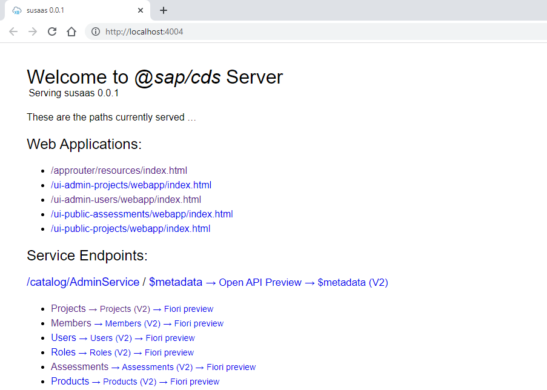
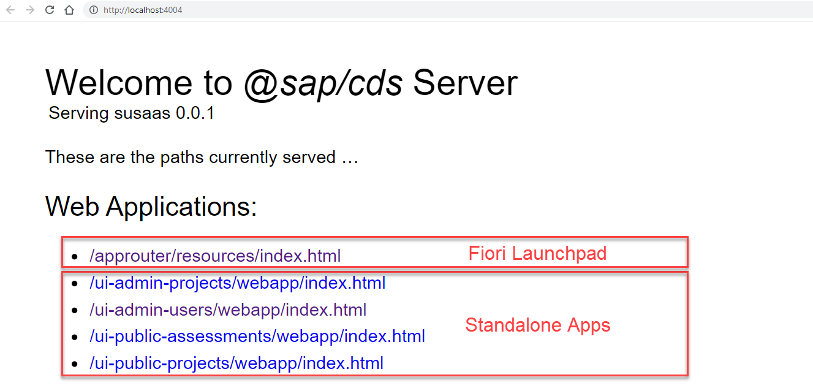
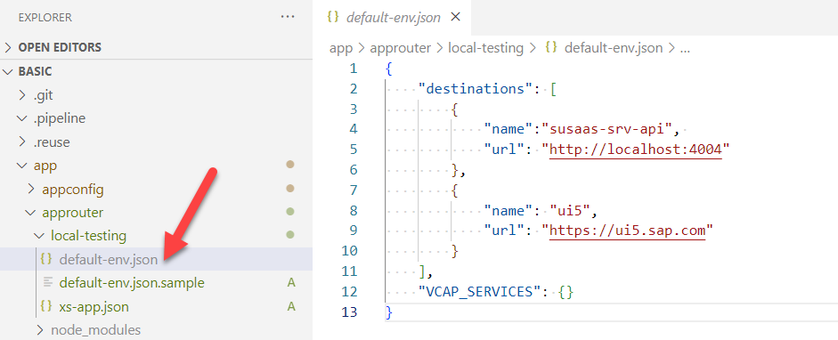
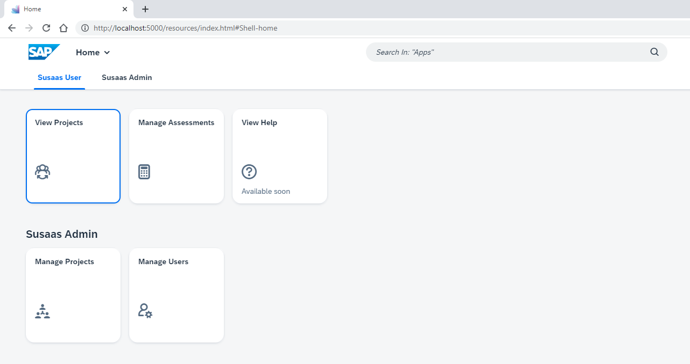
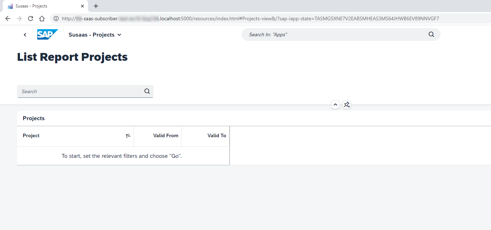

# Local and hybrid development

In this part of the **Expert Scope** you will learn how to use the local and hybrid development features of CAP. This will simplify the development process and let's you implement new features in a local environment with and without multitenancy enable. 

[**Local Development**](#1-Local-Development)
1. [Running the multitenant application locally (susaas-srv)](#1-Running-the-multitenant-application-locally-susaas-srv)<br>
    1.1. [Start the application with local multitenancy](#11-Start-the-application-with-local-multitenancy)<br>
    1.2. [Onboard a new SaaS tenant to your application](#12-Onboard-a-new-SaaS-tenant-to-your-application)<br>
    1.3. [Check the application](#13-Check-the-application)
2. [Running the frontend application locally (susaas)](#2-Running-the-frontend-application-locally-susaas)<br>
    2.1. [Local testing using cds watch --open](#21-Local-testing-using-cds-watch---open)<br>
    2.2. [Local testing using the HTML5 Repo Mock](#22-Local-testing-using-the-HTML5-Repo-Mock )
3. [Running the API Endpoint Locally](#3-Running-the-API-Endpoint-locally)<br>
    3.1. [Start the API locally](#31-Start-the-API-locally)<br>
    3.2. [Read data from API locally](#32-Read-data-from-API-locally)<br>
    3.3. [Insert Products to API locally](#33-Insert-Products-to-API-locally)<br>
    3.4. [Insert recycling materials with API locally](#34-insert-recycling-materials-with-api-locally)<br>

[**Hybrid Development**](#hybrid-development)
1. [Running the multitenant application in hybrid mode (susaas-srv)](#1-running-the-multitenant-application-in-hybrid-mode-susaas-srv)<br>
    1.1. [Login to the Cloud Foundry Space of provider subaccount](#11-login-to-the-cloud-foundry-space-of-provider-subaccount)<br>
    1.2. [Get environment variables for susaas-srv](#12-get-environment-variables-for-susaas-srv)<br>
    1.3. [Start the multitenant application in hybrid mode with production profile](#13-start-the-multitenant-application-in-hybrid-mode-with-production-profile)
2. [Running frontend application in hybrid mode](#2-running-frontend-application-in-hybrid-mode)<br>
    2.1. [Read environment variables from Approuter (susaas)](#21-read-environment-variables-from-approuter-susaas)<br>
    2.2. [Replace the TENANT_HOST_PATTERN variable](#22-replace-the-tenanthostpattern-variable)<br>
    2.3. [Add a destination to your backend application](#23-add-a-destination-to-your-backend-application)<br>
    2.4. [Run the frontend application in hybrid mode](#24-Run-the-frontend-application-in-hybrid-mode)<br>
    2.5. [Start the UI Application](#25-start-the-ui-application)
3. [Running the multitenant API in hybrid mode (susaas-api-srv)](#3-running-the-multitenant-api-in-hybrid-mode-susaas-api-srv)<br>
    3.1. [Getting the environment variables for multitenant API](#31-getting-the-environment-variables-for-multitenant-api)<br>
    3.2. [Start the API in hybrid mode](#32-start-the-api-in-hybrid-mode)<br>
    3.3. [Test the API in hybrid mode](#33-test-the-api-in-hybrid-mode)


# Local Development 

A local development environment (LDE) is the way of running applications and services on your laptop/desktop. Software developers use local development to test their development, examine newly added features and debug their applications.

> **Hint**: You may follow this documentation for both **Basic Scope** and **Advanced Scope**. You just need to checkout 
the [**basic**](https://github.com/SAP-samples/btp-cf-cap-multitenant-susaas/tree/basic) branch for **Basic Scope** and [**advanced**](https://github.com/SAP-samples/btp-cf-cap-multitenant-susaas/tree/advanced) for **Advanced Scope**, before starting to following the steps below.

## 1. Running the multitenant application locally (susaas-srv)

With SAP Cloud Application Programming Model's (CAP) latest MTX package release (@sap/cds-mtxs) developers are able to run 
their applications in local mode as mentioned [here](https://cap.cloud.sap/docs/guides/multitenancy/mtxs#test-drive-locally).

### 1.1. Start the application with local multitenancy

Run the command below in your project root directory to start the backend application locally. This will start the application including multitenancy support on your local device. An initial **t0** tenant is initialized which contains technical data managed by CAP. The t0 tenant is not a real SaaS application tenant. 

```sh
cds watch --profile local-with-mtx
```

If everything is fine, you should see an output as shown below.

```sh
[cds] - connect to db > sqlite { url: ':memory:' }
[cds] - serving cds.xt.SaasProvisioningService { path: '/-/cds/saas-provisioning' }
[cds] - serving cds.xt.ModelProviderService { path: '/-/cds/model-provider' }
[cds] - serving cds.xt.DeploymentService { path: '/-/cds/deployment' }
[cds] - serving AdminService { path: '/catalog/AdminService', impl: 'srv/admin-service.js' }
[cds] - serving PublicService { path: '/catalog/PublicService', impl: 'srv/public-service.js' }
[cds] - serving cds.xt.ExtensibilityService { path: '/-/cds/extensibility' }
[cds|t0] - loaded model from 1 file(s):

  node_modules/@sap/cds-mtxs/db/t0.cds

[mtx|t0] - (re-)deploying SQLite database for tenant: t0
/> successfully deployed to sqlite in-memory db


[cds] - server listening on { url: 'http://localhost:4004' }
[cds] - launched at 21/11/2022, 15:42:19, version: 6.3.1, in: 8.626s
[cds] - [ terminate with ^C ]
```

### 1.2. Onboard a new SaaS tenant to your application

Since we have our application up and running, the next step is adding a new SaaS tenant to our application so that a new SQLITE instance for that specific tenant is generated.

Create a new terminal instance and run the command below to onboard tenant **t1**.

```sh
cds subscribe t1 --to http://localhost:4004 -u alice
```

You should see an output as shown below.

```sh
Subscribing { tenant: 't1' } to { url: 'http://localhost:4004' }
Subscription succeeded.
```

Please note that user **alice** is defined in your [package.json](https://github.com/SAP-samples/btp-cf-cap-multitenant-susaas/blob/basic/package.json) file as a member of tenant **t1** with the roles **Admin**, **cds.Subscriber** and **cds.ExtensionDeveloper** as shown below. Therefore we were able to subscribe the credentials of user **alice** since that user has privileges to subscribe a tenant.

```json
...
        "[local-with-mtx]": {
          "strategy": "mock",
          "db": "sql-mt",
          "users": {
           "alice": {
              "tenant": "t1",
              "roles": [
                "Admin",
                "cds.Subscriber",
                "cds.ExtensionDeveloper"
              ]
            },
  ...
```

For further information, please see the [official documentation](https://cap.cloud.sap/docs/guides/multitenancy/mtxs#deploymentservice).


### 1.3. Check the application

Now that the application backend is running, we can directly go to [http://localhost:4004](http://localhost:4004).

[](./images/localhost.png)

After e.g., clicking on the **Projects** entity, a popup will ask for your credentials. You can again enter **alice** as username since that is our tenant **t1** sample user. Leave the password field blank and hit **Enter**.

[](./images/localhostcreds.png)

You should see the projects in your browser as a response, as shown below.

[](./images/projects-response.png)


## 2. Running the frontend application locally (susaas)

Local frontend development is also crucial for the developers, since as a developer you would like to try things locally first
then deploy the real environment. By following this section, you will be able to run your frontend application locally and do the local development. 

Local testing can be as easy as calling **cds watch --open**, but if you want to test like in a production environment, you can make use of the so called **HTML5 Repo Mock**. This tool allows you to mock an SAP HTML5 Application Repository like it is used in you SAP BTP account. 


### 2.1. Local testing using cds watch --open

For local testing without the HTML5 Repo Mock, just simply start the application as explained in the previous step w/ multitencany or w/o multitenancy. 

**w/ Multitenancy**

```sh
cds watch --profile=local-with-mtx --open
```

> **Hint** - Don't forget to subscribe your t1 tenant in this case before opening the application in your browser. 


**w/o multitenancy**

```sh
cds watch --open
```

Your browser should automatically open **http://localhost:4004**. You will see a link */approuter/resources/index.html* pointing to a **Web Application** providing a mocked Fiori Launchpad for opening and testing all provided SAPUI5 apps. Furthermore, you will find links to the standalone SAPUI5 apps if required for testing.

[](./images/localwomock.png)

Click on the standalone link(s) or the respective tiles within the Fiori Launchpad and you will be asked for username and password in a dialog. Use **alice** as username and leave the password field blank as we explained in the previous [step](#12-onboard-a-new-initial-tenant-to-your-application). Then you can explore the application, modify the UI by changing the annotations in the backend and test your development.


### 2.2. Local testing using the HTML5 Repo Mock 

Using the HTML5 Repo Mock requires a few more steps then using the pure *cds watch* test approach. Still, this approach is similar to what's actually happening in your SAP BTP environment. To use the HTML5 Repo Mock, you need to create a *default-env.json* file in the */app/approuter/local-testing* directory to be able to run the application locally. This default-env.json file is needed for SAP Approuter to point your local backend. You can use and rename the provided sample file in the respective directory. The VCAP_SERVICES object can remain empty. 

[](./images/ui-default-env-local.png)

```js
{
    "destinations": [{
        "name":"susaas-srv-api", 
        "url": "http://localhost:4004"
    },
    {
        "name": "ui5",
        "url": "https://ui5.sap.com"
    }],
    "VCAP_SERVICES": {}
}
```

> **Important** - In case you modify the *xs-app.json* of your Approuter, please also update the xs-app.json file in the *app/approuter/local-testing* directory accordingly. Just make sure the **authenticationMethod** of the local-testing file remains **none**.

Before you start the HTML5 Repo Mock, make sure your backend is started (*cds watch*). Then start your frontend application locally (using the HTML5 Repo Mock) by running the commands below:

```sh
cd app/approuter/
npm install (only required once)
npm run start:local
```

After running the commands, go to [http://localhost:5000](http://localhost:5000). You should see the application as below.

[](./images/local-running-app-ui.png)

Click on anything and you will be asked for username and password in a dialog. Use **alice** as username and leave the password field blank as we explained in the previous [step](#12-onboard-a-new-initial-tenant-to-your-application). Then you can explore the application, modify the UI by changing the annotations in the backend and test your development.


## 3. Running the API Endpoint locally 

In addition to frontend and backend, we also have a multitenant API endpoint which you might want to test locally. Please note that on local mode your changes will not be reflected to frontend or backend application since the sqlite does not share. And also in local mode, you will not be running the multitenancy since the multitenancy endpoints are only available in backend application.

But you will still be able to check your API, if the relevant data is inserted correctly, if the handlers are running correctly and so on.

### 3.1. Start the API locally

In your root directory run the command below.

```sh
npm run api-start-local
```

You should see that API is running locally as shown below.

```sh
[cds] - connect to db > sqlite { url: ':memory:' }
 > init from db/data/susaas.db-Dummy.csv
 > init from test/data/susaas.db-Assessments.csv
 > init from test/data/susaas.db-CircularityMetrics.csv
 > init from test/data/susaas.db-MaterialSplits.csv
 > init from test/data/susaas.db-Members.csv
 > init from test/data/susaas.db-Products.csv
 > init from test/data/susaas.db-Projects.csv
 > init from test/data/susaas.db-RecyclingCountries.csv
 > init from test/data/susaas.db-RecyclingMaterials.csv
 > init from test/data/susaas.db-Roles.csv
 > init from test/data/susaas.db-SalesOrders.csv
 > init from test/data/susaas.db-SalesSplits.csv
 > init from test/data/susaas.db-Users.csv
/> successfully deployed to sqlite in-memory db

[cds] - serving ApiService { path: '/odata/api', impl: 'srv-api/api-service.js' }
There is no service, therefore does not serve multitenancy!

[cds] - server listening on { url: 'http://localhost:4005' }
[cds] - launched at 22/11/2022, 19:56:53, version: 6.3.1, in: 1.052s
[cds] - [ terminate with ^C ]
```


### 3.2. Read data from API locally 

You can use the request below from a terminal to read the current products.

> **Hint** - The port might be different in your case (e.g., 4004). Check the output of your *npm run api-start-local* command.

```sh
curl http://localhost:4005/odata/api/Products -u "alice"
``` 


### 3.3. Insert Products to API locally

You can use the request below from a terminal to insert products.

```sh
curl --location --request POST 'http://localhost:4005/odata/api/bulkUpdateProducts' \
--user 'alice' \
--header 'Content-Type: application/json' \
--data-raw '
{
      "products" : [
            {"ID": "HT-1000-1","eolProductDesign": 43,"traditionalSalesShare": 82,"repairSalesShare": 8,"resellSalesShare": 10},
            {"ID": "HT-1001-2","eolProductDesign": 38,"traditionalSalesShare": 97,"repairSalesShare": 3,"resellSalesShare": 0}
      ]
}'
``` 


### 3.4. Insert recycling materials with API locally 

You can use the request below from a terminal to insert recycling materials.

```sh
curl --location --request POST 'http://localhost:4005/odata/api/bulkInsertRecyclingMaterials' \
--user 'alice' \
--header 'Content-Type: application/json' \
--data-raw '{
      "recyclingMaterials" : [
            {"product_ID":"HT-1000","material":"MT10000001","materialName":"Aluminium","weightShare":14,"recycleShare":23},
            {"product_ID":"HT-1000","material":"MT20000008","materialName":"Plastic","weightShare":34,"recycleShare":30}

      ]
}'
```

Feel free to modify this requests and try other endpoints which are served by your API.


# Hybrid Development

You can easily test your CAP application using a local database and mock ups. But at some point, you’re going to want to test with real cloud services. Of course, you can always deploy your application to the cloud.

With hybrid testing capabilities, you can stay in your local development environment and avoid the long turnaround times of cloud deployment, and you can selectively decide which services you want to use from the cloud.

To explain it a bit simpler, you will be still running on your laptop but you will be using SAP BTP Services like SAP HANA Cloud
or XSUAA.


## Prerequisites

- To be able to start hybrid development you need to deploy your multitenant application to SAP BTP Cloud Foundry Runtime at least once and you should have at least one subscribed tenant to your multitenant application. 

- In this sample you will be using [cf DefaultEnv](https://github.com/saphanaacademy/DefaultEnv) plugin so please install it before you start developing in hybrid mode. You can install the **cf DefaultEnv plugin** using the following command.

```sh
cf install-plugin DefaultEnv
```

- Make sure you checked out the [basic](https://github.com/SAP-samples/btp-cf-cap-multitenant-susaas/tree/basic) or [advanced](https://github.com/SAP-samples/btp-cf-cap-multitenant-susaas/tree/advanced) branch.

> **Hint**: You may follow this documentation for both **Basic Scope** and **Advanced Scope**. You just need to checkout 
the [**basic**](https://github.com/SAP-samples/btp-cf-cap-multitenant-susaas/tree/basic) branch for **Basic Scope** and [**advanced**](https://github.com/SAP-samples/btp-cf-cap-multitenant-susaas/tree/advanced) for **Advanced Scope**, before starting to following the steps below.


## 1. Running the multitenant application in hybrid mode (susaas-srv)

In this section you will learn how to run your susaas-srv module in hybrid mode. That means the application runtime will be on your laptop but all the other backing services will be used from your SAP BTP Account.


### 1.1. Login to the Cloud Foundry Space of provider subaccount 

Run the command below and please make sure to log in to the correct Cloud Foundry Space, because all the backing services are created there.

```sh
cf login
```

### 1.2. Get environment variables for susaas-srv 

Your susaas-srv application name is built as susaas-srv-<your-cf-space-name>. Run the command below in your root directory.

```sh
cf de susaas-srv-<yourcfspacename>
```

### 1.3. Start the multitenant application in hybrid mode with production profile

Now that you downloaded the environment variables, run the command below to start your application in hybrid mode.

```sh
cds watch --production
```

After executing this command your application should be up and running but the logs will look different. As the application is now running with the production profile, the application logs are formatted for SAP BTP Application Logging service.

> **Hınt** - Please notice that your service is now using the backing services in your SAP BTP Cloud Foundry Runtime such as XSUAA or SAP HANA Cloud.


## 2. Running frontend application in hybrid mode

In this section you will be running your frontend application with the connection to the backing services in your SAP BTP Cloud Foundry Space such as XSUAA or Destination Service. For hybrid testing of your frontend application, you will again use the HTML5 Repo Mock. A simplified testing using *cds watch* is not possible in this case as a SAP Approuter instance is required. 


### 2.1. Read environment variables from Approuter (susaas)

First switch to the Approuter directory to which you need to download our environment variables to.

```sh
cd app/approuter
cf de susaas-<your-cf-space-name>
```

Please note that in the *app/approuter* directory, a default-env.json file will be created.


### 2.2. Replace the TENANT_HOST_PATTERN variable 

Go to your *default-env.json* file and replace the TENANT_HOST_PATTERN value as shown below.

> **Hint** - A sample file can be found in the same directory for your reference. 

```json
    {
    "VCAP_SERVICES":{
     ...
    },
    "VCAP_APPLICATION":{
      ...
    },
    "DEPLOY_ATTRIBUTES": "{\n  \"app-content-digest\" : \"123123123123\"\n}",
    "TENANT_HOST_PATTERN": "^(.*).localhost" // <-- Put this value into your file
    }
```


### 2.3. Add a destination to your backend application

To be able to connect to your backend you also need to set the **destination** property in our *default-env.json* file.

With this **destination** property you can connect your UI application to:
- The backend application running on SAP BTP
- The backend application running locally on localhost

> **Hint** - A sample file can be found in the same directory for your reference. 

```json
    {
    "VCAP_SERVICES":{
     ...
    },
    "VCAP_APPLICATION":{
      ...
    },
    "DEPLOY_ATTRIBUTES": "{\n  \"app-content-digest\" : \"123123123123\"\n}",
    "TENANT_HOST_PATTERN": "^(.*).localhost", // <-- Put this value into your file
    "destinations" : [
        {
            "name": "ui5",
            "url": "https://ui5.sap.com"
        },
        {
            "name": "susaas-srv-api",     
            "url": "http://localhost:4004", // <-- you can also provide your deployed SAP BTP backend application url
            "forwardAuthToken":true
        }
      ]
    }
```

### 2.4. Run the frontend application in hybrid mode

Go to the */app/approuter/* directory and run the command below.

```sh
cd /app/approuter
npm install (only required once)
npm run start:hybrid
```

You should see that your application will be up and running and your approuter is listening on **localhost:5000**.


### 2.5. Start the UI Application

Go to your **consumer subaccount** and get its subdomain (e.g., from the Subaccount Overview page). Start the application by going to - **yourconsumersubdomain**.localhost:5000. For example if your consumer subdomain is - **consumer-123xyz** - the endpoint that you should go is - **consumer-123xyz**.localhost:5000.

You should see that the app is up and running as below.

[](./images/hybrid-ui-running.png)


## 3. Running the multitenant API in hybrid mode (susaas-api-srv)

Before running the SaaS API in hybrid mode, please make sure to terminate your local backend instances if still up and running from[this step](#13-start-the-multitenant-application-in-hybrid-mode-with-production-profile).


### 3.1. Getting the environment variables for multitenant API

First run the command below in the root directory of your project.

```sh
cf de susaas-api-srv-<yourspacename>
```

### 3.2. Start the API in hybrid mode

Run the command below to start API in hybrid mode.

```sh
npm run api-start-hybrid
```


### 3.3. Test the API in hybrid mode

Before testing your API in hybrid mode, go to your existing consumer subaccount. Make sure this consumer subaccount already has a **Sustainable SaaS API** service instance including an existing service binding. If not, please create both. 

[](./images/api-key-hybrid.jpg)

Select the service instance and open your service binding credentials. Copy the binding credentials, use them to fill the placeholders in the following [http file](https://github.com/SAP-samples/btp-cf-cap-multitenant-susaas/blob/basic/http/api-test-hybrid.http) and you're ready to go.

> **Hint** - You might consider copying the http file and renaming it to api-test-hybrid-private.http first. This ensures that your credentials are not committed to GitHub. 

You can use the [http file](https://github.com/SAP-samples/btp-cf-cap-multitenant-susaas/blob/basic/http/api-test-hybrid.http), to send the requests one by one.
